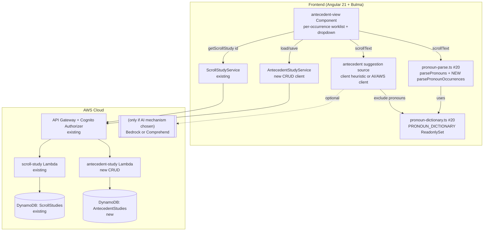

# Design Document: Antecedent Analysis (Step 6 — Identify Antecedents, Referents, Audience, and Speaker)

## Overview

This feature lets a Bible student assign an **antecedent** to each pronoun **occurrence** found in a
book's scroll and persist that work. It is the next slice of the planned **Step 6 — Pronoun Study**
tool, building directly on the **Parse Scroll for Pronouns** feature (issue #20,
`.kiro/specs/parse-scroll-for-pronouns/`, now implemented on `main`): #20 turns a `ready` **Scroll
Study** (Step 4) into a deterministic list of pronouns, and this feature attaches an antecedent to
each pronoun occurrence and saves it. Per the Step 6 reference
(`docs/references/inductive-study-step-6.md`), an antecedent is "the noun a pronoun or possessive
adjective replaces" (e.g. "Jesus" for "He"), identified **per occurrence** — the same word form
("He") can take different antecedents in different places.

The design is **additive** and follows the project's established stack: an Angular 21 standalone +
signals + Bulma frontend for the worksheet, and a serverless-first backend of one new DynamoDB
table + one new CRUD Lambda behind the existing Cognito-authorized API Gateway. The per-occurrence
pronoun worklist is computed **client-side** from the scroll text already returned by
`ScrollStudyService`, reusing #20's pure parser via a small **additive** accessor (see "#20 service
change" below). The scroll text is **student-provided** (maintainer-confirmed on PR #28: typed or
pasted by the student, not sourced from a copyrighted work), which both keeps the copyright
constraint satisfied and *permits* — but does not require — sending the scroll text to an AI/AWS
service to improve the antecedent suggestions. The suggestion mechanism is evaluated and a
recommendation landed in "Suggestion mechanism evaluation" below. This feature introduces the first
**persisted** Step-6 record (#20 persisted nothing).

The MVP flow: open the antecedent worksheet for a `ready` scroll → the app parses the pronoun
occurrences and produces candidate antecedents from the text → the student picks a suggested
antecedent or types one for each occurrence → save → reopen later with every selection restored.

## Architecture

The feature adds a new lazily-routed Angular component, a new client service for the Antecedent
Study CRUD API, a suggestion source, an **additive accessor on #20's parser**, and a new DynamoDB
table + CRUD Lambda + API routes that mirror the existing `scroll-study` / `book-study-crud`
constructs exactly.



```mermaid
sequenceDiagram
    participant U as Student
    participant AV as antecedent-view
    participant SS as ScrollStudyService
    participant ASVC as AntecedentStudyService
    participant PP as pronoun-parse (#20)
    participant AS as suggestion source

    U->>AV: Open /scroll/:id/antecedents
    AV->>SS: getScrollStudy(id)
    SS-->>AV: ScrollStudy {status, scrollText}
    alt status ready
        AV->>PP: parsePronounOccurrences(scrollText)
        PP-->>AV: PronounOccurrence[] (ordered worklist)
        AV->>AS: suggestAntecedents(scrollText)
        AS-->>AV: string[] (candidate options; async if AI)
        AV->>ASVC: get(scrollStudyId)
        ASVC-->>AV: AntecedentStudy | 404(none yet)
        AV-->>U: rows (occurrence + snippet + dropdown, pre-filled from saved)
        U->>AV: pick/type antecedents, then Save
        AV->>ASVC: save(scrollStudyId, assignments)
        ASVC-->>AV: ok
        AV-->>U: "Saved"
    else uploading/extracting
        AV-->>U: "scroll text still being prepared" + back link
    else failed / 404
        AV-->>U: explanatory message + back link to /scrolls
    end
```

## Key design decision: worklist granularity — PER OCCURRENCE

The central question is the **unit** an antecedent attaches to. The maintainer **decided
per-occurrence** on PR #28 ("the Worklist granularity I want occurrence"). The Step 6 reference agrees
— in Colossians 2:13-15 the same "He" takes the Father in several places while other pronouns take
distinct antecedents, so a per-word granularity would be interpretively wrong.

Two options were considered earlier; the maintainer's decision resolves them:

- **(a) Per distinct pronoun word.** One antecedent per distinct worklist word. This matches #20's
  shipped `parsePronouns` output directly and needs no #20 change, but it **cannot** record that two
  "he"s refer to different antecedents. **Rejected by the maintainer.**
- **(b) Per occurrence.** One antecedent per in-text appearance, keyed by the occurrence's position.
  Interpretively correct and what the maintainer wants. It requires #20's services to expose
  per-occurrence positions, which #20's shipped `parsePronouns`/`toHighlightSegments` do not return.
  **Chosen.**

**Decision: (b) — one antecedent per pronoun occurrence.** Each occurrence is identified by its
0-based `occurrence` index (reading order within the text) and its character `start` offset in
`scrollText`. This requires the additive #20 service change below. An assignment is keyed by
`occurrence` (stable ordinal) with `start` carried for context and migration-tolerance; `word` is
stored for display. The data model, worklist UI, correctness properties, and tests are all written to
this granularity.

## #20 service change (additive prerequisite)

#20 shipped (`src/app/pronoun-parse.ts` on `main`):

- `parsePronouns(text): PronounCount[]` — distinct `{ word, count }`, sorted count-desc then
  word-asc. **No positions.**
- `toHighlightSegments(text): Segment[]` — ordered `text`/`pronoun` segments for highlighting;
  reconstructs the input but exposes no caller-visible offset or occurrence index.
- `isPronoun(token): boolean`.
- `PRONOUN_DICTIONARY: ReadonlySet<string>` in `src/app/pronoun-dictionary.ts` (the export **name is
  now known** from the merged #20, so this spec names it).

None of these yields a per-occurrence position a worklist row can key on. This feature therefore
specifies a **new, additive** accessor on the same #20 module — it does **not** change the existing
three functions' signatures or behavior (keeping the change additive, per the maintainer's "keep the
changes additive where possible"):

```typescript
// src/app/pronoun-parse.ts  (ADDITIVE — existing exports unchanged)

/** One in-text appearance of a dictionary pronoun, in reading order. */
export interface PronounOccurrence {
  /** Canonical lower-cased dictionary form (same value parsePronouns reports as `word`). */
  word: string;
  /** The original-cased matched token as it appears in the text. */
  token: string;
  /** Zero-based character offset of the token's first character in `text`. */
  start: number;
  /** Zero-based ordinal of this appearance within `text` (reading order). */
  occurrence: number;
}

/**
 * Every pronoun occurrence in `text`, ordered by `start` ascending (== `occurrence` order).
 * Pure, O(n), never throws; `''` -> `[]`. Uses the SAME PRONOUN_DICTIONARY and whole-letter-run
 * matching as parsePronouns/toHighlightSegments (one pronoun definition in the code).
 */
export function parsePronounOccurrences(text: string): PronounOccurrence[];
```

Implementation note (for the build agent): this is the same single `matchAll(LETTER_RUN)` pass
`parsePronouns`/`toHighlightSegments` already use, pushing one `PronounOccurrence` per matched
dictionary run with a running `occurrence` counter and the match's `index` as `start`. Because it
reuses the one `PRONOUN_DICTIONARY` and the one `LETTER_RUN` regex, grouping its output by `word`
and counting reproduces `parsePronouns(text)` exactly (Requirement 0 property). A `*.spec.ts` case is
added next to #20's existing `pronoun-parse.spec.ts` asserting that equivalence plus determinism,
ascending `start`, and `'' -> []`.

This is the "changes to #20's pronoun services" the maintainer authorized. It is small, additive, and
lives in #20's file; it does not touch #20's `pronoun-view` component or #20's spec. It **does** mean
the build-ordering rule below now covers this additive signature/return change as part of the #20
dependency.

## Components and Interfaces

### Frontend (Angular 21 standalone, signals, Bulma)

**`antecedent-view` component** (`src/app/antecedent-view/antecedent-view.component.ts`), a new
standalone component mirroring the structure of the existing `scroll-view` and `book-study-detail`
components (`ChangeDetectionStrategy.OnPush`, `ActivatedRoute` param, signal-based view state). It:

- reads `scrollStudyId` from the route and calls `ScrollStudyService.getScrollStudy(id)` (the same
  authenticated path #20's pronoun view uses — no new scroll service);
- holds a `state` signal (`'loading' | 'ready' | 'preparing' | 'failed' | 'error'`), a `study`
  signal, a `rows` signal (the occurrence rows, each `{ occurrence, start, word, snippet,
  antecedent }`), an `options` signal (`string[]`, the shared dropdown options), a
  `suggestionsLoading`/`suggestionsError` pair (relevant only if the AI mechanism is chosen), and a
  `saving`/`saveError` signal pair;
- distinguishes a *not found* study (404) from a *transient* load failure (network/5xx) in the
  `getScrollStudy` `error` callback typed `(err: { status?: number })` —
  `state.set(err?.status === 404 ? 'failed' : 'error')` — the same branch
  `book-study-detail.component.ts` uses. 404/`failed` is terminal (back link to `/scrolls`); a 5xx is
  recoverable with a Retry button;
- on a `ready` study, computes the worklist once via `parsePronounOccurrences(study.scrollText)`
  (the additive #20 accessor above), builds each row's `snippet` by slicing a short window of
  `scrollText` around `start` (so the student can tell two occurrences of the same word apart,
  Requirement 1 criterion 6), requests suggestions via the suggestion source
  (`suggestAntecedents(study.scrollText)`), then calls `AntecedentStudyService.get(scrollStudyId)` to
  pre-fill each row's `antecedent` from any saved record (matched by `occurrence`) and to seed
  `options` with saved antecedents;
- renders a Bulma `table`/list, one row per occurrence (in reading order), each showing the pronoun
  token, its position/snippet, and a user-editable dropdown control bound to that row's `antecedent`;
- offers a **Save** button that calls `AntecedentStudyService.save` with the non-empty assignments and
  surfaces success/failure (Requirement 4). The empty-state (no pronouns), `preparing`, `failed`, and
  `error` states render the same notification patterns as #20's pronoun view.

`data-testid`s are namespaced to this view: `antecedent-table`, `antecedent-row`, `antecedent-word`,
`antecedent-snippet`, `antecedent-select`, `antecedent-add`, `antecedent-clear`, `antecedent-save`,
`antecedent-empty`, `antecedent-preparing`, `antecedent-failed`.

**The user-editable dropdown.** Two options were considered: a native `<select>` (Bulma `.select`)
plus a separate "add antecedent" text input, versus a third-party combobox library. **Decision: a
Bulma `.select` bound to the row's `antecedent` plus a small inline text input + "Add" button that,
on confirm, trims the value, adds it to `options` (case-insensitive de-dup) and sets it as the row's
antecedent.** Rationale: the project uses Bulma CSS only (no JS component library) and signals, so a
native select + input keeps the dependency surface at zero and is fully keyboard/screen-reader
accessible without extra ARIA plumbing. The select includes a blank first option (`— none —`) so
clearing is just selecting it (Requirement 3 criterion 4). This is the "user-editable dropdown":
options come from suggestions + student additions, and free text is always available via the Add
input. Because options are **shared** across rows while each row's selected `antecedent` is
**per-occurrence**, setting one "he" never changes another (Requirement 3 property).

**New vs. extending #20's pronoun view.** Options: (a) add antecedent editing into #20's
`pronoun-view`, or (b) a **new, separate `antecedent-view`** on its own route. **Decision: (b)** —
#20 is a read-only parse/worklist surface that persists nothing, while this feature adds editing and
persistence; keeping them separate avoids complicating #20's component and spec (the same reasoning
#20 used to stay separate from `scroll-view`). `antecedent-view` *reuses* #20's parser (via the new
`parsePronounOccurrences` accessor) and `PRONOUN_DICTIONARY` and the scroll service, but does not
modify #20's component.

### Routing and navigation

A new lazily-loaded route is added to `src/app/app.routes.ts` (additive; existing routes untouched),
nested under the scroll id to keep the "a scroll's antecedents" relationship explicit and let the
view read the same `scrollStudyId` param:

```
scroll/:scrollStudyId/antecedents  →  antecedent-view
```

The student reaches it from #20's pronoun view (a **"Assign antecedents (Step 6)"** link added to
the pronoun view's `ready` state — the one additive change to that component) and/or directly from
the scroll view; the exact entry link placement follows whatever #20 ships. No new top-level navbar
entry is added (the view is reached contextually from a specific scroll), matching #20's navigation
decision.

### Build ordering rule: this feature MUST be built on a merged #20 (now including the additive accessor)

The frontend half of this feature imports symbols from #20's modules and depends on the **additive
`parsePronounOccurrences` accessor** specified above:

- `parsePronouns` / **new** `parsePronounOccurrences` / `PronounOccurrence` from
  `src/app/pronoun-parse.ts`;
- `PRONOUN_DICTIONARY` from `src/app/pronoun-dictionary.ts` (for the suggestion source's
  pronoun-exclusion rule).

This is a **hard build-ordering rule, not a sequencing note**:

- **This issue (#23) MUST be built on top of a merged #20.** #20 is merged on `main` today, so the
  base files exist. The build phase additionally adds the small `parsePronounOccurrences` accessor to
  #20's `pronoun-parse.ts` as the first step (it is a prerequisite of the per-occurrence worklist —
  Requirement 0). The build agent MUST NOT re-create #20's parser or dictionary; it extends the
  existing module additively, preserving the one pronoun definition in the code.
- **Which criteria depend on the accessor.** Requirement 0 (the accessor itself), Requirement 1
  criteria 1, 2, 6 and both properties (per-occurrence worklist derivation and snippets), all of
  Requirement 3 (the per-occurrence dropdown), and Requirement 4 criteria 1, 3, 6 (the saved set is
  keyed to occurrences). These are **unverifiable** without `parsePronounOccurrences`.
- **What is independent of #20.** The backend half — the `AntecedentStudies` table, the
  `AntecedentStudyFn` Lambda, its API routes, and their CDK/Lambda tests — depends on nothing from
  #20 and can be built and fully tested in isolation (the Lambda tests pass an `assignments` array
  directly; they never call the parser). If a partial landing is ever desired, the backend can land
  first, but the **feature is not complete** until the frontend half (with the additive accessor) is
  built and its criteria verified.

### Antecedent suggestion source

The suggestion source produces the initial dropdown options (Requirement 2). Its *interface* to the
component is fixed regardless of mechanism — a function that, given the scroll text, yields an
ordered, de-duplicated `string[]` of candidate antecedents excluding pronoun-dictionary words — so
the component, data model, and the rest of the design do not change if the mechanism is later swapped:

```typescript
/** Candidate antecedent terms for the dropdown. Ordered asc, de-duped case-insensitively,
 *  excluding PRONOUN_DICTIONARY words. Never throws; '' or unavailable -> []. */
export function suggestAntecedents(text: string): Observable<string[]>; // sync heuristic resolves immediately
```

The chosen *mechanism* behind this interface is the subject of the next section. If the client
heuristic is chosen, `suggestAntecedents` is a pure synchronous computation (wrapped in `of(...)` or
called directly). If an AI/AWS mechanism is chosen, it is an async call through a new
`AntecedentSuggestService` + Lambda route, and the component renders the worklist immediately and
fills options when the response arrives (Requirement 2 criterion 4, Non-Functional 6).

## Suggestion mechanism evaluation (deterministic heuristic vs. AI / advanced AWS)

The maintainer asked (PR #28): "Suggestion heuristic precision. You can evaluate … any AI or advanced
AWS services that can improve this instead of a simple Regex based search." The scroll text is now
confirmed student-provided, so there is **no copyright blocker** to sending it to an AI/AWS service.
This section compares the options and lands on a recommendation; the maintainer can accept or
override.

### What "better suggestions" means here

The suggestion list only has to be *helpful starting options* for a user-editable dropdown — the
student always edits freely and types anything the suggestions miss. So the bar is: surface the
book's likely antecedents (names, titles, descriptive noun phrases) without much noise, cheaply,
without adding operational weight. It is explicitly **not** an authoritative coreference resolver.

### Option A — Deterministic client-side heuristic (the current approach)

Extract candidate terms from the scroll text in the browser: capitalised proper-noun candidates and,
optionally, frequent noun-like tokens, excluding `PRONOUN_DICTIONARY` words, de-duped and sorted.

- **Precision/quality:** Moderate. Catches proper names ("Paul", "Christ") well; misses lower-case or
  multi-word antecedents ("the certificate of debt", "rulers and authorities") and can include
  sentence-initial capitals that are not antecedents. Good enough as *starting* options given the
  dropdown is user-editable.
- **Cost:** $0. Runs client-side over text already fetched. No AWS call.
- **Operational complexity:** None new. Zero new AWS services (keeps the "small number of distinct
  services" principle intact); the feature stays frontend-only on the suggestion side (backend is
  just the CRUD table/Lambda).
- **Latency:** Instant (single O(n) pass, no network).
- **Copyright:** N/A — nothing leaves the browser.

### Option B — Amazon Bedrock (Claude Haiku, already used by AI-summary)

Send the scroll text (now permitted) to Bedrock with a prompt asking for the list of likely
antecedent entities/phrases in the passage.

- **Precision/quality:** High. An LLM readily returns multi-word and lower-case antecedents and real
  entity phrases, far beyond a regex. It can also be noisy/non-deterministic and occasionally
  hallucinate a term not in the text (acceptable for *suggestions*, but worth a dedup-against-text
  filter).
- **Cost:** Non-zero and the **stack's main cost variable**. Scroll text can be large (up to ~350 KB
  per the scroll spec), so per-call input tokens are substantial; even at Haiku prices this is the
  most expensive option and scales with scroll size and how often the worksheet is opened. Mitigable
  by caching the suggestion per `scrollStudyId` so it is computed once, not on every open.
- **Operational complexity:** Low-to-moderate. Bedrock is **already wired** (AI-summary uses Claude
  Haiku), so no new *service type* — but this feature would add a new Lambda route + IAM grant and
  make the suggestion path server-side (no longer frontend-only).
- **Latency:** Seconds (LLM round-trip); must be async/non-blocking with the worklist shown first.
- **Copyright:** Permitted (student-provided text).

### Option C — Amazon Comprehend (entity recognition / coreference)

Use Comprehend's entity detection (`DetectEntities`) to extract people/organisations/locations as
candidate antecedents. (Comprehend has no general pronoun→antecedent coreference API; entity
detection is the usable primitive.)

- **Precision/quality:** Moderate-to-good for named entities (better than regex at real names,
  weaker than an LLM for descriptive/common-noun antecedents like "the ruler of this world"). It does
  not resolve which entity a given pronoun refers to.
- **Cost:** Pay-per-use per unit of text; cheaper per call than Bedrock for large text, but it is a
  **new AWS service type** — contrary to the "keep the number of distinct AWS services small"
  principle — for a modest quality gain over the heuristic.
- **Operational complexity:** Moderate-plus. New service type, new Lambda route + IAM, new SDK
  client, new test mocks. Highest incremental surface of the three.
- **Latency:** Sub-second to seconds, async.
- **Copyright:** Permitted (student-provided text).

### Recommendation

**Keep the deterministic client-side heuristic (Option A) for this increment, and design the
suggestion source behind a swappable interface so Bedrock (Option B) can be dropped in later without
touching the data model, component, or persistence.**

Rationale:

- The suggestions feed a **user-editable** dropdown — their job is to save typing, not to be
  authoritative. The heuristic clears that bar at **zero cost, zero new AWS service, zero latency**,
  which is squarely aligned with the stack's cost-conscious, serverless-first, "few services"
  principles.
- Both AI options make the feature **no longer frontend-only** (new Lambda route + IAM), and Bedrock
  — the strongest-quality option — is the **stack's main cost variable** and scales with scroll size.
  Spending the project's main cost lever to pre-fill an editable dropdown is poor value when the
  student edits freely anyway.
- Comprehend adds a **new service type** for only a modest gain over the heuristic, which the
  "small number of distinct services" principle argues against.
- The `suggestAntecedents(text): Observable<string[]>` interface (above) is deliberately mechanism-
  agnostic, so if the maintainer later finds the heuristic too noisy in real use, upgrading to
  Bedrock is a localized change (swap the source implementation + add one Lambda route) that does not
  disturb anything else. Because Bedrock is already wired for AI-summary, that upgrade introduces no
  new *service type*.

**If the maintainer prefers higher-quality suggestions now and accepts the cost**, Option B (Bedrock
Haiku) is the better of the two AI options (reuses an already-wired service; richer multi-word
antecedents) — with two conditions: cache the result per `scrollStudyId` so it is computed once per
scroll rather than on every worksheet open, and keep the heuristic as the graceful-degradation
fallback (Requirement 2 criterion 4). **Choosing any AI/AWS mechanism means this feature is no longer
frontend-only — it adds an AWS resource (a new Lambda route and IAM grant, and for Comprehend a new
service type) — so the issue's risk checkbox for "touches data tables / infra" should be reconsidered
by the maintainer before the build proceeds down that path.** The persistence half (the
`AntecedentStudies` table + CRUD Lambda) already touches infra regardless of this choice.

### Antecedent suggestion helper (if Option A — recommended — is taken)

One pure, exported function (no Angular, no I/O — unit-testable, mirroring
`english-definition.normalize.ts`, `bible-books.ts`, and #20's `pronoun-parse.ts`):

```typescript
/** Distinct candidate antecedent terms extracted from scroll text, sorted asc, de-duped
 *  case-insensitively, excluding pronoun-dictionary words. Pure and deterministic. */
export function suggestAntecedents(text: string): string[]; // the component wraps this in of(...) for the Observable interface
```

**Extraction rule.** Walk the text and collect capitalised word tokens (`/[A-Z][a-z]+/` runs) that
are **not** sentence-initial-only (a conservative proper-noun heuristic: a capitalised word that
either appears somewhere not immediately after sentence-ending punctuation, or appears more than
once), excluding any token whose lower-cased form is in #20's `PRONOUN_DICTIONARY` (Requirement 2
criterion 3). De-duplicate case-insensitively, keep the first-seen original casing, and sort
ascending. This is a deliberately simple, deterministic heuristic — it is *suggestions*, not
authoritative parsing; the student edits freely. It never throws; `suggestAntecedents('')` returns
`[]`.

**Single-source dependency on #20's dictionary (hard coupling).** The "exclude pronoun-dictionary
words" rule (Requirement 2 criterion 3) MUST consume the **exact same** pronoun set #20 owns — not a
private copy. The helper imports it directly from #20's dictionary module. #20 is merged, so the
export name is now known from the shipped file:

```typescript
import { PRONOUN_DICTIONARY } from './pronoun-dictionary';
```

`suggestAntecedents` lower-cases each candidate token and skips it when
`PRONOUN_DICTIONARY.has(lowerToken)`. It MUST NOT declare its own pronoun list or re-derive one; this
preserves the invariant that there is exactly one pronoun definition in the code (shared with
`parsePronouns`/`parsePronounOccurrences`).

### Antecedent Study client service (`src/app/antecedent-study.service.ts`)

A new `@Injectable({ providedIn: 'root' })` service mirroring `BookStudyService` /
`ScrollStudyService` (uses `HttpClient`, `environment.apiUrl`, user scoping via the existing
`user-id.interceptor`). It maps the DynamoDB record shape to a frontend `AntecedentStudy` the way
`toBookStudy`/`toScrollStudy` do.

The frontend domain interfaces `AntecedentStudy` and `AntecedentAssignment` are declared **once**
in `src/app/models.ts` (beside `BookStudy`) and **imported** by the service and the component. Note
the repo is **mixed** on where domain interfaces live: `BookStudy` is declared in `models.ts` and
imported by `book-study.service.ts`, but `ScrollStudy`/`ScrollStudyRecord` are declared **inline** in
`scroll-study.service.ts`. This is a genuine 50/50 split, not a settled convention — so, although
this feature mirrors `scroll-study` for its backend and component structure, it deliberately follows
the **`BookStudy` placement** for the interface home (declare in `models.ts`, import where used)
rather than the inline `ScrollStudy` pattern. `models.ts` is the better pattern (one authoritative
declaration), and stating the choice explicitly removes any ambiguity about which precedent wins. See
Data model for their shape.

```typescript
import { AntecedentStudy, AntecedentAssignment } from './models';

@Injectable({ providedIn: 'root' })
export class AntecedentStudyService {
  /** GET the saved antecedent study for a scroll; 404 if none saved yet. */
  get(scrollStudyId: string): Observable<AntecedentStudy>;
  /** PUT the full set of assignments for a scroll (create-or-replace). */
  save(scrollStudyId: string, assignments: AntecedentAssignment[]): Observable<void>;
}
```

### Backend: Antecedent Study CRUD Lambda (`infra/lambda/antecedent-study/index.ts`)

A new Lambda mirroring `scroll-study`/`book-study-crud`: it reads the Cognito `sub` from
`event.requestContext.authorizer.claims.sub`, uses `DynamoDBDocumentClient`, and reuses the shared
`corsResponse`/`getRequestOrigin` helpers. The Antecedent Study is **keyed one-per-scroll-per-user**
(the natural key is the `scrollStudyId`), so there is no separate generated id and no list route
needed for the MVP — the worksheet always loads by its scroll id:

- `GET /scroll-studies/{scrollStudyId}/antecedents` → return the record or `404` if none saved.
- `PUT /scroll-studies/{scrollStudyId}/antecedents` → validate the body, upsert the record
  (preserve `createdAt`, set `updatedAt`) via the explicit read-before-write below, return `200`.

**`createdAt`-preserving upsert (authoritative mechanism).** Neither `scroll-study` nor
`book-study-crud` has an update-in-place path today — `book-study-crud` only ever *creates* with
`createdAt == updatedAt == now`. A naive `PutCommand` of a freshly-built record would therefore
**overwrite `createdAt` with the current time on every save**, silently violating Requirement 4's
"`createdAt` preserved across updates" property. The `PUT` handler MUST read before it writes:

```typescript
async function saveAntecedentStudy(
  userId: string,
  scrollStudyId: string,
  assignments: AntecedentAssignment[], // already validated + empties dropped
): Promise<void> {
  const now = new Date().toISOString();
  const key = { PK: `USER#${userId}`, SK: `ANTECEDENT#${scrollStudyId}` };

  // 1) read the existing item (own partition only)
  const existing = await docClient.send(new GetCommand({ TableName: tableName, Key: key }));
  const createdAt = (existing.Item as AntecedentStudyRecord | undefined)?.createdAt ?? now;

  // 2) write, carrying createdAt forward (or now on first save)
  const record: AntecedentStudyRecord = {
    ...key,
    scrollStudyId,
    userId,
    assignments,
    createdAt,          // preserved on update; == now on first create
    updatedAt: now,     // always advances
  };
  await docClient.send(new PutCommand({ TableName: tableName, Item: record }));
}
```

The `GetCommand` is scoped to `PK=USER#<sub>`, so a user can only ever read/overwrite their own
record; there is no cross-user path. This read-before-write is the single authoritative mechanism
for the `createdAt` invariant (owned by the Lambda — see Invariant ownership) and is covered by a
Lambda test that issues two `PUT`s and asserts `createdAt` is unchanged while `updatedAt` advances
(mocked `GetCommand` returning the first-save item on the second call).

Nesting the antecedent routes under the existing `scroll-studies/{scrollStudyId}` resource keeps the
ownership relationship explicit and reuses the same path param the scroll routes use. The Lambda is a
**new** function (`AntecedentStudyFn`) with its own construct id and physical name
(`n('AntecedentStudy')`), not a change to `scrollStudyFn`, so the existing scroll Lambda and its
tests are untouched.

### Infrastructure (`infra/lib/word-study-tool-stack.ts`, additive)

Mirroring the `ScrollStudies` table + `ScrollStudyFn` + routes block already in the stack:

- **`AntecedentStudies` DynamoDB table** (new construct id `AntecedentStudies`, physical name
  `n('AntecedentStudies')`): `PK`/`SK` string keys, `PAY_PER_REQUEST`, `AWS_MANAGED` encryption,
  `removalPolicy: config.statefulRemovalPolicy`. No `GSI1` is needed for the MVP because records are
  fetched by exact key (`PK=USER#<sub>`, `SK=ANTECEDENT#<scrollStudyId>`), not listed; a GSI can be
  added later if a "my antecedent studies" list surface is built. No PITR (consistent with
  `BookStudies` — "PITR on WordStudies only" stays true, no new `StageConfig` field).
- **`AntecedentStudyFn` `NodejsFunction`** with `commonLambdaProps`, `functionName: n('AntecedentStudy')`,
  its own `fnLogs('AntecedentStudyFn')` log group, `entry` pointing at the new Lambda, and
  `ANTECEDENT_STUDIES_TABLE_NAME` + `ALLOWED_ORIGINS` env; `antecedentStudiesTable.grantReadWriteData(fn)`
  (least privilege: this table only).
- **Routes**: on the existing `scroll-studies/{scrollStudyId}` resource, add a child resource
  `antecedents` with `GET` and `PUT` methods wired to the new integration with `authMethodOptions`.

These additions follow the delivery rule that new constructs are *added*, never renaming existing
stateful ids/names, and touch no prod value in `stage-config.ts`. **If** the maintainer selects an
AI/AWS suggestion mechanism, this stack additionally gains one suggestion Lambda + route (+ a Bedrock
`InvokeModel` IAM grant for Option B, or a Comprehend grant + new SDK for Option C); that is the only
delta from the recommended Option-A design, and it is the part flagged for the "touches infra" risk
reconsideration.

## Data model / API changes

### New DynamoDB table: `AntecedentStudies`

Same key shape as the other per-user tables; keyed one record per scroll per user.

```typescript
interface AntecedentStudyRecord {
  PK: string;            // "USER#<sub>"
  SK: string;            // "ANTECEDENT#<scrollStudyId>"
  scrollStudyId: string;
  userId: string;        // Cognito sub
  assignments: AntecedentAssignment[];  // only non-empty antecedents are stored
  createdAt: string;     // ISO 8601
  updatedAt: string;     // ISO 8601
}

interface AntecedentAssignment {
  occurrence: number;    // 0-based ordinal of the pronoun appearance in the scroll text (the key)
  start: number;         // 0-based character offset of the occurrence in the scroll text (context/migration)
  word: string;          // canonical lower-cased pronoun form (for display; not the key)
  antecedent: string;    // trimmed, 1–200 chars
}
```

**Per-occurrence keying.** An assignment is identified by `occurrence` (the stable reading-order
ordinal from `parsePronounOccurrences`). `start` is stored alongside it as context and to tolerate
re-parses, and `word` is stored for display. On load, the view matches a saved assignment to a
current worklist row by `occurrence`; an assignment whose `occurrence` no longer resolves to a
matching current occurrence (e.g. the scroll was re-uploaded, Requirement 4 criterion 6) is ignored.
Two occurrences of the same `word` therefore carry independent antecedents — the core per-occurrence
requirement.

**Interface homes (one declaration each, no inline duplicates).**
- Backend: `AntecedentStudyRecord` and the backend `AntecedentAssignment` are added to
  `infra/lambda/shared/models.ts`, beside the existing `ScrollStudyRecord`/`BookStudyRecord`; the
  `antecedent-study` Lambda imports them from `../shared/models`.
- Frontend: `AntecedentStudy` and `AntecedentAssignment` are added to `src/app/models.ts`, beside
  `BookStudy` (the frontend repo is mixed — `BookStudy` lives in `models.ts` while `ScrollStudy` is
  inline in `scroll-study.service.ts`; this feature deliberately follows the `BookStudy` placement,
  see the client-service section); the `AntecedentStudyService` and `antecedent-view` component import
  them from `./models`. The service's `get` maps the record to `AntecedentStudy` (dropping the
  `PK`/`SK`), exactly as `toBookStudy`/`toScrollStudy` do.

Neither interface is declared inline in a service or component file.

### New API routes (both Cognito-authorized)

| Method | Path | Body | Response |
|---|---|---|---|
| `GET` | `/scroll-studies/{scrollStudyId}/antecedents` | — | `200` record, or `404` if none saved |
| `PUT` | `/scroll-studies/{scrollStudyId}/antecedents` | `{ assignments: AntecedentAssignment[] }` | `200` on upsert |

No change to any existing route or record. No new un-hashed `public/` asset and no new CDK context
lookup, so the `DeployShell`/`DeployAssets` include/exclude lists and `cdk.context.json` are
unchanged. (A suggestion route is added only if an AI/AWS mechanism is chosen — not in the
recommended Option-A design.)

## Error handling

| Operation | Failure condition | How detected | Recoverable? | Caller receives | Logged |
|---|---|---|---|---|---|
| `getScrollStudy(id)` | scroll not found / not owned (404) | `err?.status === 404` → `failed` | n/a (wrong id) | `failed` state + back link to `/scrolls` | no (expected) |
| `getScrollStudy(id)` | network / 5xx | `err?.status !== 404` → `error` | yes | `error` state + Retry (re-issues GET) | browser console only |
| worklist derive | scroll `uploading`/`extracting` | `study.status` | yes (return later) | `preparing` notification + back link to `/scroll/:id` | no |
| worklist derive | scroll `failed` | `study.status` | no (re-upload) | `failed` notification (reason) + back link to `/scrolls` | no |
| suggestions (heuristic) | any text input | — | n/a (never throws) | always returns a value (possibly empty) | no |
| suggestions (AI, if chosen) | service error / timeout | HTTP status | yes (worksheet still usable) | empty option set + non-blocking "suggestions unavailable" notice; free-text still works (R2 c4) | server-side |
| `AntecedentStudyService.get` | no saved record yet (404) | HTTP 404 | n/a | treated as "empty study" — all rows start unassigned (not an error) | no |
| `AntecedentStudyService.get` | network / 5xx | HTTP status | yes | worksheet still usable from parse; a non-blocking "could not load saved antecedents" notice + Retry | console |
| `AntecedentStudyService.save` | validation rejected (400) | HTTP 400 | yes | `saveError` set; selections stay editable; message shown | server-side (Lambda) |
| `AntecedentStudyService.save` | network / 5xx | HTTP status | yes | `saveError` set; selections stay editable; Retry | server-side |

**Lambda-side error handling** mirrors `scroll-study`/`book-study-crud`: a top-level `try/catch`
returns `corsResponse(500, …)` on unexpected errors; a missing/empty `sub` returns `400`
("Missing authentication."); a missing `scrollStudyId` path param returns `400`; a `GET` with no
record returns `404`. Validation failures on `PUT` return `400` with a specific message.

**Validation rules (external inputs).**
- `scrollStudyId` (route param): required, non-empty; passed straight through. A record for a
  scroll the `sub` does not own is simply absent → `404` on `GET` and a fresh record on `PUT` keyed
  to this user (a user can only ever write under their own `USER#<sub>` partition, so there is no
  cross-user write).
- `assignments` (PUT body): must be an array (an empty array `[]` is valid — see empty-worksheet
  save below); each element must have a non-negative integer `occurrence`, a non-negative integer
  `start`, a non-empty string `word`, and an `antecedent` string. The Lambda first **trims** each
  `antecedent`, then **drops** any element whose trimmed `antecedent` is empty (these are unassigned
  rows, not errors). It **rejects** (400) a body that is not an array, an element with a
  missing/wrong-typed field, or an element whose trimmed `antecedent` exceeds 200 characters — the
  server **rejects over-length, it does not truncate** (Requirement 3 criterion 6). The client's
  `maxlength=200` input cap means over-length normally never reaches the server; the server reject is
  defense-in-depth and the single authority on the 200-char invariant. The two tiers agree on the
  outcome (reject), so there is no silent truncation anywhere.
- **Empty-worksheet save (Requirement 4 criterion 5):** a `PUT` whose assignments are all empty
  after the drop step yields `assignments: []`. The handler still **upserts** a record with
  `assignments: []` through the same `createdAt`-preserving path above — it does **not** delete the
  record and does **not** leave a prior non-empty set in place. The operation is idempotent (saving
  an all-empty worksheet twice is indistinguishable from saving it once). There is no `DELETE` route
  in this increment. A Lambda test asserts that a `PUT` with all-empty assignments stores
  `assignments: []` and that a subsequent `GET` returns the empty-assignment record (not a 404).
- `scrollText` (client-side, from the record): any string including empty/whitespace/HTML-significant
  chars; `parsePronounOccurrences` and `suggestAntecedents` tolerate all (empty → empty list), per
  #20's parse contract and Requirement 2.

**Invariant ownership.** User-scoping is owned by the backend exactly as the other CRUD Lambdas own
it: all reads/writes are under `PK=USER#<sub>`, so a student can only touch their own antecedent
records; the frontend adds no new trust boundary. The "assignment antecedent is non-empty and ≤200
chars" invariant is owned by the Lambda `PUT` validation (authoritative — it rejects over-length
with 400, never truncates), with the client `maxlength=200` enforcing the same for UX. The
"`createdAt` preserved across updates" invariant is owned by the Lambda's read-before-write `PUT`
(the single mechanism; see the upsert pseudocode above). The "a pronoun occurrence maps to the #20
parse" invariant is owned by reusing #20's `parsePronounOccurrences`/`parsePronouns` (one module) and
the single `PRONOUN_DICTIONARY`, never a copy — there is exactly one pronoun definition in the code.

## Testing strategy

All frontend tests run under the existing Angular + vitest harness; infra tests under the infra
vitest harness. Nothing in this feature calls AWS at test time — the Lambda tests mock the DynamoDB
document client, and `infra/test/setup-no-aws.ts` points any unmocked call at a dead endpoint. (If an
AI/AWS suggestion mechanism were chosen, its SDK would be mocked too — never invoked in tests.)

Unit (#20 accessor) — added to `src/app/pronoun-parse.spec.ts`: `parsePronounOccurrences` is
deterministic (same text → same ordered list), ascending `start`, `occurrence` is the 0-based
reading-order ordinal, `'' → []`, and **grouping its output by `word` and counting equals
`parsePronouns(text)`** (the equivalence property) — plus `fast-check` property cases.

Unit (suggestion helper, Option A) — `antecedent-suggest.spec.ts`: determinism (same text → same
ordered list), case-insensitive de-dup, exclusion of pronoun-dictionary words, empty input → `[]`,
never throws; property-style cases with `fast-check` following `bible-books.spec.ts`.

Component — `antecedent-view.component.spec.ts` (Angular TestBed, stubbed `ScrollStudyService` and
`AntecedentStudyService`): `ready` scroll renders one row per `parsePronounOccurrences` **occurrence**
in reading order, each with a snippet; two occurrences of the same word render as independent rows and
assigning one does not change the other; a saved study pre-fills matching occurrence rows (matched by
`occurrence`); selecting an option sets the row antecedent; typing + Add inserts a new option (de-duped)
and sets it; clearing resets to empty; Save calls `save` with only non-empty assignments (carrying
`occurrence`/`start`/`word`) and reports success; a `save` failure keeps selections editable and shows
the error; `uploading`/`extracting` → `preparing`; `failed`/404 → `failed`; 5xx → `error` with working
Retry; empty-text scroll → empty-state with no Save; saving after clearing every selection calls `save`
with `[]` (empty-worksheet save, R4 criterion 5); a stale saved assignment whose `occurrence` is no
longer in the parse is ignored on load (Requirement 4 criterion 6); a regression assertion that the
view calls only `ScrollStudyService.getScrollStudy` and the two `AntecedentStudyService` methods.

Lambda — `infra/lambda/antecedent-study/index.test.ts` (mocked `DynamoDBDocumentClient`): `GET`
returns the record / `404` when absent; `PUT` upserts; **two sequential `PUT`s preserve `createdAt`
and advance `updatedAt`** (the second `GetCommand` mock returns the first-save item, asserting
read-before-write); drops empty-antecedent elements after trim; **a `PUT` with all-empty assignments
stores `assignments: []` and a following `GET` returns that empty record (not 404)**; **rejects an
over-length antecedent (>200 chars after trim) with 400 — asserting reject, not a truncated save**;
rejects a non-array body, a malformed element, and an element with a non-integer/negative `occurrence`
or `start` (400); missing `sub` → 400; missing path param → 400; unexpected error → 500; CORS headers
via the shared helper.

CDK / infra — `infra/test/word-study-tool-stack.test.ts` gains assertions for the new
`AntecedentStudies` table (keys, billing, encryption, removal policy per stage), the new
`AntecedentStudyFn` (env var, least-privilege grant to the new table only, its log group), and the
two new authorized routes under `scroll-studies/{scrollStudyId}/antecedents`. One existing assertion
**must** change: the two hardcoded log-group counts `expect(groups).toHaveLength(7)` (lines ~210 and
~342) become `8`, because the new `AntecedentStudyFn` adds one log group. The `PROD_LOGICAL_IDS`
array (line ~12) needs **no** edit — it is asserted with `expect(ids).toContain(id)` (a must-contain
subset check, line ~158), so a new construct id does not have to be added to it, and no existing id
is renamed. This is consistent with the "add constructs, never rename" rule. (If an AI/AWS suggestion
Lambda is added, that is one more log group — count `9` — plus its own grant assertions.)

## Risks

- **Suggestion heuristic precision (Option A, recommended).** The capitalised-proper-noun heuristic
  will miss lower-case or multi-word antecedents ("the certificate of debt") and may include
  non-antecedent capitalised words (sentence starts, place names). This is accepted because the
  dropdown is user-editable: the student types anything the suggestions miss (Requirement 3), and the
  suggestions are a convenience, not an authority. If real use shows the heuristic is too noisy, the
  mechanism-agnostic `suggestAntecedents` interface lets Bedrock (Option B) be dropped in without
  touching the data model or component — see the suggestion-mechanism evaluation.
- **Cost/infra if an AI mechanism is chosen.** Bedrock is the stack's main cost variable and scales
  with scroll size (text up to ~350 KB); Comprehend adds a new service type. Either makes the
  suggestion path server-side (new Lambda route + IAM), so the feature is no longer frontend-only and
  the issue's "touches data tables / infra" risk must be reconsidered. The recommendation (keep the
  heuristic) avoids this; the recommendation section states the conditions (per-scroll caching,
  heuristic fallback) if the maintainer overrides.
- **Dependency on #20 + the additive accessor (build-ordering rule).** The frontend half imports
  `parsePronouns`/`parsePronounOccurrences` from `src/app/pronoun-parse.ts` and `PRONOUN_DICTIONARY`
  from `src/app/pronoun-dictionary.ts`. #20 is merged on `main`, so the base files exist; the build
  adds the small additive `parsePronounOccurrences` accessor as its first step (Requirement 0) rather
  than re-creating any parser/dictionary (which would break the single-pronoun-definition invariant).
  The CRUD/table/Lambda half is independent of #20 and fully testable in isolation, but the feature
  is not complete until the frontend half (with the accessor) is built and its criteria (R0, R1.1/1.2/1.6,
  all of R3, R4.1/3/6) are verified.
- **Stale saved occurrences after re-upload.** If a scroll is re-uploaded with different text, saved
  assignments whose `occurrence` no longer resolves to a matching current occurrence are ignored on
  load (Requirement 4 criterion 6) rather than migrated; they remain in the stored record harmlessly
  until the next save rewrites the set. (This is a known limitation of positional keying; a future
  increment could re-anchor assignments by surrounding text if needed.)
- **No "list my antecedent studies" surface.** Records are keyed one-per-scroll and fetched by scroll
  id, so there is no standalone list of antecedent studies (you reach them via the scroll). A list
  surface would need a `GSI1` (updated-at) like the other tables; deferred as Out of Scope since the
  scroll is always the entry point.

## Out of scope

- The pronoun list/parse/highlight itself (issue #20) — consumed via the additive
  `parsePronounOccurrences` accessor, not reimplemented. The accessor is the only addition to #20's
  module; its existing `parsePronouns`/`toHighlightSegments`/`isPronoun` are unchanged.
- **Referent**, **audience**, **speaker**, and **point-of-view** identification (the rest of Step 6).
- Classifying pronouns by type/person/gender/number/case, or grammatically validating a chosen
  antecedent.
- A top-level "Antecedent Studies" list surface and the `GSI1` it would require.
- Re-anchoring stale saved assignments after a scroll re-upload (ignored on load for this increment).
- Serving or displaying copyrighted Bible verse text.
- Any change to the Scroll Study upload/extraction flow, the Word Study tool, or the Book Study tool.

## Responses to design review (CHANGES_REQUESTED)

### Round 1 (prior pass)

Revision pass addressing every finding from the first review. All were addressed; none backlogged or
ignored.

- **H1 (frontend depends on unimplemented #20; no decision rule) — addressed.** Added an explicit
  **Build ordering rule** (Architecture): #23 MUST be built on a merged #20, else the build agent
  stops and marks the issue `agent-blocked` and MUST NOT re-create #20's parser/dictionary. The rule
  enumerates which criteria are unverifiable until #20 lands and which half (backend) is independent.
- **H2 (`createdAt`-preserving upsert under-specified) — addressed.** The `PUT` section now specifies
  the authoritative read-before-write mechanism with pseudocode, notes that neither `book-study-crud`
  nor `scroll-study` has this path today, assigns the invariant to the Lambda, and adds a two-`PUT`
  Lambda test asserting `createdAt` is unchanged while `updatedAt` advances.
- **M1 (over-length handling ambiguous / client-server mismatch) — addressed.** R3 criterion 6 and
  the validation section now state one behavior for both tiers: client `maxlength=200` caps input,
  server **rejects (400)** a trimmed antecedent over 200 (never truncates).
- **M2 (all-empty save unspecified) — addressed.** Added R4 criterion 5 and an "Empty-worksheet
  save" paragraph: a `PUT` with zero non-empty assignments idempotently upserts `assignments: []`.
- **M3 (`suggestAntecedents` dictionary coupling not enforced) — addressed.** The suggestion-helper
  section requires consuming #20's single exported pronoun `ReadonlySet<string>`, never a copy.
- **N1 (interface home inconsistent) — addressed.** Interfaces declared once (backend in
  `infra/lambda/shared/models.ts`, frontend in `src/app/models.ts`).
- **N2 (`PROD_LOGICAL_IDS` "updated additively" misleading) — addressed.** The CDK paragraph now
  states `PROD_LOGICAL_IDS` needs no edit and the real change is the log-group counts `7 → 8`.

### Round 2 (prior pass)

Addressing every finding in `design-review.json` / `design-review.md` (2 MEDIUM). Both addressed.

- **M1 (design assumes an exact dictionary symbol name #20 never commits to) — addressed (and now
  superseded).** Round 2 made the import mechanism-agnostic because #20's *spec* did not name the
  export. #20 is now **merged**, so the shipped export name `PRONOUN_DICTIONARY` is a known fact; this
  Round 3 revision names it directly (read from the shipped `src/app/pronoun-dictionary.ts`), removing
  the placeholder hedging while keeping the single-source import rule.
- **M2 ("interface home" cited as a settled convention but only half true) — addressed.** The spec
  now states plainly that the repo is a 50/50 split and this feature deliberately follows the
  `BookStudy` placement (`models.ts`), rather than calling it "the convention."

### Round 3 (PR #28 comment revision)

Addressing the maintainer's two PR comments. Both addressed; neither re-litigated.

- **Comment 1 — "Address the Worklist granularity I want occurrence. Add whatever changes to the
  initial pronoun services from #20 as necessary." — addressed.** Reworked the whole spec from
  per-distinct-word to **per-occurrence** granularity. The granularity decision now records
  per-occurrence as the maintainer's settled choice (option (b)), not (a). Added **Requirement 0** and
  a **#20 service change** section specifying a new *additive* `parsePronounOccurrences(text):
  PronounOccurrence[]` accessor on #20's `src/app/pronoun-parse.ts` (character `start` + 0-based
  `occurrence` index), leaving #20's existing `parsePronouns`/`toHighlightSegments`/`isPronoun`
  untouched — the authorized, kept-additive change to #20's services, folded into the build-ordering
  dependency. Reworked the data model: `AntecedentAssignment` is now keyed by `occurrence` (with
  `start` + `word` carried), so two occurrences of the same word hold independent antecedents.
  Updated the worklist UI (one row per occurrence, with a context snippet — R1 c6), the correctness
  properties (per-occurrence set equality; the `parsePronounOccurrences`↔`parsePronouns` grouping
  equivalence), load-matching by `occurrence`, the stale-after-re-upload handling, validation (integer
  `occurrence`/`start`), and all tests to the per-occurrence model. The earlier "per-occurrence is Out
  of Scope" items were removed. #20 is confirmed merged on `main` (I read the shipped
  `pronoun-parse.ts` and `pronoun-dictionary.ts`), so the base files exist and the build adds only the
  additive accessor.
- **Comment 2 — "Suggestion heuristic precision. You can evaluate … any AI or advanced AWS services
  that can improve this instead of a simple Regex based search." — addressed.** Added a **Suggestion
  mechanism evaluation** section comparing the deterministic client-side heuristic (Option A) against
  **Amazon Bedrock / Claude Haiku** (Option B, already wired for AI-summary) and **Amazon Comprehend**
  (Option C), each scored on precision/quality, cost, operational complexity (service count), latency,
  and the now-confirmed fact that the scroll text is **student-provided** (so there is no copyright
  blocker to sending it to an AI/AWS service — reflected in Non-Functional 3/4 and the overview).
  Landed on a clear **recommendation: keep the deterministic heuristic for this increment** (zero cost,
  zero new service, instant, aligned with the cost-conscious/serverless-first/"few services" stance)
  **behind a mechanism-agnostic `suggestAntecedents` interface** so Bedrock can be dropped in later
  without disturbing the data model or component. The section also gives the maintainer the override
  path (Bedrock Haiku, with per-scroll caching + heuristic fallback) and **flags that choosing any
  AI/AWS mechanism makes the feature no longer frontend-only (adds a Lambda route/IAM, and for
  Comprehend a new service type), so the issue's "touches data tables / infra" risk checkbox should be
  reconsidered by the maintainer.** The recommendation is presented for the maintainer to accept or
  override, not forced.
