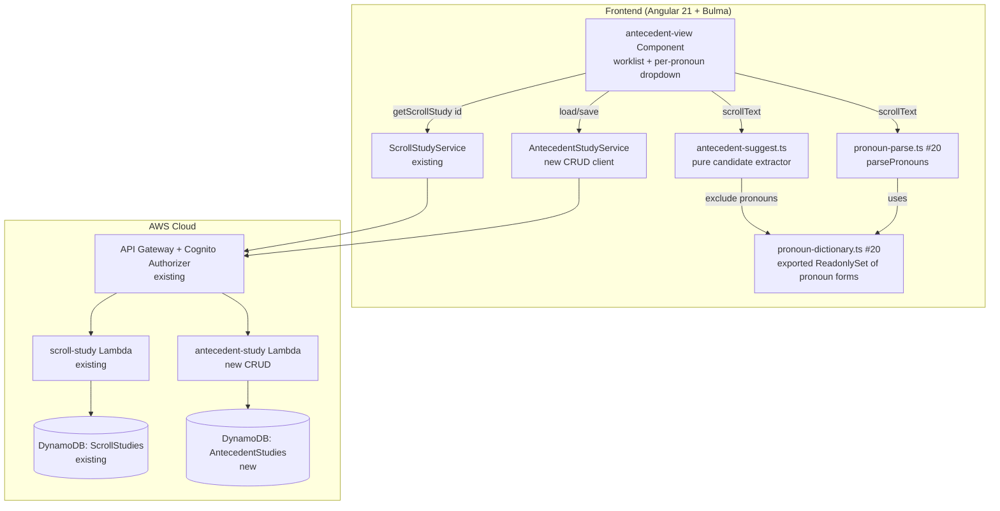
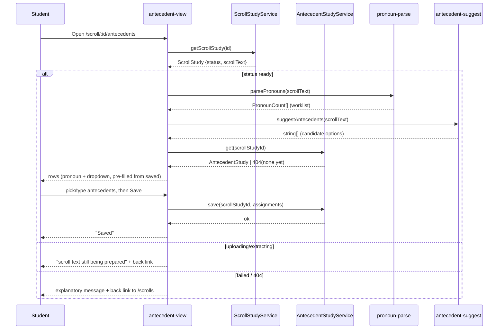

# Design Document: Antecedent Analysis (Step 6 — Identify Antecedents, Referents, Audience, and Speaker)

## Overview

This feature lets a Bible student assign an **antecedent** to each pronoun found in a book's scroll
and persist that work. It is the next slice of the planned **Step 6 — Pronoun Study** tool, building
directly on the **Parse Scroll for Pronouns** feature (issue #20,
`.kiro/specs/parse-scroll-for-pronouns/`): #20 turns a `ready` **Scroll Study** (Step 4) into a
deterministic worklist of pronouns, and this feature attaches an antecedent to each worklist unit
and saves it. Per the Step 6 reference (`docs/references/inductive-study-step-6.md`), an antecedent
is "the noun a pronoun or possessive adjective replaces" (e.g. "Jesus" for "He"); the student records
one antecedent per pronoun in the worklist.

The design is **additive** and follows the project's established stack: an Angular 21 standalone +
signals + Bulma frontend for the worksheet, and a serverless-first backend of one new DynamoDB
table + one new CRUD Lambda behind the existing Cognito-authorized API Gateway. The pronoun worklist
and the "suggested antecedents" are computed **client-side** from the scroll text already returned by
`ScrollStudyService` — reusing #20's pure `parsePronouns`/dictionary — so no AI call and no
app-provided Bible text is introduced, consistent with the product's copyright and cost constraints.
This feature introduces the first **persisted** Step-6 record (#20 persisted nothing).

The MVP flow: open the antecedent worksheet for a `ready` scroll → the app parses the pronouns and
extracts candidate antecedents from the text → the student picks a suggested antecedent or types one
for each pronoun → save → reopen later with every selection restored.

## Architecture

The feature adds a new lazily-routed Angular component, a new client service for the Antecedent
Study CRUD API, a pure suggestion helper, and a new DynamoDB table + CRUD Lambda + API routes that
mirror the existing `scroll-study` / `book-study-crud` constructs exactly.





## Key design decision: worklist granularity

The central question is the **unit** an antecedent attaches to. The Step 6 reference identifies
antecedents **per pronoun occurrence** (in Colossians 2:13-15 the same "He" takes the Father in
several places, while other pronouns take distinct antecedents). But issue #20's `parsePronouns`
returns a **distinct-word** worklist (`{ word, count }`), not an occurrence list keyed by position,
and #20 explicitly defers per-occurrence navigation.

Two options were considered:

- **(a) Per distinct pronoun word.** One antecedent per distinct worklist word (what #20 actually
  produces today). Simple, matches the shipped-as-spec worklist, and matches the literal issue
  wording ("an antecedent can be selected for each pronoun **in the list**").
- **(b) Per occurrence.** One antecedent per in-text occurrence, which is the interpretively correct
  granularity but requires #20 to first expose per-occurrence positions — out of this issue's scope
  (#20's Out of Scope defers per-occurrence navigation) and would couple this feature to a change in
  another feature.

**Decision: (a) — one antecedent per distinct pronoun worklist unit**, keyed by the canonical
lower-cased pronoun word that #20 produces. Rationale: it is exactly the list #23 names, it keeps
this increment self-contained (no change to the #20 parse or data), and it is still useful — the
student records "who/what does *this pronoun* refer to in this book" at the granularity the current
worklist supports. The data model keys an assignment by an opaque `pronounKey` string (today the
pronoun word) so that **if #20 later yields per-occurrence units, this feature extends by making
`pronounKey` an occurrence id with no table or Lambda change** — this is called out in Risks and Out
of Scope. The requirements are written against "worklist unit" for exactly this reason.

## Components and Interfaces

### Frontend (Angular 21 standalone, signals, Bulma)

**`antecedent-view` component** (`src/app/antecedent-view/antecedent-view.component.ts`), a new
standalone component mirroring the structure of the existing `scroll-view` and `book-study-detail`
components (`ChangeDetectionStrategy.OnPush`, `ActivatedRoute` param, signal-based view state). It:

- reads `scrollStudyId` from the route and calls `ScrollStudyService.getScrollStudy(id)` (the same
  authenticated path #20's pronoun view uses — no new scroll service);
- holds a `state` signal (`'loading' | 'ready' | 'preparing' | 'failed' | 'error'`), a `study`
  signal, a `rows` signal (the worklist rows, each `{ pronounKey, word, count, antecedent }`), an
  `options` signal (`string[]`, the shared dropdown options), and a `saving`/`saveError` signal
  pair;
- distinguishes a *not found* study (404) from a *transient* load failure (network/5xx) in the
  `getScrollStudy` `error` callback typed `(err: { status?: number })` —
  `state.set(err?.status === 404 ? 'failed' : 'error')` — the same branch
  `book-study-detail.component.ts` uses. 404/`failed` is terminal (back link to `/scrolls`); a 5xx is
  recoverable with a Retry button;
- on a `ready` study, computes the worklist once via `parsePronouns(study.scrollText)` (imported from
  #20's `src/app/pronoun-parse.ts`; the dictionary it uses lives in #20's
  `src/app/pronoun-dictionary.ts`), computes `options` via `suggestAntecedents(study.scrollText)`
  (new helper, below), then calls `AntecedentStudyService.get(scrollStudyId)` to pre-fill each row's
  `antecedent` from any saved record and to seed `options` with saved antecedents;
- renders a Bulma `table`/list, one row per worklist unit, each with the pronoun word, its count, and
  a user-editable dropdown control bound to that row's `antecedent`;
- offers a **Save** button that calls `AntecedentStudyService.save` with the non-empty assignments and
  surfaces success/failure (Requirement 4). The empty-state (no pronouns), `preparing`, `failed`, and
  `error` states render the same notification patterns as #20's pronoun view.

`data-testid`s are namespaced to this view: `antecedent-table`, `antecedent-row`, `antecedent-word`,
`antecedent-select`, `antecedent-add`, `antecedent-clear`, `antecedent-save`, `antecedent-empty`,
`antecedent-preparing`, `antecedent-failed`.

**The user-editable dropdown.** Two options were considered: a native `<select>` (Bulma `.select`)
plus a separate "add antecedent" text input, versus a third-party combobox library. **Decision: a
Bulma `.select` bound to the row's `antecedent` plus a small inline text input + "Add" button that,
on confirm, trims the value, adds it to `options` (case-insensitive de-dup) and sets it as the row's
antecedent.** Rationale: the project uses Bulma CSS only (no JS component library) and signals, so a
native select + input keeps the dependency surface at zero and is fully keyboard/screen-reader
accessible without extra ARIA plumbing. The select includes a blank first option (`— none —`) so
clearing is just selecting it (Requirement 3 criterion 4). This is the "user-editable dropdown":
options come from suggestions + student additions, and free text is always available via the Add
input.

**New vs. extending #20's pronoun view.** Options: (a) add antecedent editing into #20's
`pronoun-view`, or (b) a **new, separate `antecedent-view`** on its own route. **Decision: (b)** —
#20 is a read-only parse/worklist surface that persists nothing, while this feature adds editing and
persistence; keeping them separate avoids complicating #20's component and specs (the same reasoning
#20 used to stay separate from `scroll-view`). `antecedent-view` *reuses* #20's pure `parsePronouns`
(`pronoun-parse.ts`) and the exported pronoun set (`pronoun-dictionary.ts`) and the scroll service,
but does not modify #20's component.

### Routing and navigation

A new lazily-loaded route is added to `src/app/app.routes.ts` (additive; existing routes untouched),
nested under the scroll id to keep the "a scroll's antecedents" relationship explicit and let the
view read the same `scrollStudyId` param:

```
scroll/:scrollStudyId/antecedents  →  antecedent-view
```

The student reaches it from #20's pronoun view (a **"Assign antecedents (Step 6)"** link added to
the pronoun view's `ready` state — the one additive change to that component) and/or directly from
the scroll view; the exact entry link placement follows whatever #20 ships. No new top-level navbar
entry is added (the view is reached contextually from a specific scroll), matching #20's navigation
decision.

### Build ordering rule: this feature MUST be built on a merged #20

The frontend half of this feature (`antecedent-view`, `antecedent-suggest.ts`) imports two symbols
that **only exist once #20 is merged**: `parsePronouns` from `src/app/pronoun-parse.ts` and the
pronoun-dictionary set from `src/app/pronoun-dictionary.ts`. Those files do not exist in `src/`
today (`#20` is still only a spec at `.kiro/specs/parse-scroll-for-pronouns/`). This is a **hard
build-ordering rule, not a sequencing note**:

- **This issue (#23) MUST be built on top of a merged #20.** If #20 is not merged when the build
  phase starts, the build agent SHALL stop and mark the issue `agent-blocked` (it cannot import a
  file that does not exist, and the frontend acceptance criteria below cannot be satisfied or
  tested). It MUST NOT re-create #20's parser or dictionary to work around the gap — doing so would
  violate the single-source-of-truth invariant (one pronoun definition in the code).
- **Which criteria are blocked until #20 lands.** Requirement 1 criteria 1, 2, 3, 5 (worklist
  derivation and empty-state depend on `parsePronouns`), all of Requirement 2 (suggestion depends on
  the pronoun dictionary), all of Requirement 3 (the per-pronoun dropdown is per worklist row), and
  Requirement 4 criteria 1, 3, 5, 6 (the saved set is keyed to worklist units). These are
  **unverifiable at build time** without the merged #20 parser and dictionary.
- **What is independent of #20.** The backend half — the `AntecedentStudies` table, the
  `AntecedentStudyFn` Lambda, its API routes, and their CDK/Lambda tests — depends on nothing from
  #20 and can be built and fully tested in isolation (the Lambda tests pass an `assignments` array
  directly; they never call `parsePronouns`). If a partial landing is ever desired, the backend can
  land first, but the **feature is not complete** (and the issue not closable) until the merged #20
  lets the frontend half build and its criteria be verified.

### Antecedent suggestion helper (`src/app/antecedent-suggest.ts`)

One pure, exported function (no Angular, no I/O — unit-testable, mirroring
`english-definition.normalize.ts`, `bible-books.ts`, and #20's `pronoun-parse.ts`):

```typescript
/** Distinct candidate antecedent terms extracted from scroll text, sorted asc, de-duped
 *  case-insensitively, excluding pronoun-dictionary words. Pure and deterministic. */
export function suggestAntecedents(text: string): string[];
```

**Extraction rule.** Walk the text and collect capitalised word tokens (`/[A-Z][a-z]+/` runs) that
are **not** sentence-initial-only (a conservative proper-noun heuristic: a capitalised word that
either appears somewhere not immediately after sentence-ending punctuation, or appears more than
once), excluding any token whose lower-cased form is in #20's pronoun dictionary (Requirement 2
criterion 3). De-duplicate case-insensitively, keep the first-seen original casing, and sort
ascending. This is a deliberately simple, deterministic heuristic — it is *suggestions*, not
authoritative parsing; the student edits freely. It never throws; `suggestAntecedents('')` returns
`[]`.

**Single-source dependency on #20's dictionary (hard coupling).** The "exclude pronoun-dictionary
words" rule (Requirement 2 criterion 3) MUST consume the **exact same** pronoun set #20 owns — not
a private copy. `antecedent-suggest.ts` therefore imports it directly from #20's dictionary module.

**The export symbol name is #20's to decide, not this spec's.** #20's design
(`.kiro/specs/parse-scroll-for-pronouns/design.md`, "Pronoun dictionary" section) commits only to
"a fixed, exported constant: a `ReadonlySet<string>` of lower-cased pronoun and possessive-adjective
forms" in `src/app/pronoun-dictionary.ts`; it does **not** name the exported identifier. This spec
does not own that name, so it does not assert one. The build agent imports the single exported
`ReadonlySet<string>` of lower-cased pronoun forms from `./pronoun-dictionary`, binding to **whatever
identifier #20 actually ships**:

```typescript
// Import the single exported ReadonlySet<string> of lower-cased pronoun forms that
// #20 ships in src/app/pronoun-dictionary.ts. #20's design does not fix the export name,
// so bind to whatever identifier that file exports (shown here as PRONOUN_DICTIONARY for
// readability only — if #20 exports it under a different name, update this import to match;
// never re-declare the set).
import { PRONOUN_DICTIONARY } from './pronoun-dictionary';
```

`suggestAntecedents` lower-cases each candidate token and skips it when the imported set
`.has(lowerToken)`. It MUST NOT declare its own pronoun list or re-derive one; this preserves the
invariant that there is exactly one pronoun definition in the code (shared with `parsePronouns`).
Because `pronoun-dictionary.ts` does not exist until #20 merges, this helper cannot be implemented
or tested until then — this is the frontend half of the build-ordering rule above, and the exact
export name becomes knowable only once #20 is merged (the build agent reads it from the shipped
file, not from this spec).

**Why a heuristic, not AI.** AI suggestion was rejected: it would add a Bedrock call (cost + the
copyright constraint that AI prompts contain no copyrighted text — the scroll text is the student's
own, but routing it to Bedrock for this is unnecessary) and non-determinism. The product's "no
copyrighted Bible text" and cost-minimal stance favor a client-side heuristic over the already-held
scroll text.

### Antecedent Study client service (`src/app/antecedent-study.service.ts`)

A new `@Injectable({ providedIn: 'root' })` service mirroring `BookStudyService` /
`ScrollStudyService` (uses `HttpClient`, `environment.apiUrl`, user scoping via the existing
`user-id.interceptor`). It maps the DynamoDB record shape to a frontend `AntecedentStudy` the way
`toBookStudy`/`toScrollStudy` do.

The frontend domain interfaces `AntecedentStudy` and `AntecedentAssignment` are declared **once**
in `src/app/models.ts` (beside `BookStudy`) and **imported** by the service and the component. Note
the repo is **mixed** on where domain interfaces live: `BookStudy` is declared in `models.ts` and
imported by `book-study.service.ts`, but `ScrollStudy`/`ScrollStudyRecord` are declared **inline** in
`scroll-study.service.ts`. This is a genuine 50/50 split, not a settled convention — so, although
this feature mirrors `scroll-study` for its backend and component structure, it deliberately follows
the **`BookStudy` placement** for the interface home (declare in `models.ts`, import where used)
rather than the inline `ScrollStudy` pattern. `models.ts` is the better pattern (one authoritative
declaration), and stating the choice explicitly removes any ambiguity about which precedent wins. See
Data model for their shape.

```typescript
import { AntecedentStudy, AntecedentAssignment } from './models';

@Injectable({ providedIn: 'root' })
export class AntecedentStudyService {
  /** GET the saved antecedent study for a scroll; 404 if none saved yet. */
  get(scrollStudyId: string): Observable<AntecedentStudy>;
  /** PUT the full set of assignments for a scroll (create-or-replace). */
  save(scrollStudyId: string, assignments: AntecedentAssignment[]): Observable<void>;
}
```

### Backend: Antecedent Study CRUD Lambda (`infra/lambda/antecedent-study/index.ts`)

A new Lambda mirroring `scroll-study`/`book-study-crud`: it reads the Cognito `sub` from
`event.requestContext.authorizer.claims.sub`, uses `DynamoDBDocumentClient`, and reuses the shared
`corsResponse`/`getRequestOrigin` helpers. The Antecedent Study is **keyed one-per-scroll-per-user**
(the natural key is the `scrollStudyId`), so there is no separate generated id and no list route
needed for the MVP — the worksheet always loads by its scroll id:

- `GET /scroll-studies/{scrollStudyId}/antecedents` → return the record or `404` if none saved.
- `PUT /scroll-studies/{scrollStudyId}/antecedents` → validate the body, upsert the record
  (preserve `createdAt`, set `updatedAt`) via the explicit read-before-write below, return `200`.

**`createdAt`-preserving upsert (authoritative mechanism).** Neither `scroll-study` nor
`book-study-crud` has an update-in-place path today — `book-study-crud` only ever *creates* with
`createdAt == updatedAt == now`. A naive `PutCommand` of a freshly-built record would therefore
**overwrite `createdAt` with the current time on every save**, silently violating Requirement 4's
"`createdAt` preserved across updates" property. The `PUT` handler MUST read before it writes:

```typescript
async function saveAntecedentStudy(
  userId: string,
  scrollStudyId: string,
  assignments: AntecedentAssignment[], // already validated + empties dropped
): Promise<void> {
  const now = new Date().toISOString();
  const key = { PK: `USER#${userId}`, SK: `ANTECEDENT#${scrollStudyId}` };

  // 1) read the existing item (own partition only)
  const existing = await docClient.send(new GetCommand({ TableName: tableName, Key: key }));
  const createdAt = (existing.Item as AntecedentStudyRecord | undefined)?.createdAt ?? now;

  // 2) write, carrying createdAt forward (or now on first save)
  const record: AntecedentStudyRecord = {
    ...key,
    scrollStudyId,
    userId,
    assignments,
    createdAt,          // preserved on update; == now on first create
    updatedAt: now,     // always advances
  };
  await docClient.send(new PutCommand({ TableName: tableName, Item: record }));
}
```

The `GetCommand` is scoped to `PK=USER#<sub>`, so a user can only ever read/overwrite their own
record; there is no cross-user path. This read-before-write is the single authoritative mechanism
for the `createdAt` invariant (owned by the Lambda — see Invariant ownership) and is covered by a
Lambda test that issues two `PUT`s and asserts `createdAt` is unchanged while `updatedAt` advances
(mocked `GetCommand` returning the first-save item on the second call).

Nesting the antecedent routes under the existing `scroll-studies/{scrollStudyId}` resource keeps the
ownership relationship explicit and reuses the same path param the scroll routes use. The Lambda is a
**new** function (`AntecedentStudyFn`) with its own construct id and physical name
(`n('AntecedentStudy')`), not a change to `scrollStudyFn`, so the existing scroll Lambda and its
tests are untouched.

### Infrastructure (`infra/lib/word-study-tool-stack.ts`, additive)

Mirroring the `ScrollStudies` table + `ScrollStudyFn` + routes block already in the stack:

- **`AntecedentStudies` DynamoDB table** (new construct id `AntecedentStudies`, physical name
  `n('AntecedentStudies')`): `PK`/`SK` string keys, `PAY_PER_REQUEST`, `AWS_MANAGED` encryption,
  `removalPolicy: config.statefulRemovalPolicy`. No `GSI1` is needed for the MVP because records are
  fetched by exact key (`PK=USER#<sub>`, `SK=ANTECEDENT#<scrollStudyId>`), not listed; a GSI can be
  added later if a "my antecedent studies" list surface is built. No PITR (consistent with
  `BookStudies` — "PITR on WordStudies only" stays true, no new `StageConfig` field).
- **`AntecedentStudyFn` `NodejsFunction`** with `commonLambdaProps`, `functionName: n('AntecedentStudy')`,
  its own `fnLogs('AntecedentStudyFn')` log group, `entry` pointing at the new Lambda, and
  `ANTECEDENT_STUDIES_TABLE_NAME` + `ALLOWED_ORIGINS` env; `antecedentStudiesTable.grantReadWriteData(fn)`
  (least privilege: this table only).
- **Routes**: on the existing `scroll-studies/{scrollStudyId}` resource, add a child resource
  `antecedents` with `GET` and `PUT` methods wired to the new integration with `authMethodOptions`.

These additions follow the delivery rule that new constructs are *added*, never renaming existing
stateful ids/names, and touch no prod value in `stage-config.ts`.

## Data model / API changes

### New DynamoDB table: `AntecedentStudies`

Same key shape as the other per-user tables; keyed one record per scroll per user.

```typescript
interface AntecedentStudyRecord {
  PK: string;            // "USER#<sub>"
  SK: string;            // "ANTECEDENT#<scrollStudyId>"
  scrollStudyId: string;
  userId: string;        // Cognito sub
  assignments: AntecedentAssignment[];  // only non-empty antecedents are stored
  createdAt: string;     // ISO 8601
  updatedAt: string;     // ISO 8601
}

interface AntecedentAssignment {
  pronounKey: string;    // canonical lower-cased pronoun word (opaque; see granularity decision)
  antecedent: string;    // trimmed, 1–200 chars
}
```

**Interface homes (one declaration each, no inline duplicates).**
- Backend: `AntecedentStudyRecord` and the backend `AntecedentAssignment` are added to
  `infra/lambda/shared/models.ts`, beside the existing `ScrollStudyRecord`/`BookStudyRecord`; the
  `antecedent-study` Lambda imports them from `../shared/models`.
- Frontend: `AntecedentStudy` and `AntecedentAssignment` are added to `src/app/models.ts`, beside
  `BookStudy` (the frontend repo is mixed — `BookStudy` lives in `models.ts` while `ScrollStudy` is
  inline in `scroll-study.service.ts`; this feature deliberately follows the `BookStudy` placement,
  see the client-service section); the `AntecedentStudyService` and `antecedent-view` component import
  them from `./models`. The service's `get` maps the record to `AntecedentStudy` (dropping the
  `PK`/`SK`), exactly as `toBookStudy`/`toScrollStudy` do.

Neither interface is declared inline in a service or component file.

### New API routes (both Cognito-authorized)

| Method | Path | Body | Response |
|---|---|---|---|
| `GET` | `/scroll-studies/{scrollStudyId}/antecedents` | — | `200` record, or `404` if none saved |
| `PUT` | `/scroll-studies/{scrollStudyId}/antecedents` | `{ assignments: AntecedentAssignment[] }` | `200` on upsert |

No change to any existing route or record. No new un-hashed `public/` asset and no new CDK context
lookup, so the `DeployShell`/`DeployAssets` include/exclude lists and `cdk.context.json` are
unchanged.

## Error handling

| Operation | Failure condition | How detected | Recoverable? | Caller receives | Logged |
|---|---|---|---|---|---|
| `getScrollStudy(id)` | scroll not found / not owned (404) | `err?.status === 404` → `failed` | n/a (wrong id) | `failed` state + back link to `/scrolls` | no (expected) |
| `getScrollStudy(id)` | network / 5xx | `err?.status !== 404` → `error` | yes | `error` state + Retry (re-issues GET) | browser console only |
| worklist derive | scroll `uploading`/`extracting` | `study.status` | yes (return later) | `preparing` notification + back link to `/scroll/:id` | no |
| worklist derive | scroll `failed` | `study.status` | no (re-upload) | `failed` notification (reason) + back link to `/scrolls` | no |
| `AntecedentStudyService.get` | no saved record yet (404) | HTTP 404 | n/a | treated as "empty study" — all rows start unassigned (not an error) | no |
| `AntecedentStudyService.get` | network / 5xx | HTTP status | yes | worksheet still usable from parse; a non-blocking "could not load saved antecedents" notice + Retry | console |
| `AntecedentStudyService.save` | validation rejected (400) | HTTP 400 | yes | `saveError` set; selections stay editable; message shown | server-side (Lambda) |
| `AntecedentStudyService.save` | network / 5xx | HTTP status | yes | `saveError` set; selections stay editable; Retry | server-side |
| suggestion / parse | any text input | — | n/a (never throws) | always returns a value (possibly empty) | no |

**Lambda-side error handling** mirrors `scroll-study`/`book-study-crud`: a top-level `try/catch`
returns `corsResponse(500, …)` on unexpected errors; a missing/empty `sub` returns `400`
("Missing authentication."); a missing `scrollStudyId` path param returns `400`; a `GET` with no
record returns `404`. Validation failures on `PUT` return `400` with a specific message.

**Validation rules (external inputs).**
- `scrollStudyId` (route param): required, non-empty; passed straight through. A record for a
  scroll the `sub` does not own is simply absent → `404` on `GET` and a fresh record on `PUT` keyed
  to this user (a user can only ever write under their own `USER#<sub>` partition, so there is no
  cross-user write).
- `assignments` (PUT body): must be an array (an empty array `[]` is valid — see empty-worksheet
  save below); each element must have a non-empty string `pronounKey` and an `antecedent` string.
  The Lambda first **trims** each `antecedent`, then **drops** any element whose trimmed `antecedent`
  is empty (these are unassigned rows, not errors). It **rejects** (400) a body that is not an array,
  an element with a missing/wrong-typed field, or an element whose trimmed `antecedent` exceeds 200
  characters — the server **rejects over-length, it does not truncate** (Requirement 3 criterion 6).
  The client's `maxlength=200` input cap means over-length normally never reaches the server; the
  server reject is defense-in-depth and the single authority on the 200-char invariant. The two
  tiers agree on the outcome (reject), so there is no silent truncation anywhere.
- **Empty-worksheet save (Requirement 4 criterion 5):** a `PUT` whose assignments are all empty
  after the drop step yields `assignments: []`. The handler still **upserts** a record with
  `assignments: []` through the same `createdAt`-preserving path above — it does **not** delete the
  record and does **not** leave a prior non-empty set in place. The operation is idempotent (saving
  an all-empty worksheet twice is indistinguishable from saving it once). There is no `DELETE` route
  in this increment. A Lambda test asserts that a `PUT` with all-empty assignments stores
  `assignments: []` and that a subsequent `GET` returns the empty-assignment record (not a 404).
- `scrollText` (client-side, from the record): any string including empty/whitespace/HTML-significant
  chars; `parsePronouns` and `suggestAntecedents` tolerate all (empty → empty list), per #20's parse
  contract and Requirement 2.

**Invariant ownership.** User-scoping is owned by the backend exactly as the other CRUD Lambdas own
it: all reads/writes are under `PK=USER#<sub>`, so a student can only touch their own antecedent
records; the frontend adds no new trust boundary. The "assignment antecedent is non-empty and ≤200
chars" invariant is owned by the Lambda `PUT` validation (authoritative — it rejects over-length
with 400, never truncates), with the client `maxlength=200` enforcing the same for UX. The
"`createdAt` preserved across updates" invariant is owned by the Lambda's read-before-write `PUT`
(the single mechanism; see the upsert pseudocode above). The "a pronoun worklist unit maps to the
#20 parse" invariant is owned by reusing #20's `parsePronouns` (`pronoun-parse.ts`) and the exported
pronoun set (`pronoun-dictionary.ts`) unchanged, never a copy — there is exactly one pronoun
definition in the code.

## Testing strategy

All frontend tests run under the existing Angular + vitest harness; infra tests under the infra
vitest harness. Nothing in this feature calls AWS at test time — the Lambda tests mock the DynamoDB
document client, and `infra/test/setup-no-aws.ts` points any unmocked call at a dead endpoint.

Unit (pure helper) — `antecedent-suggest.spec.ts`: determinism (same text → same ordered list),
case-insensitive de-dup, exclusion of pronoun-dictionary words, empty input → `[]`, never throws;
property-style cases with `fast-check` following `bible-books.spec.ts`.

Component — `antecedent-view.component.spec.ts` (Angular TestBed, stubbed `ScrollStudyService` and
`AntecedentStudyService`): `ready` scroll renders one row per `parsePronouns` word; a saved study
pre-fills matching rows; selecting an option sets the row antecedent; typing + Add inserts a new
option (de-duped) and sets it; clearing resets to empty; Save calls `save` with only non-empty
assignments and reports success; a `save` failure keeps selections editable and shows the error;
`uploading`/`extracting` → `preparing`; `failed`/404 → `failed`; 5xx → `error` with working Retry;
empty-text scroll → empty-state with no Save; saving after clearing every selection calls `save`
with `[]` (empty-worksheet save, R4 criterion 5); a stale saved pronoun no longer in the parse is
ignored on load (Requirement 4 criterion 6); a regression assertion that the view calls only
`ScrollStudyService.getScrollStudy` and the two `AntecedentStudyService` methods.

Lambda — `infra/lambda/antecedent-study/index.test.ts` (mocked `DynamoDBDocumentClient`): `GET`
returns the record / `404` when absent; `PUT` upserts; **two sequential `PUT`s preserve `createdAt`
and advance `updatedAt`** (the second `GetCommand` mock returns the first-save item, asserting
read-before-write); drops empty-antecedent elements after trim; **a `PUT` with all-empty assignments
stores `assignments: []` and a following `GET` returns that empty record (not 404)**; **rejects an
over-length antecedent (>200 chars after trim) with 400 — asserting reject, not a truncated save**;
rejects a non-array body and malformed elements (400); missing `sub` → 400; missing path param →
400; unexpected error → 500; CORS headers via the shared helper.

CDK / infra — `infra/test/word-study-tool-stack.test.ts` gains assertions for the new
`AntecedentStudies` table (keys, billing, encryption, removal policy per stage), the new
`AntecedentStudyFn` (env var, least-privilege grant to the new table only, its log group), and the
two new authorized routes under `scroll-studies/{scrollStudyId}/antecedents`. One existing assertion
**must** change: the two hardcoded log-group counts `expect(groups).toHaveLength(7)` (lines ~210 and
~342) become `8`, because the new `AntecedentStudyFn` adds one log group. The `PROD_LOGICAL_IDS`
array (line ~12) needs **no** edit — it is asserted with `expect(ids).toContain(id)` (a must-contain
subset check, line ~158), so a new construct id does not have to be added to it, and no existing id
is renamed. This is consistent with the "add constructs, never rename" rule.

## Risks

- **Worklist granularity (distinct word, not occurrence).** Assigning one antecedent per distinct
  pronoun word cannot capture that the same word takes different antecedents in different places
  (the reference's Colossians example). This is accepted for this increment because #20's worklist is
  distinct-word; the data model's opaque `pronounKey` lets a later increment switch to per-occurrence
  keys with no table/Lambda change. Called out in Out of Scope.
- **Suggestion heuristic precision.** The capitalised-proper-noun heuristic will miss lower-case or
  multi-word antecedents ("the certificate of debt") and may include non-antecedent capitalised words
  (sentence starts, place names that are not the intended antecedent). This is accepted because the
  dropdown is user-editable: the student types anything the suggestions miss (Requirement 3), and the
  suggestions are a convenience, not an authority.
- **Hard dependency on a merged #20 (build-ordering rule).** The frontend half imports
  `parsePronouns` (`src/app/pronoun-parse.ts`) and the exported pronoun `ReadonlySet<string>`
  (`src/app/pronoun-dictionary.ts`, under whatever name #20 ships) — files that only exist once #20
  is merged. Per the **Build ordering rule** in the Architecture
  section, #23 MUST be built on a merged #20; if #20 is not merged the build agent stops and marks
  the issue `agent-blocked` rather than re-creating the parser/dictionary (which would break the
  single-pronoun-definition invariant). The CRUD/table/Lambda half is independent of #20 and fully
  testable in isolation, but the feature is not complete until the merged #20 lets the frontend half
  build and its criteria (R1.1/1.2/1.3/1.5, all of R2 and R3, R4.1/3/5/6) be verified. This is a
  stated gate, not an optimistic sequencing note.
- **No "list my antecedent studies" surface.** Records are keyed one-per-scroll and fetched by scroll
  id, so there is no standalone list of antecedent studies (you reach them via the scroll). A list
  surface would need a `GSI1` (updated-at) like the other tables; deferred as Out of Scope since the
  scroll is always the entry point.
- **Stale saved pronouns after re-upload.** If a scroll is re-uploaded with different text, saved
  antecedents whose pronoun no longer appears are ignored on load (Requirement 4 criterion 6) rather
  than migrated; they remain in the stored record harmlessly until the next save rewrites the set.

## Out of scope

- The pronoun list/parse/highlight itself (issue #20) — consumed, not reimplemented.
- **Referent**, **audience**, **speaker**, and **point-of-view** identification (the rest of Step 6).
- AI-generated suggestions or any Bedrock/AI call.
- Per-occurrence antecedents keyed to verse/offset positions (requires #20 to expose occurrences;
  the data model is forward-compatible but adding occurrence positions is not in scope).
- Classifying pronouns by type/person/gender/number/case, or grammatically validating a chosen
  antecedent.
- A top-level "Antecedent Studies" list surface and the `GSI1` it would require.
- Serving or displaying copyrighted Bible verse text.
- Any change to the Scroll Study upload/extraction flow, the Word Study tool, or the Book Study tool.

## Responses to design review (CHANGES_REQUESTED)

### Round 1 (prior pass)

Revision pass addressing every finding from the first review. All were addressed; none backlogged or
ignored.

- **H1 (frontend depends on unimplemented #20; no decision rule) — addressed.** Added an explicit
  **Build ordering rule** (Architecture): #23 MUST be built on a merged #20, else the build agent
  stops and marks the issue `agent-blocked` and MUST NOT re-create #20's parser/dictionary. The rule
  enumerates exactly which criteria are unverifiable until #20 lands (R1.1/1.2/1.3/1.5, all R2, all
  R3, R4.1/3/5/6) and which half (backend) is independent. The "Dependency on #20" risk was rewritten
  from a "sequencing note" to this hard gate.
- **H2 (`createdAt`-preserving upsert under-specified) — addressed.** The `PUT` section now specifies
  the authoritative read-before-write mechanism with pseudocode (`GetCommand` the existing item,
  carry its `createdAt` forward, else `createdAt = updatedAt = now`), notes that neither
  `book-study-crud` nor `scroll-study` has this path today, assigns the invariant to the Lambda, and
  adds a two-`PUT` Lambda test asserting `createdAt` is unchanged while `updatedAt` advances.
- **M1 (over-length handling ambiguous / client-server mismatch) — addressed.** R3 criterion 6 and
  the validation section now state one behavior for both tiers: client `maxlength=200` caps input,
  server **rejects (400)** a trimmed antecedent over 200 (never truncates). The Lambda test asserts
  400, not a truncated save. Invariant ownership updated to match.
- **M2 (all-empty save unspecified) — addressed.** Added R4 criterion 5 and an "Empty-worksheet
  save" paragraph: a `PUT` with zero non-empty assignments idempotently upserts `assignments: []`
  (no delete route, no stale prior set). Covered in the save correctness property, the Lambda test,
  and a component test.
- **M3 (`suggestAntecedents` dictionary coupling not enforced) — addressed.** The suggestion-helper
  section requires consuming #20's single exported pronoun `ReadonlySet<string>` from
  `src/app/pronoun-dictionary.ts`, never a copy, and ties the file's absence to the H1 build gate.
  Architecture diagram and prose updated to show both `pronoun-parse.ts` and `pronoun-dictionary.ts`.
  (The exact import *symbol name* is further corrected in Round 2 M1 below — round 1 named it
  literally, which round 2 found #20 never actually commits to.)
- **N1 (interface home inconsistent) — addressed.** Interfaces are now declared once:
  `AntecedentStudyRecord` + backend `AntecedentAssignment` in `infra/lambda/shared/models.ts`;
  frontend `AntecedentStudy` + `AntecedentAssignment` in `src/app/models.ts`. The service and
  component import them; no inline duplicate.
- **N2 (`PROD_LOGICAL_IDS` "updated additively" misleading) — addressed.** The CDK testing paragraph
  now states `PROD_LOGICAL_IDS` needs no edit (it is a `toContain` subset check) and that the real
  required change is the two hardcoded log-group counts `toHaveLength(7) → 8`.

### Round 2 (this pass)

Addressing every finding in `design-review.json` / `design-review.md` (2 MEDIUM). Both addressed;
none backlogged or ignored.

- **M1 (design assumes an exact dictionary symbol name #20 never commits to) — addressed.** I
  re-read #20's design (`.kiro/specs/parse-scroll-for-pronouns/design.md`, "Pronoun dictionary"
  section): it commits only to "a fixed, exported constant: a `ReadonlySet<string>` of lower-cased
  pronoun and possessive-adjective forms" and never names the export. I took the review's option
  (a): this spec no longer asserts a name it does not control. The suggestion-helper section now
  states "import the single exported `ReadonlySet<string>` of lower-cased pronoun forms from
  `./pronoun-dictionary`, binding to whatever identifier #20 ships; if it differs, the build agent
  updates this import to match (never re-declares the set)." The literal `PRONOUN_DICTIONARY` remains
  only as an explicitly-labelled readability placeholder in the code comment and import line, with
  the surrounding prose making clear it is not normative and the real name becomes knowable only once
  #20 is merged. The architecture diagram node, the component/reuse prose, the invariant-ownership
  line, and the Risks dependency bullet were all changed from the literal name to "the exported
  pronoun set." I chose (a) over (b) (fixing the name in #20's spec as a cross-spec contract) because
  this is #23's spec and editing another issue's committed spec to satisfy this one would couple the
  two specs the wrong way; #20 remains the single owner of its export name, and this spec defers to
  whatever it ships.
- **M2 ("interface home" cited as a settled convention but only half true) — addressed.** Verified
  the review's claim: `models.ts` holds `BookStudy` and `book-study.service.ts` imports it, but
  `ScrollStudy` (and `ScrollStudyRecord`) are declared **inline** in `scroll-study.service.ts`, so
  the repo is genuinely a 50/50 split. I kept the `models.ts` placement decision (it matches
  `BookStudy` and is the better pattern) but corrected the premise in the client-service and
  data-model sections: they now state plainly that the repo is mixed and that this feature
  deliberately follows the `BookStudy` placement, rather than calling it "the convention," so there
  is no conflict with the "mirror `scroll-study`" guidance elsewhere.
