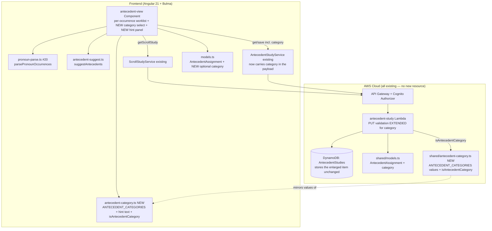
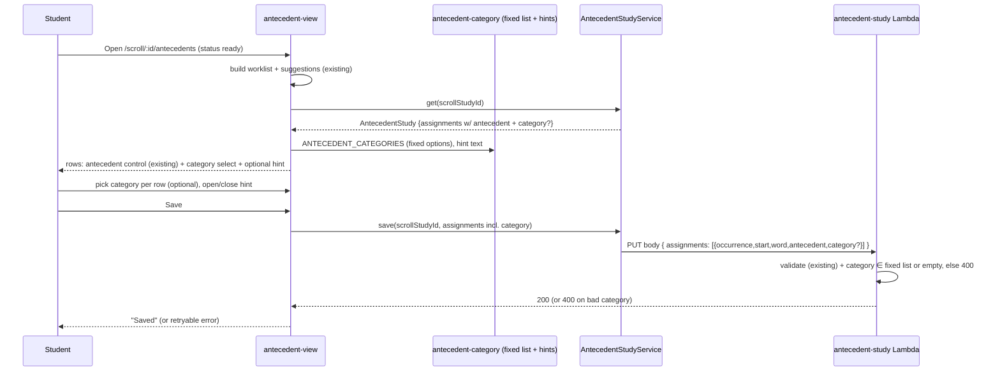

# Design Document: Antecedent Category Classifier (Step 6 — Identify Antecedents, Referents, Audience, and Speaker)

## Overview

This feature lets a Bible student **classify each antecedent they have assigned** by selecting a
**category** from a fixed list, and offers an **optional hint** that explains the categories. It is a
small, additive slice on top of the shipped **Antecedent Analysis** feature
(`.kiro/specs/antecedent-analysis/`, on `main`): that feature already derives a per-occurrence pronoun
worklist from a `ready` Scroll Study, lets the student assign an antecedent to each occurrence, and
persists the set as an **Antecedent Study** record (`AntecedentAssignment =
{ occurrence, start, word, antecedent }`, one item per scroll per user in the `AntecedentStudies`
DynamoDB table, served by the `antecedent-study` CRUD Lambda behind the existing Cognito-authorized
API Gateway). This feature adds exactly one thing to that pipeline: a `category` on each assignment.

The design is deliberately minimal and additive — it adds **no** AWS resource, table, Lambda, API
route, or service. It extends the existing `AntecedentAssignment` interface (frontend `models.ts` and
backend `shared/models.ts`), adds a category control (a Bulma `<select>`) and an optional hint panel
to the existing `antecedent-view` component, extends the existing `antecedent-study` Lambda's PUT
validation, and declares the fixed category list **once** in a new pure frontend module so the
worklist control, the hint, and the server validation all read the same set. Per the Step 6 reference
(`docs/references/inductive-study-step-6.md`), an antecedent is "the noun a pronoun or possessive
adjective replaces"; this feature records *what kind of thing* that antecedent is.

The flow is unchanged except for the new control: open the antecedent worksheet for a `ready` scroll →
assign antecedents (existing) → for each row with an antecedent, optionally pick a category from the
fixed list and consult the optional hint → save → reopen with antecedents **and** categories restored.

## Architecture





The one structural decision is **where the fixed category list lives**. Options: (a) inline the list
in `antecedent-view.component.ts`, (b) a new pure, framework-free module shared by the component and
(via a parallel backend copy) the Lambda, or (c) put it on `models.ts`. **Decision: (b)** — a new pure
module `src/app/antecedent-category.ts` that exports the ordered category list, the per-category hint
text, and an `isAntecedentCategory` guard, mirroring the project's existing pure, unit-testable helper
modules (`bible-books.ts`, `english-definition.normalize.ts`, `pronoun-parse.ts`,
`antecedent-suggest.ts`). This keeps the list out of the component (testable without Angular) and
gives the hint a single source so the options and the help can never drift (Requirement 2 criterion 3,
Non-Functional 2). The *type* alias (`AntecedentCategory`) and the enlarged `AntecedentAssignment`
interface live in `models.ts` beside the existing one, matching where `AntecedentAssignment` already
lives.

### Single source of truth across the client/server boundary

The server must validate against the **same** closed set the client offers (Requirement 4 criterion
3), but the repo compiles the Angular app (`src/`) and the Lambdas (`infra/lambda/`) as **separate**
TypeScript packages — the Lambda cannot import from `src/app/`. The project's established answer is a
**mirrored declaration**: `AntecedentAssignment` is already declared in **both** `src/app/models.ts`
and `infra/lambda/shared/models.ts`, kept in sync by hand (the same pattern used for every shared
record shape today). This feature follows that existing precedent rather than inventing a build-time
sharing mechanism:

- The canonical ordered category values and hint text live in `src/app/antecedent-category.ts`.
- The backend gets a small parallel constant — the **category values only** (no hint text, which is
  frontend-only) — in a **dedicated** shared module `infra/lambda/shared/antecedent-category.ts`
  (not piggy-backed on `shared/models.ts`), mirroring the `bible-books.ts` precedent that already
  lives as its own module in both `src/app/` and `infra/lambda/shared/`. It exports:

  ```typescript
  // infra/lambda/shared/antecedent-category.ts  (values only, no hint text)
  /** Backend mirror of the frontend ANTECEDENT_CATEGORIES. Kept in sync by hand; a drift-guard
   *  test (antecedent-category.test.ts) asserts this equals the same literal the frontend ships. */
  export const ANTECEDENT_CATEGORIES: readonly string[] = [
    'Deity', 'Person', 'Group', 'Thing', 'Place', 'Other',
  ];
  export function isAntecedentCategory(value: unknown): boolean {
    return typeof value === 'string' && ANTECEDENT_CATEGORIES.includes(value);
  }
  ```

  The `antecedent-study` Lambda imports from this module:
  `import { isAntecedentCategory } from '../shared/antecedent-category';` — the same `../shared/...`
  import style the handler already uses for `../shared/models` and `../shared/cors`.
- A **drift guard test** (see Testability) asserts the two value lists are identical, so a change to
  one that is not mirrored fails CI. This gives a single *effective* source of truth without crossing
  the package boundary at build time.

Rationale: this is the lowest-risk, convention-matching choice. A build-time symlink or shared package
would be new machinery for one small enum; the dedicated mirror module + guard test is exactly how the
codebase already shares `bible-books.ts` across the two packages, so it adds no new pattern. A
dedicated module (rather than extending `shared/models.ts`) matches that `bible-books.ts` precedent and
keeps the pure constant/guard separate from the record-shape interfaces in `models.ts`.

### The fixed category list

Declared once (ordered) in `src/app/antecedent-category.ts`. The members are derived from the Step 6
reference's worked annotations (Colossians 2:13-15 distinguishes Persons of the Trinity, human
persons/people, and things; John 12 adds a world/place sense) and kept deliberately small and closed:

```typescript
// src/app/antecedent-category.ts  (pure, no Angular, unit-testable)

/** The fixed, closed set of antecedent categories, in display order. Not user-editable. */
export const ANTECEDENT_CATEGORIES = [
  'Deity',          // a Person of the Trinity — Father, Son/Jesus, Holy Spirit
  'Person',         // a single human person — e.g. Paul, Moses, Pharaoh's daughter
  'Group',          // a group, people, or nation — e.g. the Colossians, the rulers and authorities
  'Thing',          // a thing or object — e.g. the certificate of debt
  'Place',          // a place or the world — e.g. "this world"
  'Other',          // a referent that fits none of the above / is unknown
] as const;

export type AntecedentCategory = (typeof ANTECEDENT_CATEGORIES)[number];

/** The unclassified sentinel used by the UI and persisted shape ('' = no category chosen). */
export const UNCLASSIFIED = '' as const;

/** Short, copyright-free explanation per category (keys === ANTECEDENT_CATEGORIES). */
export const ANTECEDENT_CATEGORY_HINTS: Readonly<Record<AntecedentCategory, string>> = {
  Deity: 'A Person of the Trinity — the Father, the Son (Jesus), or the Holy Spirit.',
  Person: 'A single human person named or implied in the text (e.g. Paul, Moses).',
  Group: 'A group, people, or nation (e.g. the Colossians, the rulers and authorities).',
  Thing: 'An object or abstract thing (e.g. the certificate of debt).',
  Place: 'A place, or the world and its ways (e.g. “this world”).',
  Other: 'A referent that fits none of the above, or that you have not yet determined.',
};

/** True iff value is a member of the fixed category list (used by UI reset-on-load and the mirror). */
export function isAntecedentCategory(value: unknown): value is AntecedentCategory {
  return typeof value === 'string' && (ANTECEDENT_CATEGORIES as readonly string[]).includes(value);
}

/** Normalize any stored value to a known category or '' (unclassified). Never throws. */
export function toAntecedentCategory(value: unknown): AntecedentCategory | '' {
  return isAntecedentCategory(value) ? value : UNCLASSIFIED;
}
```

The exact member names/labels are the one point surfaced to the maintainer in the spec PR (How to
review) — they are a reasonable reading of the reference, and because everything downstream reads this
one list, trimming or renaming members is a localized edit. The empty string `''` is the unclassified
sentinel (consistent with how the base feature already uses `''` for an unassigned antecedent), so the
`category` field is a simple string that is either `''` or one of the six members.

## Data model and API changes

### Enlarged assignment shape (additive)

The existing `AntecedentAssignment` gains one optional field, in **both** mirrored declarations:

```typescript
// src/app/models.ts  AND  infra/lambda/shared/models.ts (kept in sync — existing precedent)
export interface AntecedentAssignment {
  occurrence: number;   // existing — the key
  start: number;        // existing — context/migration
  word: string;         // existing — display
  antecedent: string;   // existing — trimmed, 1–200 chars
  category?: string;    // NEW — '' or one of ANTECEDENT_CATEGORIES; optional/additive
}
```

`category` is `string` (not the `AntecedentCategory` union) in the persisted interface so that
loading a legacy/unknown value does not break type-checking; the UI narrows it via
`toAntecedentCategory` on load. It is **optional** so legacy records (no `category`) remain valid
(Requirement 3 criterion 5).

### DynamoDB

No table change. `AntecedentStudies` stores the whole item; the extra attribute rides along. No GSI,
no key change, no `stage-config.ts` change, no CDK change.

### API — same routes, extended validation

- `GET /scroll-studies/{scrollStudyId}/antecedents` — unchanged; returns the record, now possibly
  including `category` on assignments. The frontend `toAntecedentStudy` mapper passes `assignments`
  through unchanged, so no mapper change is needed beyond the enlarged interface.
- `PUT /scroll-studies/{scrollStudyId}/antecedents` — the body shape is unchanged except each
  assignment may now carry `category`. The Lambda's `parsePutBody` is extended (see Components) to
  validate it.

## Components and Interfaces

### Frontend — `antecedent-view` component (extended)

The existing standalone, `OnPush`, signals-based component (`src/app/antecedent-view/
antecedent-view.component.ts`) is extended, not replaced:

- **`OccurrenceRow`** gains a `category: string` field (`''` default). `buildWorklist` sets it to `''`
  for every new row.
- **Category control.** Add a **new `<th>Category</th>` column** to the worklist table with the
  select in its own `<td>`, leaving the existing `Antecedent` cell markup and its tests untouched. The
  cell holds a Bulma `.select` bound to `row.category` with a blank first option (`— unclassified —`)
  and one option per `ANTECEDENT_CATEGORIES` member, via a new `setCategory(occurrence, value)` method
  that updates only the matching row (mirroring the existing `setAntecedent`). The select is rendered
  **disabled** (not hidden) when the row's antecedent is empty — a single deterministic binding
  `[disabled]="row.antecedent.trim().length === 0"` — so the column layout stays stable and the
  control is one testable binding (a category only has meaning with an antecedent, Requirement 1
  criterion 1 / Assumption A4). `setAntecedent(occurrence, '')` (clear) also resets that row's
  `category` to `''` (Requirement 1 criterion 5).
- **Pre-fill on load.** `loadSaved` currently maps saved `antecedent` by `occurrence`; it also maps
  `category`, passing each saved value through `toAntecedentCategory` so a legacy/unknown value renders
  as unclassified (Requirement 3 criteria 3–5, Requirement 1 criterion 3).
- **Save.** `save()` currently builds `AntecedentAssignment[]` from rows with a non-empty antecedent;
  it adds `category: row.category` (already `''` when unclassified). No other save logic changes
  (empties still dropped, retryable on failure).
- **Optional hint.** A disclosable Bulma panel (a `<details>`/`<summary>` or an `aria-expanded`
  toggle + a `message`/`box`) rendered once above or beside the table, listing each category and its
  `ANTECEDENT_CATEGORY_HINTS` text (iterated from the shared list so help and options stay in sync).
  It defaults closed, never blocks classifying, and is keyboard/screen-reader accessible
  (Requirement 2).
- New `data-testid`s namespaced to this view: `antecedent-category-select`, `antecedent-hint-toggle`,
  `antecedent-hint-panel`, `antecedent-hint-item`.

The component continues to import `ANTECEDENT_CATEGORIES`, `ANTECEDENT_CATEGORY_HINTS`, and
`toAntecedentCategory` from `../antecedent-category`, and the enlarged `AntecedentAssignment` from
`../models`.

### Frontend — `antecedent-category.ts` (new pure module)

As specified above: the ordered list, the hint record, and the two guard/normalize helpers. Pure, no
Angular, no I/O, fully unit-testable like its sibling helpers.

### Backend — `antecedent-study` Lambda `parsePutBody` (extended)

The existing per-assignment validation loop gains a category check, placed after the antecedent-length
check, reading from the mirrored backend category constant:

```typescript
// after the existing antecedent trim + length checks, before pushing:
const rawCategory = obj['category'];
if (rawCategory !== undefined && typeof rawCategory !== 'string') {
  return { error: 'category must be a string.' };
}
const category = typeof rawCategory === 'string' ? rawCategory.trim() : '';
if (category.length > 0 && !isAntecedentCategory(category)) {
  return { error: 'category must be one of the allowed values.' };   // -> HTTP 400
}
assignments.push({ occurrence, start, word, antecedent, category });  // '' when unclassified
```

`isAntecedentCategory` here is imported from `../shared/antecedent-category` (the dedicated backend
mirror module above), reading the backend's mirrored value list. An absent or empty category is
accepted and stored as `''` (Requirement 4 criterion 1); a present-but-unknown category is a 400
(criterion 2), exactly like the existing over-length antecedent rejection. All existing checks are
preserved (criterion 4).

### No routing, navigation, or service-signature change

The route (`scroll/:scrollStudyId/antecedents`), the navigation into it, and the
`AntecedentStudyService.get`/`save` signatures are unchanged — `category` rides inside the
`AntecedentAssignment[]` the service already carries. `toAntecedentStudy` passes `assignments`
through, so it needs no edit beyond the interface change.

## Error handling

- **Unknown category submitted to PUT** — the Lambda returns **HTTP 400** with a clear message
  (`category must be one of the allowed values.`). Recoverable: the client surfaces the existing
  retryable save-error state; selections (including categories) stay editable. The UI only ever sends
  `''` or a list member, so a 400 on category indicates a client/stale-list bug, logged at the
  Lambda's existing 500/400 response path (no new logging layer).
- **Legacy / unknown stored category on load** — not an error. `toAntecedentCategory` maps anything
  not in the current list to `''`; the row renders unclassified (Requirement 3 criterion 4). Never
  throws.
- **Category select interaction** — purely client-side signal updates; cannot fail. Clearing an
  antecedent clears its category deterministically.
- **Hint panel** — static content from the shared module; cannot fail at runtime.
- All existing error paths of the base feature (scroll `preparing`/`failed`/`error`/404, save
  network/5xx failure, empty worklist) are unchanged.

## Validation rules (each external input)

- **`category` (per assignment, PUT body)** — optional; type `string` when present (else 400 with
  "category must be a string."); trimmed; empty → stored as `''` (unclassified, accepted);
  non-empty → must be a member of the fixed list (else 400 "category must be one of the allowed
  values."). The server rejects, never coerces or truncates (mirrors the antecedent-length rule).
- **`category` on load (GET response → UI)** — passed through `toAntecedentCategory`: a member →
  itself; anything else (absent, empty, unknown) → `''`. Never throws.
- All other PUT fields keep their existing validation (occurrence/start non-negative integers, word
  non-empty, antecedent trimmed ≤200, empties dropped).

Invariant ownership: the **fixed category set** is owned by `antecedent-category.ts` (frontend) with
the backend mirror enforced by the drift-guard test; the **server** owns rejecting an out-of-list
category at write time (so the stored data is always `''` or a known member); the **UI** owns
normalizing an out-of-list value to unclassified at read time (so a trimmed list or legacy record
never breaks the worksheet). Both ends defend the invariant, which is why a legacy value is tolerated
on read yet an unknown value is rejected on write.

## Risks

- **Fixed-list membership is a product judgment.** The six proposed categories are a reasonable
  reading of the Step 6 reference, but the maintainer may want different names or granularity (e.g.
  splitting "Deity" into Father/Son/Spirit, or dropping "Place"). In particular, the reference treats
  "this world" (John 12) as *the people of this world and the world's ways* rather than strictly a
  geographic place, so **`Place` deliberately doubles as the world/ways sense** (hint: "A place, or
  the world and its ways"); the maintainer may prefer to fold that sense into `Group` or `Other`. This
  is surfaced in the spec PR's "How to review" (the PR note calls out the `Place`/world-ways overlap
  specifically); because every consumer reads the one list, changing it is a localized edit. Not a
  blocker — a defensible default is chosen so the build can proceed if the maintainer accepts it.
- **Client/server list drift.** Because the list is mirrored across the two TS packages (the existing
  pattern), a change to one copy that is not mirrored would let the client offer a value the server
  rejects. Mitigated by the drift-guard test that fails CI on divergence.
- **Legacy records.** Pre-feature assignments have no `category`. Handled by the optional field +
  `toAntecedentCategory` normalization + the legacy-tolerance criterion and its test.
- **Scope creep toward reporting.** Classification invites "filter/aggregate by category" asks; those
  are explicitly out of scope here to keep the increment small.

## Testability

- **Unit (frontend, `antecedent-category.spec.ts`)** — `ANTECEDENT_CATEGORIES` is non-empty and
  ordered; `ANTECEDENT_CATEGORY_HINTS` keys equal the list exactly (Requirement 2 property);
  `isAntecedentCategory` accepts every member and rejects non-members/non-strings;
  `toAntecedentCategory` maps members to themselves and everything else to `''`.
- **Component (frontend, extend `antecedent-view.component.spec.ts`)** — the new `Category` column
  renders a select per row with the fixed options + unclassified; the select is **disabled** when the
  row's antecedent is empty and enabled once an antecedent is set (the `[disabled]` binding);
  `setCategory` changes only the target row (Requirement 1 property); clearing an antecedent clears its
  category; saved categories pre-fill on load and a legacy/unknown stored value renders unclassified;
  the save payload carries `category`; the hint toggle discloses one item per category and does not
  block the control.
- **Lambda (infra, extend `antecedent-study/index.test.ts`)** — PUT accepts an assignment with a
  valid category, with no category, and with an empty category (stored `''`); PUT returns 400 for a
  non-string category and for a non-member string; all existing validation cases still pass. No AWS
  is called (DynamoDB client mocked, per the no-AWS test rule).
- **Drift guard (two per-package literal assertions)** — the two TypeScript packages compile
  separately and the infra vitest package cannot `import` from `src/app/`, so there is **no**
  cross-package import. Instead, each package asserts its own `ANTECEDENT_CATEGORIES` deep-equals the
  **same shared literal contract** `['Deity','Person','Group','Thing','Place','Other']`, exactly as
  `bible-books.test.ts` already guards its mirror against a hard-coded `EXPECTED_BIBLE_BOOKS` literal:
  - `infra/lambda/shared/antecedent-category.test.ts` declares the literal
    `EXPECTED_ANTECEDENT_CATEGORIES = ['Deity','Person','Group','Thing','Place','Other']` and asserts
    `expect([...ANTECEDENT_CATEGORIES]).toEqual([...EXPECTED_ANTECEDENT_CATEGORIES])`.
  - `src/app/antecedent-category.spec.ts` declares the **same** literal and makes the **same**
    assertion against the frontend `ANTECEDENT_CATEGORIES`.

  The shared literal is the contract: changing one package's list without changing the other makes
  that package's assertion fail under `npm run verify`, so an unmirrored change cannot pass CI. This
  is a plain in-package import plus a literal comparison — no text-parsing of the other package's
  source and no new cross-package machinery.

All of the above are unit/assertion tests with no network or AWS; the feature is fully testable
offline, consistent with the project's `npm run verify` gate.

## Out of scope

- Everything in the base Antecedent Analysis feature (worklist, suggestions, assignment, save/resume
  mechanics) beyond adding and persisting the `category` field.
- Referent / audience / speaker / point-of-view (other Step 6 parts).
- A user-editable or maintainer-managed category list; the list is code-defined and closed.
- Any new DynamoDB table/GSI, Lambda, API route, CDK construct, CDK context lookup, `public/` asset,
  AWS service, or `stage-config.ts` change.
- Aggregation, filtering, counting, reporting, or export of antecedents by category.
- Judging whether a chosen category is correct for a given antecedent.

## Responses to design review (round 1 — CHANGES_REQUESTED)

- **Finding 1 (MEDIUM) — backend mirror location/name unresolved X-or-Y.** Addressed. Pinned the
  backend mirror to a **dedicated module** `infra/lambda/shared/antecedent-category.ts` exporting
  `ANTECEDENT_CATEGORIES` (values only, no hint text) and `isAntecedentCategory`, matching the
  `bible-books.ts` precedent (confirmed present in both `src/app/` and `infra/lambda/shared/`). The
  `antecedent-study` Lambda imports `isAntecedentCategory` from `../shared/antecedent-category` — the
  same `../shared/...` style the handler already uses for `../shared/models` and `../shared/cors`
  (confirmed in `index.ts`). The "or `shared/models.ts`" wording is removed; the architecture diagram
  now shows the dedicated module.
- **Finding 2 (MEDIUM) — drift-guard mechanism ambiguous / one option infeasible.** Addressed.
  Dropped the infeasible "a test that reads both" option and pinned the **two per-package literal
  assertions** pattern that `bible-books.test.ts` already uses: each package deep-equals its own
  `ANTECEDENT_CATEGORIES` against the identical shared literal
  `['Deity','Person','Group','Thing','Place','Other']` (infra
  `shared/antecedent-category.test.ts` and frontend `antecedent-category.spec.ts`), the shared literal
  being the contract. An unmirrored change fails that package's assertion under `npm run verify`; no
  cross-package import or source-text parsing.
- **Finding 3 (NIT) — "disabled/hidden" is two behaviors.** Addressed. Pinned **disabled** via the
  single binding `[disabled]="row.antecedent.trim().length === 0"` (column layout stays stable, one
  deterministic binding to test); removed the "hidden" alternative. Component test note updated.
- **Finding 4 (NIT) — "Antecedent cell" vs. "new Category column".** Addressed. Pinned a **new
  `<th>Category</th>` column** with the select in its own `<td>`, leaving the existing antecedent
  control markup and tests untouched; removed the alternative. Component test note updated.
- **Finding 5 (NIT) — "Place" over-reads the reference's "this world".** Addressed. Kept the `Place`
  hint phrasing ("A place, or the world and its ways") and expanded the Risks note to call out
  explicitly that `Place` doubles as the people-of-the-world / world's-ways sense and that the
  maintainer may fold it into `Group`/`Other`; flagged that the spec PR's "How to review" should carry
  this note so the maintainer can decide. (Not blocking; a defensible default stands.)
