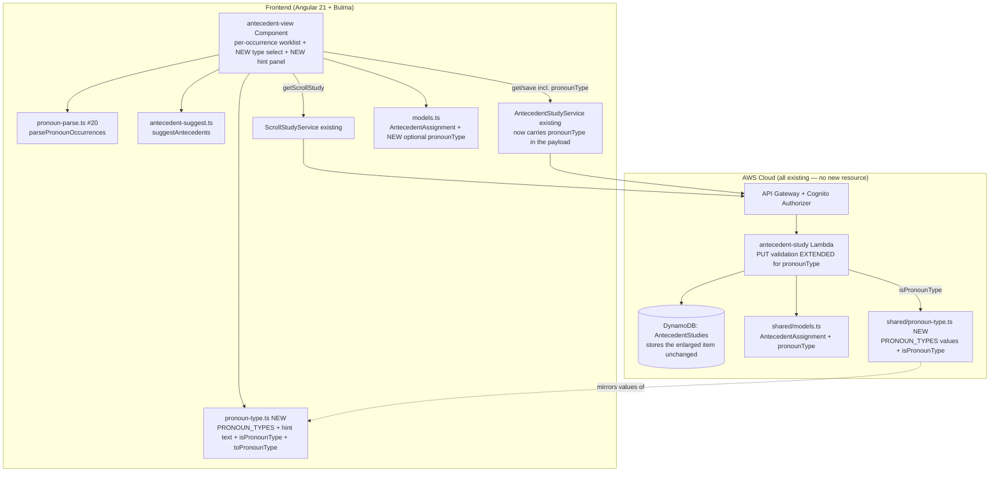
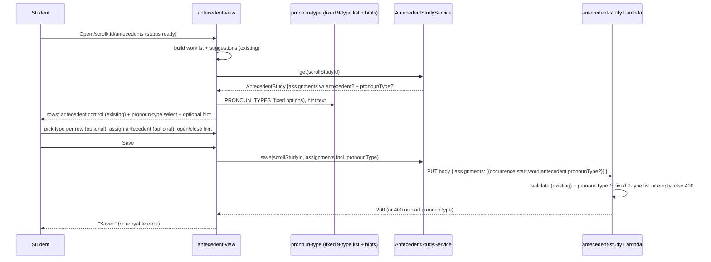

# Design Document: Pronoun Type Classifier (Step 6 — Identify Antecedents, Referents, Audience, and Speaker)

## Overview

This feature lets a Bible student **classify each pronoun by its grammatical type** by selecting one
of the nine pronoun types the Step 6 reference defines, and offers an **optional hint** that explains
those types. It is a small, additive slice on top of the shipped **Antecedent Analysis** feature
(`.kiro/specs/antecedent-analysis/`, on `main`): that feature already derives a per-occurrence pronoun
worklist from a `ready` Scroll Study, lets the student assign an antecedent to each occurrence, and
persists the set as an **Antecedent Study** record (`AntecedentAssignment =
{ occurrence, start, word, antecedent }`, one item per scroll per user in the `AntecedentStudies`
DynamoDB table, served by the `antecedent-study` CRUD Lambda behind the existing Cognito-authorized
API Gateway). This feature adds exactly one thing to that pipeline: a `pronounType` on each
occurrence row.

The thing being classified is the **pronoun** — the per-occurrence worklist row the base feature
already produces — by its **grammatical type**. Per the Step 6 reference
(`docs/references/inductive-study-step-6.md`), under "Types of Pronouns" there are nine types
(Personal, Demonstrative, Indefinite, Intensive, Reflexive, Interrogative, Relative, Reciprocal,
Quantifier). This is **not** a semantic classification of what the antecedent refers to; it is the
grammatical type of the pronoun itself, and it is meaningful whether or not the student has yet
assigned that pronoun an antecedent.

The design is deliberately minimal and additive — it adds **no** AWS resource, table, Lambda, API
route, or service. It extends the existing `AntecedentAssignment` interface (frontend `models.ts` and
backend `shared/models.ts`), adds a pronoun-type control (a Bulma `<select>`) and an optional hint
panel to the existing `antecedent-view` component, extends the existing `antecedent-study` Lambda's
PUT validation, and declares the fixed nine-type list **once** in a new pure frontend module so the
worklist control, the hint, and the server validation all read the same set.

The flow is unchanged except for the new control: open the antecedent worksheet for a `ready` scroll →
for each pronoun occurrence, optionally assign an antecedent (existing) and/or pick a grammatical type
from the fixed nine-type list, consulting the optional hint → save → reopen with antecedents **and**
pronoun types restored.

## Architecture





The one structural decision is **where the fixed type list lives**. Options: (a) inline the list in
`antecedent-view.component.ts`, (b) a new pure, framework-free module shared by the component and (via
a parallel backend copy) the Lambda, or (c) put it on `models.ts`. **Decision: (b)** — a new pure
module `src/app/pronoun-type.ts` that exports the ordered type list, the per-type hint text, and
`isPronounType` / `toPronounType` helpers, mirroring the project's existing pure, unit-testable helper
modules (`bible-books.ts`, `english-definition.normalize.ts`, `pronoun-parse.ts`,
`antecedent-suggest.ts`). This keeps the list out of the component (testable without Angular) and
gives the hint a single source so the options and the help can never drift (Requirement 2 criterion 3,
Non-Functional 2). The *type* alias (`PronounType`) and the enlarged `AntecedentAssignment` interface
live in `models.ts` beside the existing one, matching where `AntecedentAssignment` already lives.

### Single source of truth across the client/server boundary

The server must validate against the **same** closed set the client offers (Requirement 4 criterion
3), but the repo compiles the Angular app (`src/`) and the Lambdas (`infra/lambda/`) as **separate**
TypeScript packages — the Lambda cannot import from `src/app/`. The project's established answer is a
**mirrored declaration**: `AntecedentAssignment` is already declared in **both** `src/app/models.ts`
and `infra/lambda/shared/models.ts`, kept in sync by hand (the same pattern used for every shared
record shape today), and the `bible-books.ts` list already lives as its own module in both `src/app/`
and `infra/lambda/shared/` with a drift-guard test. This feature follows that existing precedent
rather than inventing a build-time sharing mechanism:

- The canonical ordered type values and hint text live in `src/app/pronoun-type.ts`.
- The backend gets a small parallel constant — the **type values only** (no hint text, which is
  frontend-only) — in a **dedicated** shared module `infra/lambda/shared/pronoun-type.ts` (not
  piggy-backed on `shared/models.ts`), mirroring the `bible-books.ts` precedent. It exports:

  ```typescript
  // infra/lambda/shared/pronoun-type.ts  (values only, no hint text)
  /** Backend mirror of the frontend PRONOUN_TYPES. Kept in sync by hand; a drift-guard test
   *  (pronoun-type.test.ts) asserts this equals the same literal the frontend ships. */
  export const PRONOUN_TYPES: readonly string[] = [
    'Personal', 'Demonstrative', 'Indefinite', 'Intensive', 'Reflexive',
    'Interrogative', 'Relative', 'Reciprocal', 'Quantifier',
  ];
  export function isPronounType(value: unknown): boolean {
    return typeof value === 'string' && PRONOUN_TYPES.includes(value);
  }
  ```

  The `antecedent-study` Lambda imports from this module:
  `import { isPronounType } from '../shared/pronoun-type';` — the same `../shared/...` import style
  the handler already uses for `../shared/models` and `../shared/cors`.
- A **drift guard test** (see Testability) asserts the two value lists are identical, so a change to
  one that is not mirrored fails CI. This gives a single *effective* source of truth without crossing
  the package boundary at build time.

Rationale: this is the lowest-risk, convention-matching choice. A build-time symlink or shared package
would be new machinery for one small enum; the dedicated mirror module + guard test is exactly how the
codebase already shares `bible-books.ts` across the two packages, so it adds no new pattern. A
dedicated module (rather than extending `shared/models.ts`) matches that `bible-books.ts` precedent and
keeps the pure constant/guard separate from the record-shape interfaces in `models.ts`.

### The fixed pronoun-type list

Declared once (ordered to match the Step 6 reference's "Types of Pronouns" table) in
`src/app/pronoun-type.ts`. The nine members and their hint text are taken from that table's Use
descriptions and Examples (paraphrased lightly for brevity; no verse text):

```typescript
// src/app/pronoun-type.ts  (pure, no Angular, unit-testable)

/** The fixed, closed set of grammatical pronoun types from the Step 6 reference, in reference order.
 *  Not user-editable. */
export const PRONOUN_TYPES = [
  'Personal',
  'Demonstrative',
  'Indefinite',
  'Intensive',
  'Reflexive',
  'Interrogative',
  'Relative',
  'Reciprocal',
  'Quantifier',
] as const;

export type PronounType = (typeof PRONOUN_TYPES)[number];

/** The unclassified sentinel used by the UI and persisted shape ('' = no type chosen). */
export const UNCLASSIFIED = '' as const;

/** Short, copyright-free Use + Examples per type (keys === PRONOUN_TYPES), from the Step 6 reference. */
export const PRONOUN_TYPE_HINTS: Readonly<Record<PronounType, string>> = {
  Personal:
    'Takes the place of nouns functioning as the subject, object, indirect object, subject ' +
    'complement, or object of a preposition. Examples: I, me, you, he, him, she, it, we, us, ' +
    'they, them, mine, yours, his, hers, its, ours, theirs.',
  Demonstrative:
    'Identifies specific persons or things and serves as the subject. Examples: this, that, ' +
    'these, those.',
  Indefinite:
    'Refers to unspecified persons or things. Examples: all, another, someone, somebody, ' +
    'something, most, each, one, any, anybody, anyone, anything, everybody, everyone, few, ' +
    'many, several, nobody, none, no one, neither, nothing.',
  Intensive:
    'Emphasizes the antecedent. Examples: myself, yourself, himself, herself, itself, ' +
    'ourselves, yourselves, themselves.',
  Reflexive:
    'Indicates that the subject acts upon itself. Examples: myself, yourself, himself, herself, ' +
    'itself, ourselves, yourselves, themselves.',
  Interrogative:
    'Introduces questions. Examples: who, what, whose, whom, which, whoever, whatever, whichever.',
  Relative:
    'Introduces dependent clauses. Examples: who, whose, whom, which, that, whoever, whomever, ' +
    'whichever, whosever.',
  Reciprocal:
    'Expresses a reciprocal action or relationship. Examples: one another, each other.',
  Quantifier:
    'Expresses quantity. Examples: all, both, some, much, any, many, little, half, three, etc.',
};

/** True iff value is a member of the fixed type list (used by UI reset-on-load and the mirror). */
export function isPronounType(value: unknown): value is PronounType {
  return typeof value === 'string' && (PRONOUN_TYPES as readonly string[]).includes(value);
}

/** Normalize any stored value to a known type or '' (unclassified). Never throws. */
export function toPronounType(value: unknown): PronounType | '' {
  return isPronounType(value) ? value : UNCLASSIFIED;
}
```

The nine members and their order come directly from the Step 6 reference and are not a product
judgment; they are fixed by the reference. The empty string `''` is the unclassified sentinel
(consistent with how the base feature already uses `''` for an unassigned antecedent), so the
`pronounType` field is a simple string that is either `''` or one of the nine members.

## Data model and API changes

### Enlarged assignment shape (additive)

The existing `AntecedentAssignment` gains one optional field, in **both** mirrored declarations:

```typescript
// src/app/models.ts  AND  infra/lambda/shared/models.ts (kept in sync — existing precedent)
export interface AntecedentAssignment {
  occurrence: number;    // existing — the key
  start: number;         // existing — context/migration
  word: string;          // existing — display
  antecedent: string;    // existing — trimmed, 0–200 chars ('' allowed when only a type is set)
  pronounType?: string;  // NEW — '' or one of PRONOUN_TYPES; optional/additive
}
```

`pronounType` is `string` (not the `PronounType` union) in the persisted interface so that loading a
legacy/unknown value does not break type-checking; the UI narrows it via `toPronounType` on load. It
is **optional** so legacy records (no `pronounType`) remain valid (Requirement 3 criterion 5).

Note on `antecedent` for a persisted row: because a row may now be persisted with a type but no
antecedent (Requirement 3 criterion 2), the server stores `antecedent: ''` for such a row. This is
additive — the field is still always present and still trimmed/length-checked when non-empty.

### DynamoDB

No table change. `AntecedentStudies` stores the whole item; the extra attribute rides along. No GSI,
no key change, no `stage-config.ts` change, no CDK change.

### API — same routes, extended validation

- `GET /scroll-studies/{scrollStudyId}/antecedents` — unchanged; returns the record, now possibly
  including `pronounType` on assignments. The frontend `toAntecedentStudy` mapper passes `assignments`
  through unchanged, so no mapper change is needed beyond the enlarged interface.
- `PUT /scroll-studies/{scrollStudyId}/antecedents` — the body shape is unchanged except each
  assignment may now carry `pronounType`. The Lambda's `parsePutBody` is extended (see Components) to
  validate it and to keep type-only rows.

## Components and Interfaces

### Frontend — `antecedent-view` component (extended)

The existing standalone, `OnPush`, signals-based component (`src/app/antecedent-view/
antecedent-view.component.ts`) is extended, not replaced:

- **`OccurrenceRow`** gains a `pronounType: string` field (`''` default). `buildWorklist` sets it to
  `''` for every new row.
- **Type control.** Add a **new `<th>Type</th>` column** to the worklist table with the select in its
  own `<td>`, leaving the existing `Antecedent` cell markup and its tests untouched. The cell holds a
  Bulma `.select` bound to `row.pronounType` with a blank first option (`— unclassified —`) and one
  option per `PRONOUN_TYPES` member, via a new `setPronounType(occurrence, value)` method that updates
  only the matching row (mirroring the existing `setAntecedent`). The select is **always enabled** for
  every pronoun occurrence row — it is **not** gated on the antecedent — because a pronoun has a
  grammatical type regardless of whether its antecedent is known (Requirement 1 criterion 5,
  Assumption A4). Clearing or editing a row's antecedent does **not** touch its `pronounType`.
- **Pre-fill on load.** `loadSaved` currently maps saved `antecedent` by `occurrence`; it also maps
  `pronounType`, passing each saved value through `toPronounType` so a legacy/unknown value renders as
  unclassified (Requirement 3 criteria 3–5, Requirement 1 criterion 3).
- **Save.** `save()` currently builds `AntecedentAssignment[]` from rows with a non-empty antecedent;
  it now also includes a row that has a non-empty `pronounType` even if its antecedent is empty, and
  for every included row it adds `pronounType: row.pronounType` (already `''` when unclassified). A
  row with neither a non-empty antecedent nor a non-empty type is still dropped. No other save logic
  changes (retryable on failure).
- **Optional hint.** A disclosable Bulma panel (a `<details>`/`<summary>` or an `aria-expanded`
  toggle + a `message`/`box`) rendered once above or beside the table, listing each type and its
  `PRONOUN_TYPE_HINTS` text (iterated from the shared list so help and options stay in sync). It
  defaults closed, never blocks classifying, and is keyboard/screen-reader accessible (Requirement 2).
- New `data-testid`s namespaced to this view: `pronoun-type-select`, `pronoun-type-hint-toggle`,
  `pronoun-type-hint-panel`, `pronoun-type-hint-item`.

The component imports `PRONOUN_TYPES`, `PRONOUN_TYPE_HINTS`, and `toPronounType` from
`../pronoun-type`, and the enlarged `AntecedentAssignment` from `../models`.

### Frontend — `pronoun-type.ts` (new pure module)

As specified above: the ordered nine-type list, the hint record, and the two guard/normalize helpers.
Pure, no Angular, no I/O, fully unit-testable like its sibling helpers.

### Backend — `antecedent-study` Lambda `parsePutBody` (extended)

Two changes to the per-assignment validation loop:

1. The existing loop currently `continue`s (drops the row) when the trimmed antecedent is empty. It is
   adjusted so a row is only dropped when **both** the trimmed antecedent is empty **and** the
   `pronounType` is empty/absent; a row with a valid type but no antecedent is kept with
   `antecedent: ''`.
2. A pronoun-type check, reading from the mirrored backend type constant:

   ```typescript
   // read + validate pronounType (after the antecedent trim; length check still applies when non-empty):
   const rawType = obj['pronounType'];
   if (rawType !== undefined && typeof rawType !== 'string') {
     return { error: 'pronounType must be a string.' };
   }
   const pronounType = typeof rawType === 'string' ? rawType.trim() : '';
   if (pronounType.length > 0 && !isPronounType(pronounType)) {
     return { error: 'pronounType must be one of the allowed values.' };   // -> HTTP 400
   }
   if (antecedent.length === 0 && pronounType.length === 0) {
     continue; // nothing to persist for this row — drop it, not an error
   }
   if (antecedent.length > ANTECEDENT_MAX_LENGTH) {
     return { error: `antecedent must be ${ANTECEDENT_MAX_LENGTH} characters or fewer.` };
   }
   assignments.push({ occurrence, start, word, antecedent, pronounType });  // '' when unclassified
   ```

`isPronounType` here is imported from `../shared/pronoun-type` (the dedicated backend mirror module
above), reading the backend's mirrored value list. An absent or empty `pronounType` is accepted and
stored as `''` (Requirement 4 criterion 1); a present-but-unknown value is a 400 (criterion 2),
exactly like the existing over-length antecedent rejection. All existing field checks are preserved
(criterion 4); the only behavior change to the drop rule is that a type-only row is now kept.

### No routing, navigation, or service-signature change

The route (`scroll/:scrollStudyId/antecedents`), the navigation into it, and the
`AntecedentStudyService.get`/`save` signatures are unchanged — `pronounType` rides inside the
`AntecedentAssignment[]` the service already carries. `toAntecedentStudy` passes `assignments`
through, so it needs no edit beyond the interface change.

## Error handling

- **Unknown pronounType submitted to PUT** — the Lambda returns **HTTP 400** with a clear message
  (`pronounType must be one of the allowed values.`). Recoverable: the client surfaces the existing
  retryable save-error state; selections (including types) stay editable. The UI only ever sends `''`
  or a list member, so a 400 on type indicates a client/stale-list bug, logged at the Lambda's
  existing 500/400 response path (no new logging layer).
- **Legacy / unknown stored pronounType on load** — not an error. `toPronounType` maps anything not in
  the current list to `''`; the row renders unclassified (Requirement 3 criterion 4). Never throws.
- **Type select interaction** — purely client-side signal updates; cannot fail. It is independent of
  the antecedent control.
- **Hint panel** — static content from the shared module; cannot fail at runtime.
- All existing error paths of the base feature (scroll `preparing`/`failed`/`error`/404, save
  network/5xx failure, empty worklist) are unchanged.

## Validation rules (each external input)

- **`pronounType` (per assignment, PUT body)** — optional; type `string` when present (else 400 with
  "pronounType must be a string."); trimmed; empty → stored as `''` (unclassified, accepted);
  non-empty → must be a member of the fixed nine-type list (else 400 "pronounType must be one of the
  allowed values."). The server rejects, never coerces or truncates (mirrors the antecedent-length
  rule).
- **Row drop rule (PUT body)** — a row with an empty antecedent AND an empty `pronounType` is dropped
  (unchanged intent: nothing to persist); a row with a valid type but empty antecedent is kept with
  `antecedent: ''`.
- **`pronounType` on load (GET response → UI)** — passed through `toPronounType`: a member → itself;
  anything else (absent, empty, unknown) → `''`. Never throws.
- All other PUT fields keep their existing validation (occurrence/start non-negative integers, word
  non-empty, antecedent trimmed ≤200 when non-empty).

Invariant ownership: the **fixed type set** is owned by `pronoun-type.ts` (frontend) with the backend
mirror enforced by the drift-guard test; the **server** owns rejecting an out-of-list type at write
time (so the stored data is always `''` or a known member); the **UI** owns normalizing an out-of-list
value to unclassified at read time (so a legacy record never breaks the worksheet). Both ends defend
the invariant, which is why a legacy value is tolerated on read yet an unknown value is rejected on
write.

## Risks

- **Row-drop rule change.** The base feature drops any row with an empty antecedent on save. This
  feature loosens that so a row with a pronoun type but no antecedent is persisted (otherwise a
  type-only classification would be silently lost). The change is localized to the one `continue`
  condition in `parsePutBody` and the mirror in the component's `save()`; a test pins both the kept
  (type-only) and dropped (empty/empty) cases.
- **Client/server list drift.** Because the list is mirrored across the two TS packages (the existing
  pattern), a change to one copy that is not mirrored would let the client offer a value the server
  rejects. Mitigated by the drift-guard test that fails CI on divergence.
- **Legacy records.** Pre-feature assignments have no `pronounType`. Handled by the optional field +
  `toPronounType` normalization + the legacy-tolerance criterion and its test.
- **Scope creep toward reporting.** Classification invites "filter/aggregate by type" asks; those are
  explicitly out of scope here to keep the increment small.

## Testability

- **Unit (frontend, `pronoun-type.spec.ts`)** — `PRONOUN_TYPES` has the nine members in reference
  order; `PRONOUN_TYPE_HINTS` keys equal the list exactly (Requirement 2 property); `isPronounType`
  accepts every member and rejects non-members/non-strings; `toPronounType` maps members to themselves
  and everything else to `''`.
- **Component (frontend, extend `antecedent-view.component.spec.ts`)** — the new `Type` column renders
  a select per row with the fixed nine options + unclassified; the select is **enabled regardless of
  the antecedent** (including on a row with an empty antecedent); `setPronounType` changes only the
  target row (Requirement 1 property); changing/clearing an antecedent leaves the row's type unchanged;
  saved types pre-fill on load and a legacy/unknown stored value renders unclassified; the save payload
  carries `pronounType` and includes a type-only row; the hint toggle discloses one item per type and
  does not block the control.
- **Lambda (infra, extend `antecedent-study/index.test.ts`)** — PUT accepts an assignment with a valid
  type, with no type, and with an empty type (stored `''`); PUT keeps a row with a valid type and
  empty antecedent and drops a row with neither; PUT returns 400 for a non-string type and for a
  non-member string; all existing validation cases still pass. No AWS is called (DynamoDB client
  mocked, per the no-AWS test rule).
- **Drift guard (two per-package literal assertions)** — the two TypeScript packages compile
  separately and the infra vitest package cannot `import` from `src/app/`, so there is **no**
  cross-package import. Instead, each package asserts its own `PRONOUN_TYPES` deep-equals the **same
  shared literal contract**
  `['Personal','Demonstrative','Indefinite','Intensive','Reflexive','Interrogative','Relative','Reciprocal','Quantifier']`,
  exactly as `bible-books.test.ts` already guards its mirror against a hard-coded `EXPECTED_BIBLE_BOOKS`
  literal:
  - `infra/lambda/shared/pronoun-type.test.ts` declares the literal
    `EXPECTED_PRONOUN_TYPES = ['Personal','Demonstrative','Indefinite','Intensive','Reflexive','Interrogative','Relative','Reciprocal','Quantifier']`
    and asserts `expect([...PRONOUN_TYPES]).toEqual([...EXPECTED_PRONOUN_TYPES])`.
  - `src/app/pronoun-type.spec.ts` declares the **same** literal and makes the **same** assertion
    against the frontend `PRONOUN_TYPES`.

  The shared literal is the contract: changing one package's list without changing the other makes
  that package's assertion fail under `npm run verify`, so an unmirrored change cannot pass CI. This
  is a plain in-package import plus a literal comparison — no text-parsing of the other package's
  source and no new cross-package machinery.

All of the above are unit/assertion tests with no network or AWS; the feature is fully testable
offline, consistent with the project's `npm run verify` gate.

## Out of scope

- Everything in the base Antecedent Analysis feature (worklist, suggestions, assignment, save/resume
  mechanics) beyond adding and persisting the `pronounType` field and keeping type-only rows.
- Referent / audience / speaker / point-of-view (other Step 6 parts).
- Classifying the pronoun's person / gender / number / case, or classifying the antecedent by what it
  refers to.
- A user-editable or maintainer-managed type list; the list is code-defined, closed, and fixed by the
  Step 6 reference.
- Any new DynamoDB table/GSI, Lambda, API route, CDK construct, CDK context lookup, `public/` asset,
  AWS service, or `stage-config.ts` change.
- Aggregation, filtering, counting, reporting, or export of pronouns by type.
- Judging whether a chosen type is correct for a given pronoun.

## Responses to design review

### Round 1 (CHANGES_REQUESTED)

- **Finding 1 (MEDIUM) — backend mirror location/name unresolved X-or-Y.** Addressed. Pinned the
  backend mirror to a **dedicated module** `infra/lambda/shared/pronoun-type.ts` exporting
  `PRONOUN_TYPES` (values only, no hint text) and `isPronounType`, matching the `bible-books.ts`
  precedent (confirmed present in both `src/app/` and `infra/lambda/shared/`). The `antecedent-study`
  Lambda imports `isPronounType` from `../shared/pronoun-type` — the same `../shared/...` style the
  handler already uses for `../shared/models` and `../shared/cors` (confirmed in `index.ts`). The "or
  `shared/models.ts`" wording is removed; the architecture diagram shows the dedicated module.
- **Finding 2 (MEDIUM) — drift-guard mechanism ambiguous / one option infeasible.** Addressed.
  Dropped the infeasible "a test that reads both" option and pinned the **two per-package literal
  assertions** pattern that `bible-books.test.ts` already uses: each package deep-equals its own list
  against the identical shared literal (infra `shared/pronoun-type.test.ts` and frontend
  `pronoun-type.spec.ts`), the shared literal being the contract. An unmirrored change fails that
  package's assertion under `npm run verify`; no cross-package import or source-text parsing.
- **Finding 3 (NIT) — "disabled/hidden" is two behaviors.** Superseded by the Round 3 axis
  correction: the type control is now **always enabled** per pronoun occurrence row (a pronoun's type
  does not depend on its antecedent), so there is no disable/hide condition to pin — the single
  behavior is "always enabled," tested directly.
- **Finding 4 (NIT) — "Antecedent cell" vs. "new column".** Addressed. Pinned a **new `<th>Type</th>`
  column** with the select in its own `<td>`, leaving the existing antecedent control markup and tests
  untouched; removed the alternative. Component test note updated.
- **Finding 5 (NIT) — "Place" over-reads the reference's "this world".** Obsolete after the Round 3
  axis correction: there is no `Place` member any more. The fixed list is now the nine grammatical
  pronoun types from the reference, which involves no product judgment about antecedent kinds.

### Round 3 (axis correction — maintainer feedback on the spec PR)

The maintainer corrected the **axis** of classification. The earlier draft modeled a semantic
*antecedent* category — an invented list of **Deity / Person / Group / Thing / Place / Other**
describing *what the antecedent refers to*. That list does not appear in the Step 6 reference and is
the wrong thing to classify. The maintainer clarified that the feature classifies the **grammatical
type of each pronoun**, drawn from the reference's "Types of Pronouns" table.

What changed in this revision:

- **Axis and fixed list.** Replaced the semantic antecedent-kind list with the reference's **nine
  grammatical pronoun types** (Personal, Demonstrative, Indefinite, Intensive, Reflexive,
  Interrogative, Relative, Reciprocal, Quantifier), in reference order. The list is now fixed by the
  reference rather than a product judgment, so the "fixed-list membership" risk and the "How to
  review" callout about member names are removed.
- **What is classified.** The classified thing is the **pronoun** (the per-occurrence worklist row),
  not the antecedent. All naming updated accordingly.
- **Renames.** Shared module `antecedent-category.ts` → `pronoun-type.ts`; constant
  `ANTECEDENT_CATEGORIES` → `PRONOUN_TYPES`; hint record → `PRONOUN_TYPE_HINTS`; guards
  `isAntecedentCategory`/`toAntecedentCategory` → `isPronounType`/`toPronounType`; type alias
  `AntecedentCategory` → `PronounType`; backend mirror `shared/antecedent-category.ts` →
  `shared/pronoun-type.ts`; record field `category` → `pronounType`; `data-testid`s and test
  descriptions updated throughout. The drift-guard literal is now the nine type names.
- **Enable rule corrected.** Because a pronoun has a grammatical type regardless of whether its
  antecedent is filled in, the type control is **enabled for every pronoun occurrence row**,
  independent of the antecedent. The earlier draft gated the category on a non-empty antecedent and
  cleared it when the antecedent was cleared; that coupling is removed. Clearing/editing an antecedent
  no longer touches the row's type.
- **Persistence of type-only rows.** Because a type can now exist without an antecedent, the save/PUT
  drop rule was loosened: a row is dropped only when it has neither an antecedent nor a type; a
  type-only row is persisted (with `antecedent: ''`). The round-trip and server-validation criteria
  and tests were updated to cover this.
- **Hint.** Still an optional, on-demand panel, now explaining each of the nine pronoun types using
  the reference's own Use descriptions and Examples.

Everything else — the additive single optional field, the shared-module + hand-mirrored-backend +
drift-guard pattern, no new DynamoDB table / Lambda / API route / CDK construct / AWS service, no
`stage-config.ts` change, the createdAt-preserving upsert, legacy tolerance, server-rejects-unknown
(400), and UI-normalizes-unknown-to-unclassified — is unchanged from the reviewed design; only the
classification axis and the list membership changed.
