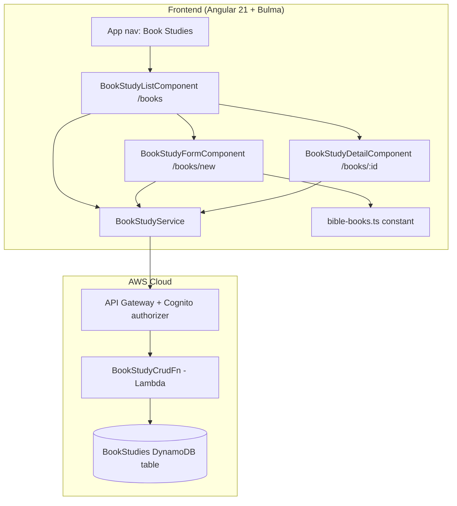

# Design Document: Organize Studies by Book of the Bible

## Overview

This feature introduces a **Book Study**: a user-owned container, defined by a book of the
Bible, that organizes a student's work for that book. It adds a new section to the Angular
app (a "Book Studies" list, a create form, and a detail view) and a new serverless CRUD path
(`/books`) backed by a Lambda and a DynamoDB table. In this first increment a Book Study
holds its own metadata (book, optional title, optional notes) and supports create, list,
view, and delete. Linking existing word studies into a Book Study is deliberately deferred;
the data model reserves room for it so the later increment is additive.

The feature fits the existing architecture exactly. The frontend mirrors the structure of
the current word-study feature: standalone components with signals and Bulma, lazy-loaded
routes, a thin `HttpClient` service, and the existing `userIdInterceptor` that attaches the
Cognito ID token in the `Authorization` header (the raw `getIdToken()` value, no `Bearer`
prefix). The backend mirrors `study-crud`: a single `NodejsFunction` behind the
API Gateway Cognito authorizer, reading the user from the `sub` claim and using the shared
`corsResponse` helper. Persistence follows the same `PK`/`SK` + `GSI1` single-table pattern
already used by `WordStudies`.

## Architecture



The `userIdInterceptor` already attaches the Cognito ID token in the `Authorization` header
(the raw `getIdToken()` value, no `Bearer` prefix) to any request whose URL contains
`/studies` or `/ai/`. This design extends that predicate to also match `/books` so the new
service's calls are authenticated the same way (see Components → Frontend wiring). No new auth
mechanism is introduced.

## Decisions

**New table vs. reuse `WordStudies`.** Two options: (a) store Book Studies as new item types
inside the existing `WordStudies` table (e.g. `SK = BOOK#<id>`), or (b) create a dedicated
`BookStudies` table. We choose **(b), a new table**. Rationale: it keeps the two entities'
access patterns, item shapes, and lifecycles cleanly separated; it avoids touching a
stateful, point-in-time-recovery-protected table that holds the user's existing work (the
delivery rules forbid risky changes to stateful resources); and the marginal cost is
effectively zero under on-demand billing (consistent with the delivery cost model). The new
table reuses the identical `PK`/`SK` + `GSI1` layout so the `study-crud` patterns transfer
directly. This is additive — no change to `WordStudies` construct ID, physical name, schema,
or PITR setting.

**PITR on the new table.** The two existing tables disagree, and there is no shared PITR
field in `stage-config.ts`: `WordStudies` toggles PITR via `config.wordStudiesPitr` (true in
prod), while `StrongsData` omits PITR entirely. The prod assertion test `enables PITR on
WordStudies only` requires PITR to be enabled on `WordStudies` and `undefined` on every other
table, and the dev test `sets PITR explicitly false on WordStudies-dev and true nowhere`
requires PITR to be `true` on no table in dev. We therefore choose **no PITR on
`BookStudies`**: omit `pointInTimeRecoverySpecification` entirely (like `StrongsData`), rather
than reuse `wordStudiesPitr`. This is the lowest-cost, test-compatible choice — reusing
`wordStudiesPitr` would enable a second PITR table in prod, failing the "PITR on WordStudies
only" test and raising prod cost against the cost model. No new `StageConfig` field is added,
so `stage-config.ts` (including its frozen prod values) is unchanged. Book Studies are small,
easily recreated containers whose loss is low-impact; PITR can be added later behind a new
`StageConfig` field if the deferred word-study-linking increment makes the data more valuable
(that increment would also rewrite the "PITR on WordStudies only" test).

**One Lambda per domain.** We add a single `BookStudyCrudFn` handling all four `/books`
methods, mirroring how `study-crud` handles all `/studies` methods in one function. This
keeps the function count and IAM surface small (one function, scoped read/write to the one
new table) rather than splitting per verb.

**Canonical book list owned by the frontend.** The 66-book list is a static TypeScript
constant (`bible-books.ts`) shared by the form (to populate the selector) and by validation.
The Lambda carries its own copy of the same list under `infra/lambda/shared/` for
server-side validation, since the frontend and Lambda are separate bundles and the Lambda
must not trust client input. The two lists are identical by construction; a unit test on each
side asserts length 66 and OT/NT split (39/27) to catch drift.

**Edit deferred.** The increment is create/view/delete only (Requirement, A4). Omitting edit
removes a `PUT`/update path and its optimistic-concurrency questions from this pass; a later
increment can add `PUT /books/{id}` additively.

## Components and Interfaces

### Frontend components (Angular 21 standalone, signals, Bulma)

All three components follow the existing conventions: `ChangeDetectionStrategy.OnPush`,
`inject()` for dependencies, `signal()` for state, inline templates with Bulma classes,
`data-testid` hooks, and co-located `*.spec.ts` tests (Angular + vitest).

- **`BookStudyListComponent`** (`src/app/book-study-list/`, route `/books`). Modeled on
  `StudyListComponent`. Holds `state: signal<'idle'|'loading'|'loaded'|'error'>` and
  `bookStudies: signal<BookStudy[]>`. On init calls `BookStudyService.list()`. Renders a
  Bulma table (title/book, book, last updated, actions), an empty state, a loading state, an
  error state with Retry, and a "New Book Study" button routing to `/books/new`. Reuses the
  delete-confirmation modal pattern (`role="alertdialog"`, `studyToDelete`-style signal,
  `deleting` and `deleteError` signals).

- **`BookStudyFormComponent`** (`src/app/book-study-form/`, route `/books/new`). A create
  form with a `<select>` populated from `BIBLE_BOOKS` (OT group then NT group via
  `<optgroup>`), an optional title `<input>`, and an optional notes `<textarea>`. Save is
  disabled until `book` is chosen. On submit, calls `BookStudyService.create(...)`, then
  navigates to `/books` on success or shows an inline error (preserving entered values) on
  failure. Mirrors the validation-and-error UX of `StudyInputComponent` /
  `StudyListComponent`.

- **`BookStudyDetailComponent`** (`src/app/book-study-detail/`, route `/books/:bookStudyId`).
  Reads the route param via `ActivatedRoute` (as `StudyPageComponent` does), calls
  `BookStudyService.get(id)`, and renders the book, title, notes, and timestamps. Offers
  Delete (reusing the confirmation modal) and a "Back to Book Studies" link. On `404`, shows
  a not-found message linking to `/books`.

### Frontend service and wiring

- **`BookStudyService`** (`src/app/book-study.service.ts`, `providedIn: 'root'`). Thin
  wrapper over `HttpClient`, mirroring `StudyCrudService`:
  ```typescript
  list(): Observable<BookStudy[]>                 // GET  /books
  get(id: string): Observable<BookStudy>          // GET  /books/{id}
  create(input: BookStudyInput): Observable<string> // POST /books -> bookStudyId
  delete(id: string): Observable<void>            // DELETE /books/{id}
  ```
  `baseUrl` comes from `environment.apiUrl`, as in the existing services. The service builds
  URLs with the same `${baseUrl}/books`-style concatenation the existing services use
  (`StudyCrudService`, etc.). Note that although `environment.apiUrl` is documented as having
  no trailing slash, `this.api.url` ends in `/` at runtime; the existing services concatenate
  this way and work, so the new service mirrors that exact pattern — an implementer should not
  try to "fix" the slash handling.

- **Routes** (`src/app/app.routes.ts`): add three lazy `loadComponent` routes — `books`,
  `books/new`, `books/:bookStudyId` — matching the existing lazy-route style. The more
  specific `books/new` is listed before `books/:bookStudyId` so it is not swallowed by the
  param route.

- **Navigation** (`src/app/app.ts`): add a `routerLink="/books"` navbar item ("Book
  Studies") alongside "My Studies" and "New Study", with the same `routerLinkActive`
  behavior. No change to the auth gate — all routes already render only when
  `auth.isSignedIn()`.

- **Interceptor** (`src/app/user-id.interceptor.ts`): extend the match predicate so URLs
  containing `/books` also receive the `Authorization` header:
  `if (!req.url.includes('/studies') && !req.url.includes('/ai/') && !req.url.includes('/books'))`.

### Backend Lambda

- **`BookStudyCrudFn`** (`infra/lambda/book-study-crud/index.ts`). Structured exactly like
  `study-crud/index.ts`: resolves `origin` via `getRequestOrigin`, reads `userId` via
  `event.requestContext.authorizer.claims.sub`, dispatches on `httpMethod` + `resource`, and
  returns via `corsResponse`. Handlers: `POST /books`, `GET /books`, `GET /books/{bookStudyId}`,
  `DELETE /books/{bookStudyId}`. The handler reads two environment variables, exactly matching
  `study-crud`'s pattern:
  `const tableName = process.env['BOOK_STUDIES_TABLE_NAME'] ?? '';` (the `?? ''` fallback
  mirrors `study-crud`'s `WORD_STUDIES_TABLE_NAME ?? ''`), and `ALLOWED_ORIGINS`, which the
  shared `corsResponse` / `getRequestOrigin` helper reads to echo an allowed origin. Both are
  set by CDK (see Data Model → CDK wiring); without `ALLOWED_ORIGINS` the CORS helper would
  return an empty `Access-Control-Allow-Origin`.
- The handler imports the `BookStudyRecord` DynamoDB shape (below) from
  `infra/lambda/shared/models.ts` — added there next to `WordStudyRecord` — rather than
  redefining it inline, the same way `study-crud` imports `WordStudyRecord` from the shared
  models module.

## Data Model

### Shared TypeScript model

Add to both `src/app/models.ts` (frontend) and `infra/lambda/shared/models.ts` (backend):

```typescript
/** A user-owned container that organizes study work by a book of the Bible. */
export interface BookStudy {
  id: string;         // server-generated UUID
  userId: string;     // Cognito sub
  book: string;       // one of the 66 canonical book names
  title: string;      // optional display title; '' when unset
  notes: string;      // optional free text; '' when unset
  createdAt: string;  // ISO 8601
  updatedAt: string;  // ISO 8601
  // Reserved for a later increment that links word studies; not populated yet.
  // wordStudyIds?: string[];
}

/** Create payload from the form (server sets id/userId/timestamps). */
export interface BookStudyInput {
  book: string;
  title?: string;
  notes?: string;
}
```

### DynamoDB table: BookStudies

A new CDK `dynamodb.Table` in `WordStudyToolStack`, named `n('BookStudies')` (stage suffix,
so prod is `BookStudies` and dev is `BookStudies-dev`), with the same key layout, billing,
encryption, removal policy, and `GSI1` as `WordStudies`.

The DynamoDB item shape, `BookStudyRecord`, is added to `infra/lambda/shared/models.ts` next
to `WordStudyRecord` and imported by `BookStudyCrudFn` (not redefined inline). It is shown
here for reference:

```typescript
interface BookStudyRecord {
  PK: string;        // "USER#<userId>"
  SK: string;        // "BOOKSTUDY#<bookStudyId>"
  bookStudyId: string;
  userId: string;
  book: string;
  title: string;
  notes: string;
  createdAt: string; // ISO 8601
  updatedAt: string; // ISO 8601
  GSI1PK: string;    // "USER#<userId>"
  GSI1SK: string;    // "UPDATED#<updatedAt>" — sort by most recent
}
```

On create, the handler sets `updatedAt` equal to `createdAt` (both to the same
`new Date().toISOString()` value). Because this increment has no edit path (edit is
deferred — see Decisions and Out of Scope), `updatedAt` always equals `createdAt`, so the
`GSI1SK = UPDATED#<updatedAt>` sort orders Book Studies by **creation time** in this
increment. The sort only begins to diverge from creation order once the deferred edit path
lands and starts refreshing `updatedAt`; the field and index are shaped now so that change is
additive.

**Access patterns**
- Create / update: `PutCommand` with `PK = USER#<userId>`, `SK = BOOKSTUDY#<id>`.
- Get one: `GetCommand` on `PK`/`SK`; a result with a non-matching `userId` is impossible
  because `PK` embeds the caller's `userId`.
- List for user: `QueryCommand` on `GSI1`, `GSI1PK = USER#<userId>`, `ScanIndexForward: false`
  (most-recent first) — identical to `listStudies`.
- Delete: read-then-`DeleteCommand`, returning `404` when absent — identical to `deleteStudy`.

**CDK wiring (additive, non-stateful-breaking):** new construct id `BookStudies` and matching
log-group/grants; `this.bookStudiesTable.grantReadWriteData(bookStudyCrudFn)`; new
`NodejsFunction` with `functionName: n('BookStudyCRUD')`; `/books` resources on
`this.api.root` with `authMethodOptions` on every method, exactly as `/studies`. No existing
construct id or physical name changes.

- **Removal policy:** the new table uses `removalPolicy: config.statefulRemovalPolicy` — the
  same per-stage value the other tables use (`RETAIN` in prod, `DESTROY` in dev). This keeps
  it `Retain` in prod, so the stateful guard reports it as an additive resource (info), not a
  violation, and the dev test's `DeletionPolicy === 'Delete'` expectation holds.
- **PITR:** the new table omits `pointInTimeRecoverySpecification` entirely (as `StrongsData`
  does); it does **not** reuse `wordStudiesPitr`. See the "PITR on the new table" decision
  above — this keeps the prod "PITR on WordStudies only" and dev "true nowhere" tests green
  and adds no `StageConfig` field, so `stage-config.ts` prod values are unchanged.
- **Lambda environment:** the new function's `environment` block is
  `{ BOOK_STUDIES_TABLE_NAME: this.bookStudiesTable.tableName, ALLOWED_ORIGINS: allowedOriginsEnv }`,
  mirroring how `StudyCrudFn` receives `{ WORD_STUDIES_TABLE_NAME, ALLOWED_ORIGINS }`
  (`allowedOriginsEnv` is the existing `allowedOrigins.join(',')` string). `ALLOWED_ORIGINS`
  is required for `corsResponse` to echo an allowed origin.
- **Log group:** the function gets its own explicit log group via the existing `fnLogs(...)`
  helper, with `logRetention` and `removalPolicy` from `StageConfig` like the other
  functions. This raises the stack's log-group count from 4 to 5 (see Testing Strategy — the
  two existing count assertions change from `4` to `5`).

### Canonical book list

`src/app/bible-books.ts` and `infra/lambda/shared/bible-books.ts`:

```typescript
export const OLD_TESTAMENT_BOOKS: readonly string[] = [/* 39 names, Genesis…Malachi */];
export const NEW_TESTAMENT_BOOKS: readonly string[] = [/* 27 names, Matthew…Revelation */];
export const BIBLE_BOOKS: readonly string[] = [...OLD_TESTAMENT_BOOKS, ...NEW_TESTAMENT_BOOKS];
export function isValidBook(book: string): boolean { return BIBLE_BOOKS.includes(book); }
```

## API

All routes require the Cognito authorizer; `userId` is the token `sub`.

| Method | Path | Request body | Success | Errors |
|---|---|---|---|---|
| POST | `/books` | `{ book, title?, notes? }` | `200 { bookStudyId }` | `400` invalid/missing book, title/notes too long, missing auth |
| GET | `/books` | — | `200 BookStudyRecord[]` | `400` missing auth |
| GET | `/books/{bookStudyId}` | — | `200 BookStudyRecord` | `400` missing auth/id; `404` not found |
| DELETE | `/books/{bookStudyId}` | — | `200 { message }` | `400` missing auth/id; `404` not found |
| OPTIONS | all | — | CORS preflight (API default) | — |

The response records use DynamoDB field names (`bookStudyId`, etc.); the frontend service
maps them to the `BookStudy` model (`id = bookStudyId`), mirroring `StudyCrudService.toWorksheet`.

## Validation

Server-side, in `BookStudyCrudFn`, before any write (client-side mirrors these for UX but is
never trusted):

- **book** — required; `typeof === 'string'` and `isValidBook(book) === true`, else `400`
  `"Invalid or missing book."`.
- **title** — optional; if present must be a string ≤ 200 chars, else `400`. Absent/empty →
  stored as `""`.
- **notes** — optional; if present must be a string ≤ 2000 chars, else `400`. Absent/empty →
  stored as `""`.
- **userId** — taken only from the `sub` claim; any `userId` in the body is ignored (same as
  `study-crud`). Missing claim → `400 "Missing authentication."`.
- **bookStudyId** path param — required for get/delete; missing → `400`.

Parsing follows `study-crud`'s `parseSaveBody`: JSON-parse in a `try/catch`, reject
non-objects, and return `null` → `400` on malformed bodies.

## Error Handling

| Operation | Failure condition | Caller receives | Recoverable? | Logged |
|---|---|---|---|---|
| `POST /books` | malformed JSON / bad field | `400` + message | yes (user fixes input) | no (expected 4xx) |
| `POST /books` | DynamoDB `PutCommand` throws | `500` + message | yes (user retries; form keeps values) | implicitly via Lambda error path |
| `GET /books` | DynamoDB query throws | `500` + message | yes (list shows error + Retry) | as above |
| `GET /books/{id}` | item absent / other user | `404` "Study not found." | n/a (UI links back) | no |
| `DELETE /books/{id}` | item absent | `404` | n/a | no |
| `DELETE /books/{id}` | delete throws | `500` + message | yes (row stays, dismissible error) | as above |
| any handler | unexpected throw | `500 { message }` via the top-level `try/catch` | depends | message surfaced to CloudWatch |

The handler wraps its dispatch in a single `try/catch` returning `corsResponse(500, { message })`,
identical to `study-crud`. CloudWatch retention follows the per-stage `StageConfig`
(`logRetention`) already applied to the other functions; no new logging level is added.

Frontend error UX reuses existing patterns: list error state with Retry
(`StudyListComponent`), dismissible delete-error notification, and inline create-form error
that preserves entered values.

## Testing Strategy

### Unit tests
- **Lambda** (`infra/lambda/book-study-crud/index.test.ts`, vitest, mocked DynamoDB via the
  no-AWS setup): each method's success path; `userId` taken from claims and body `userId`
  ignored; validation rejects missing/invalid `book`, over-long `title`/`notes`, malformed
  JSON; `404` on get/delete of absent id; `400` on missing auth/id. No AWS endpoint is ever
  hit (uses `infra/test/setup-no-aws.ts`).
- **Shared validation / books** (`infra/lambda/shared/bible-books.test.ts` and the frontend
  `bible-books.spec.ts`): `isValidBook` true for canonical names, false otherwise;
  `BIBLE_BOOKS.length === 66`, OT 39 / NT 27; the two copies are identical.
- **Frontend components** (`*.spec.ts`, Angular + vitest, `HttpClient` mocked like the
  existing service specs): list renders rows / empty / loading / error; create disables Save
  until a book is chosen and surfaces errors without losing input; detail renders fields and
  handles `404`; delete uses the confirmation modal and removes the row on success.
- **Service** (`book-study.service.spec.ts`): each method hits the right URL/verb and maps
  `bookStudyId → id`.
- **Interceptor** (`user-id.interceptor.spec.ts`): a `/books` request receives the
  `Authorization` header; an external URL still does not.

### Property-based tests (fast-check, matching the existing `*.spec` conventions)
- For any string in `BIBLE_BOOKS`, `isValidBook` is `true`; for any string not in the set,
  `false`.
- For any valid `BookStudyInput`, the Lambda `POST` → `GET` round-trip returns a record whose
  `book`/`title`/`notes` match the input and whose `createdAt` equals `updatedAt` (on create
  the two are set to the same timestamp — see Data Model), paralleling the `saveWordStudy`
  round-trip property.

### CDK assertion tests (`infra/test/word-study-tool-stack.test.ts`)
- **New assertions:** the template contains a `BookStudies` table with `PAY_PER_REQUEST`,
  AWS-managed encryption, and a `GSI1`; a `BookStudyCRUD` function (prod) / `BookStudyCRUD-dev`
  (dev); and `/books` methods guarded by the Cognito authorizer.
- **Existing assertions that MUST change (adding the function's log group makes the stack's
  log-group count 5, not 4):**
  - `keeps 90-day log retention` (prod): `expect(groups).toHaveLength(4)` → `toHaveLength(5)`;
    the per-group `RetentionInDays === 90` loop is unchanged (the new group uses the stage
    `logRetention`).
  - `keeps 7-day log retention` (dev): `expect(groups).toHaveLength(4)` → `toHaveLength(5)`;
    the per-group `RetentionInDays === 7` and `DeletionPolicy === 'Delete'` loops are
    unchanged — the new group satisfies `Delete` via `config.statefulRemovalPolicy` in dev.
  - `uses on-demand billing for every table`, the prod `enables PITR on WordStudies only`, and
    the dev `sets PITR explicitly false on WordStudies-dev and true nowhere` tests already
    iterate all tables and continue to pass: `BookStudies` is `PAY_PER_REQUEST` and omits
    PITR, so it is neither billed per-provisioned nor PITR-enabled.
- The stateful-guard check continues to pass because the new table is additive and uses the
  stage removal policy (`Retain` in prod) — no existing stateful resource is replaced or
  deleted.

## Risks

- **Product-meaning risk.** The core interpretation — that "a study defined by a book" is a
  new Book Study container rather than a re-shaping of word studies — is an assumption (A1).
  It is the lowest-risk reading and is additive; if the user actually wanted word studies
  tagged with a book instead, the design review / spec PR review is the gate to catch it
  before any code is written.
- **List drift between frontend and Lambda book lists.** Mitigated by the length/split unit
  tests on both copies.
- **Scope creep toward edit/linking.** Explicitly deferred and fenced in Out of Scope; the
  model reserves `wordStudyIds` so the later increment stays additive.
- **CDK context / lookups.** None added — the feature introduces no new `fromLookup`, so no
  `cdk.context.json` change is required.

## Out of Scope

- Editing a Book Study's fields after creation (`PUT /books/{id}`).
- Linking, moving, or rendering word studies within a Book Study (model field reserved only).
- New step tools beyond Step 5.
- Sharing, export, or collaboration.
- Any change to the `WordStudies` table, `/studies`, or `/ai/study-summary`.
- The `wordstudy.* → axiostools.*` domain cutover.

## Design Review Responses

Responses to the review in `design-review.md` / `design-review.json` (verdict
CHANGES_REQUESTED). All seven findings are addressed in the body above.

1. **HIGH — existing CDK log-group count assertions will fail.** Addressed. Data Model → CDK
   wiring now states the new function gets its own `fnLogs(...)` group, raising the count from
   4 to 5; Testing Strategy → CDK assertion tests now explicitly changes
   `keeps 90-day log retention` and `keeps 7-day log retention` from `toHaveLength(4)` to
   `toHaveLength(5)` and notes the new group satisfies the dev `DeletionPolicy === 'Delete'`
   check via `config.statefulRemovalPolicy`.
2. **HIGH — PITR unspecified / conflicting.** Addressed by an explicit decision: **no PITR on
   `BookStudies`** (omit `pointInTimeRecoverySpecification`, like `StrongsData`), not reusing
   `wordStudiesPitr`. Documented in Decisions ("PITR on the new table") and Data Model → CDK
   wiring. This keeps the prod "PITR on WordStudies only" and dev "true nowhere" tests green,
   adds no `StageConfig` field, and leaves `stage-config.ts` prod values unchanged.
3. **MEDIUM — new Lambda env vars.** Addressed. Backend Lambda and Data Model → CDK wiring now
   specify the function's `environment` block as
   `{ BOOK_STUDIES_TABLE_NAME: this.bookStudiesTable.tableName, ALLOWED_ORIGINS: allowedOriginsEnv }`
   and the handler's `process.env['BOOK_STUDIES_TABLE_NAME'] ?? ''` fallback, matching
   `study-crud`.
4. **MEDIUM — `updatedAt` vs. create-only scope.** Addressed. Data Model now states that on
   create `updatedAt` is set equal to `createdAt`, so the `GSI1SK` sort orders by creation
   time this increment and only diverges when the deferred edit path lands; the property test
   wording was corrected to `createdAt === updatedAt`.
5. **MEDIUM — `BookStudyRecord` placement.** Addressed. The design now states
   `BookStudyRecord` is added to `infra/lambda/shared/models.ts` next to `WordStudyRecord` and
   imported by the Lambda (shown inline only for reference).
6. **NIT — "Bearer token" wording.** Addressed. Overview and Architecture prose now say the
   interceptor attaches the Cognito ID token in the `Authorization` header (raw `getIdToken()`
   value, no `Bearer` prefix).
7. **NIT — API base-URL trailing slash.** Addressed. The `BookStudyService` description now
   notes it mirrors the existing services' `${baseUrl}/books`-style URL building and that an
   implementer should not "fix" the trailing-slash behavior.
