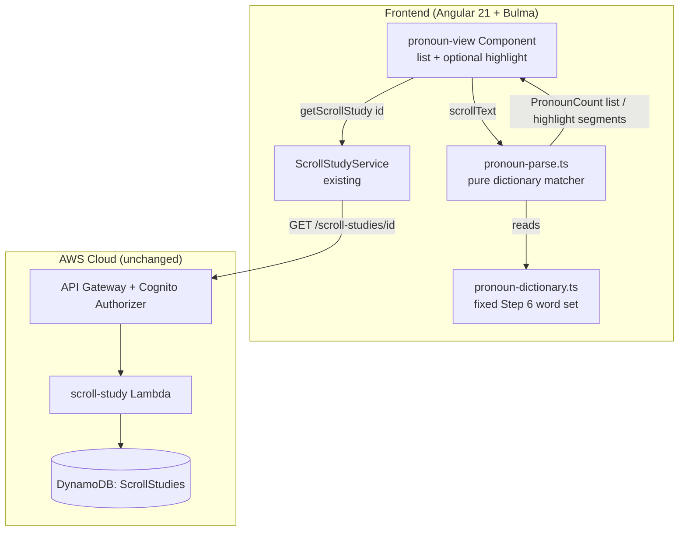
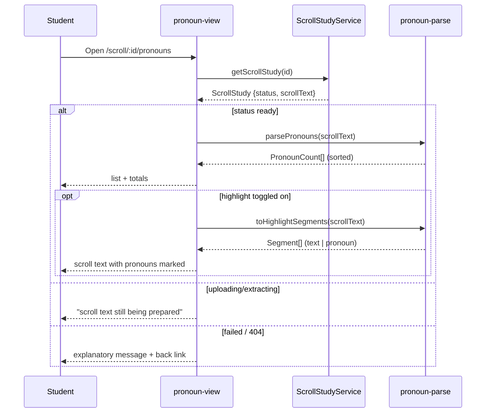

# Design Document: Parse Scroll for Pronouns (Step 6 — Identify Antecedents, Referents, Audience, and Speaker)

## Overview

This feature adds the first slice of the planned **Step 6 — Pronoun Study** tool: given a book's
running text (a `ready` **Scroll Study** from the shipped Step 4 tool), it finds every English
pronoun and possessive adjective in that text, lists each distinct pronoun with its occurrence
count, and optionally highlights the pronouns in place within the scroll text. The goal of this
increment is to hand the student a complete, deterministic worklist of pronouns to work through
when they later identify antecedents; the interpretive work of Step 6 (recording antecedents,
referents, audience, speaker, point of view) is explicitly deferred.

The design is **frontend-only** and additive. Pronoun detection is a pure, deterministic match
against a fixed, client-owned dictionary of pronouns and possessive adjectives taken straight from
the Step 6 reference (`docs/references/inductive-study-step-6.md`), including the archaic KJV forms
the reference lists. The scroll text is already available from the existing `ScrollStudyService`
(the Scroll Study's `scrollText` field, populated when its status is `ready`), so the feature adds
**no** API route, Lambda, DynamoDB table, S3 object, or any other AWS resource, and makes **no**
change to `infra/lib/stage-config.ts`. It reuses the project's established Angular 21 standalone +
signals + Bulma patterns and mirrors the structure of the existing `scroll-view` component.

Consistent with the product's copyright stance, the parsed text is the **student's own uploaded
document**, already persisted and scoped to them; this feature serves no app-provided Bible text
and places nothing into any AI prompt.

## Architecture

The feature is a new lazily-routed Angular component plus a pure parsing utility. It reads the
scroll text through the existing authenticated service and does all work in the browser.





## Components and Interfaces

### Frontend (Angular 21 standalone, signals, Bulma)

**`pronoun-view` component** (`src/app/pronoun-view/pronoun-view.component.ts`), a new standalone
component mirroring the existing `scroll-view` component's structure (signal-based view state,
`ActivatedRoute` param, `ChangeDetectionStrategy.OnPush`, Bulma `section`/`box`/notifications). It:

- reads `scrollStudyId` from the route and calls `ScrollStudyService.getScrollStudy(id)` (the same
  service and auth path the scroll view uses — no new service);
- holds a `state` signal (`'loading' | 'ready' | 'preparing' | 'failed' | 'error'`), a `study`
  signal, a `pronouns` signal (`PronounCount[]`), and a `highlight` signal (`boolean`, default
  `false`);
- on a `ready` study, computes `pronouns` once from `study.scrollText` via `parsePronouns`;
- renders the pronoun list (Bulma `table` or tag list) with per-pronoun counts and the two totals
  (distinct count, total occurrences), an empty-state box when there are no pronouns, a "still
  being prepared" notification for `uploading`/`extracting`, a `failed`/`error` notification with a
  back link to `/scroll/:id`, and a highlight toggle;
- when `highlight()` is on, renders the scroll text from `toHighlightSegments(scrollText)` inside a
  scrollable `box` using the same `white-space: pre-wrap`, bounded `max-height`, `overflow-y: auto`
  styling the `scroll-view` component already uses, so line breaks and wrapping match.

`data-testid`s are namespaced to this view: `pronoun-list`, `pronoun-row`, `pronoun-word`,
`pronoun-count`, `pronoun-totals`, `pronoun-empty`, `pronoun-preparing`, `pronoun-failed`,
`highlight-toggle`, `pronoun-highlighted-text`.

**Reusing vs. extending `scroll-view`.** Two options were considered: (a) add the pronoun list and
highlight as a second mode inside the existing `scroll-view` component, or (b) a **new, separate
`pronoun-view` component** on its own route. **Decision: (b)** — Step 6 is a distinct study step
from Step 4, the scroll view is a read-only "confirm the extraction" surface, and keeping the
pronoun tool separate avoids complicating the existing component and its specs (the same reasoning
that kept `scroll-list` separate from `study-list`). The pronoun view *reuses* `ScrollStudyService`
and copies the text-display styling, but does not modify `scroll-view`.

### Routing and navigation

A new lazily-loaded route is added to `src/app/app.routes.ts` (additive; existing routes
untouched):

```
scroll/:scrollStudyId/pronouns  →  pronoun-view
```

Nesting the pronoun route under the scroll id keeps the "a scroll's pronouns" relationship explicit
and lets the view read the same `scrollStudyId` param. The student reaches it from the existing
`scroll-view`: a **"Find pronouns (Step 6)"** button is added to `scroll-view`'s `ready` state
(the one additive change to `scroll-view` — a `routerLink` button in the ready block, guarded so it
only shows when the text is ready), routing to `scroll/:id/pronouns`. The back link in
`pronoun-view` returns to `scroll/:id`. **Decision:** no new top-level navbar entry is added for
this increment — the pronoun view is reached contextually from a specific scroll, which matches how
the step actually flows (you parse *a* book's scroll), and avoids a navbar item that would need a
scroll to be chosen first. A top-level "Pronoun Studies" surface can be added later if the step
grows its own persisted records.

### Pronoun dictionary (`src/app/pronoun-dictionary.ts`)

A fixed, exported constant: a `ReadonlySet<string>` of lower-cased pronoun and possessive-adjective
forms, grouped in source comments by the Step 6 reference's categories so the provenance is clear:

- **Personal (nominative/objective/possessive):** i, me, mine, you, he, him, his, she, her, hers,
  it, its, we, us, our, ours, they, them, their, theirs.
- **Possessive adjectives:** my, your, his, her, its, our, their (overlap with the above is
  harmless in a set).
- **Archaic KJV forms:** thou, thee, thine, thy, ye.
- **Demonstrative:** this, that, these, those.
- **Indefinite:** all, another, any, anybody, anyone, anything, each, everybody, everyone,
  everything, few, many, most, neither, nobody, none, no one, nothing, one, several, some,
  somebody, someone, something.
- **Intensive / reflexive:** myself, yourself, himself, herself, itself, ourselves, yourselves,
  themselves.
- **Interrogative / relative:** who, whom, whose, which, what, whoever, whomever, whichever,
  whosever, whatever, that.
- **Reciprocal:** `each other` and `one another` are two-word forms; **this increment matches
  single-token pronouns only**, so these multi-word reciprocals and the multi-word indefinite
  "no one" are matched by their constituent single tokens where applicable and otherwise flagged
  as a known limitation (see Risks). The dictionary therefore stores single tokens; `no one` is
  included as a documented edge the single-token matcher cannot catch as a unit.
- **Quantifier:** all, both, some, much, any, many, little, half (numerals like "three" from the
  reference are excluded — they are open-ended and would produce noise; this is a deliberate
  narrowing noted in Risks).

The set is the single source of truth; both the matcher and any test fixture import it. Keeping it
a plain constant (not fetched or configurable) matches `bible-books.ts`, the existing fixed
client-owned list.

### Pronoun parser (`src/app/pronoun-parse.ts`)

Three pure, exported functions (no Angular, no I/O — unit-testable in isolation, mirroring
`english-definition.normalize.ts` and `bible-books.ts` as pure helpers):

```typescript
export interface PronounCount {
  word: string;   // the canonical lower-cased dictionary form
  count: number;  // whole-word occurrences in the text, >= 1
}

export type Segment =
  | { kind: 'text'; value: string }
  | { kind: 'pronoun'; value: string };  // value is the original-cased matched token

/** True iff the stripped, lower-cased token is in the pronoun dictionary. Pure. */
export function isPronoun(token: string): boolean;

/** Distinct dictionary pronouns in the text with counts, sorted count desc then word asc. */
export function parsePronouns(text: string): PronounCount[];

/** The text split into ordered text/pronoun segments for highlighting; concatenating
 *  all segment `value`s reproduces the input exactly. */
export function toHighlightSegments(text: string): Segment[];
```

**Tokenisation.** A single regex walks the text splitting on word boundaries so punctuation and
whitespace are preserved as `text` segments and word runs are tested against the dictionary. A
"word" token is a maximal run of letters (including the apostrophe only where needed — pronouns in
the dictionary contain none, so a plain `[A-Za-z]+` run with surrounding punctuation stripped is
sufficient; apostrophe-containing forms like "it's" tokenise as `it` + `'s`, and `it` matches,
which is the intended behaviour). Matching lower-cases the token and tests set membership.
`parsePronouns` counts occurrences into a `Map<string, number>` keyed by the canonical lower-cased
form, then returns entries sorted by `count` descending and `word` ascending (Requirement 2
criterion 2). `toHighlightSegments` emits the same tokenisation as an ordered `Segment[]`, tagging
each word token `pronoun` or folding it into surrounding `text`, and preserves original casing and
all inter-token characters so the concatenation property holds (Requirement 3 correctness
property).

Both functions are O(n) over the input characters, single-pass, and never throw: `parsePronouns('')`
returns `[]` and `toHighlightSegments('')` returns `[]`.

### Rendering the highlight safely (Requirement 3 criterion 4)

The highlight is rendered from the `Segment[]` array via Angular's template binding, **not** via
`innerHTML`. The template iterates segments with `@for` and emits a `<span class="pronoun-mark">`
for `pronoun` segments and interpolates `text` segments with `{{ }}`. Because Angular interpolation
escapes content by default, HTML-significant characters in the scroll text (`<`, `>`, `&`) are shown
literally with no sanitiser call and no `bypassSecurityTrustHtml` — the design deliberately avoids
raw-HTML injection entirely. The containing element keeps `white-space: pre-wrap` so the segment
stream reproduces the original line breaks and wrapping. (An alternative of building an HTML string
and binding `[innerHTML]` was rejected: it needs manual escaping and a `DomSanitizer`, which is
error-prone and unnecessary when the segment model renders safely through normal binding.)

## Data model / API changes

**None.** This feature introduces no new DynamoDB table, no new API route, and no new Lambda. It
reads the existing `ScrollStudy` record through the existing `GET /scroll-studies/{scrollStudyId}`
route and `ScrollStudyService.getScrollStudy`. The `ScrollStudy` interface already exposes
`status` and `scrollText`, which is all this feature consumes. No field is added to any record and
no stored shape changes, so there is no migration and no legacy-shape concern.

No new un-hashed `public/` asset is added, so the `DeployShell`/`DeployAssets` include/exclude
lists are unaffected. No new CDK context lookup is introduced, so `cdk.context.json` is unchanged.

## Error handling

| Operation | Failure condition | Recoverable? | Caller receives | Logged |
|---|---|---|---|---|
| `getScrollStudy(id)` | scroll not found / not owned (404) | n/a (wrong id) | `failed` state: "This scroll could not be found" + back link to `/scrolls` | no (expected) |
| `getScrollStudy(id)` | network / 5xx | yes | `error` state with a Retry button (re-issues the GET) | browser console only |
| parse | study status `uploading`/`extracting` | yes (poll/return later) | `preparing` notification; no parse attempted (Req 1 criterion 5) | no |
| parse | study status `failed` | no (re-upload needed) | `failed` notification with the scroll's `failureReason` and back link | no |
| `parsePronouns` | empty / whitespace-only text | n/a | empty-state box "No pronouns found in this scroll." | no |
| `parsePronouns` / `toHighlightSegments` | any text input | n/a (never throws) | always returns a value (possibly empty) | no |

**Validation rules (external inputs).**
- `scrollStudyId` (route param): required; passed straight to `getScrollStudy`. A missing/empty id
  or an id the user does not own yields a 404 → `failed` state (Requirement 1 criterion 6). No
  client-side format validation is needed beyond non-empty, matching how `scroll-view` treats the
  param today.
- `scrollText` (from the record): may be any string, including empty, whitespace-only, truncated
  (the scroll-text spec's `truncated` flag), or containing HTML-significant characters. The parser
  tolerates all of these: empty/whitespace → empty list; truncated text parses normally (a
  `truncated` scroll is still `ready`, and the pronoun view MAY surface the existing truncation
  flag as an informational note so the student knows the worklist covers only the stored prefix);
  HTML-significant characters render literally (Requirement 3 criterion 4).

**Invariant ownership.** User-scoping is owned by the existing backend exactly as today: the
`scroll-study` Lambda returns 404 for a scroll the Cognito `sub` does not own, so the frontend
cannot parse another user's scroll. The pronoun view adds no new trust boundary. The
"a pronoun is a dictionary member" invariant is owned entirely by `pronoun-parse.ts` + the single
`pronoun-dictionary.ts` constant, so there is exactly one definition of the pronoun set in the code.

## Testing strategy

All tests run under the existing frontend harness (Angular + vitest); nothing in this feature
touches AWS, so no SDK mocking or `setup-no-aws` concern applies.

Unit — `pronoun-parse.ts` (pure, the bulk of the coverage; mirrors the property-style tests used
for `validateStrongsNumber` and `english-definition.normalize`):
- `isPronoun`: property test over the dictionary — every member matches in upper/lower/mixed case
  and surrounded by punctuation (`"He,"`, `"(it)"`); non-members (`"the"`, `"there"`, `""`) do not.
- `parsePronouns`: whole-word matching (no substring hits — "it" not matched in "with", "with"
  itself not a pronoun); case-insensitive counting ("He"/"he" collapse to one entry); the sort
  order (count desc, then word asc); empty and whitespace-only input → `[]`; the count-conservation
  property (`sum(counts)` equals the number of whole-word pronoun tokens); never throws.
- `toHighlightSegments`: the concatenation property (joined segment values === input) over varied
  inputs including HTML-significant characters, newlines, and leading/trailing punctuation; every
  `pronoun` segment's lower-cased value is in the dictionary; empty input → `[]`.

Component — `pronoun-view` (Angular TestBed with a stubbed `ScrollStudyService`):
- `ready` study → renders the pronoun list, per-pronoun counts, and the two totals; empty-text
  scroll → the empty-state box.
- `uploading`/`extracting` → the "preparing" notification and no list; `failed` → the failed
  notification with the reason and back link; 404 → `failed`; network error → `error` with a
  working Retry.
- highlight toggle default off (plain text) → on renders the highlighted segments; toggling is
  keyboard operable and sets `aria-pressed`; a regression assertion confirms the rendered text
  content (markup stripped) equals the scroll text (ties the component to the parser's
  concatenation property).
- a regression assertion confirms `pronoun-view` calls `ScrollStudyService.getScrollStudy` and
  issues no other service calls (no new/unexpected API dependency).

Existing specs — `scroll-view.component.spec.ts` gains a case for the new "Find pronouns (Step 6)"
button appearing only in the `ready` state and routing to `scroll/:id/pronouns`; no other existing
spec changes because no shared code is modified.

CDK / infra — **no change** and nothing new to assert: this feature adds no construct, route, or
Lambda, so the existing `infra/test/` suite (including the count-based log-group and
`PROD_LOGICAL_IDS` assertions) is untouched and keeps passing.

## Risks

- **Dictionary completeness vs. noise.** A fixed word list cannot distinguish parts of speech, so
  high-frequency words that are both pronouns and other parts of speech ("that", "all", "one",
  "some", "any", "many") inflate counts with non-pronoun uses. This is accepted for a first
  worklist (the student still benefits from seeing every candidate) and is called out in Out of
  Scope (no type/POS classification). Numerals-as-quantifiers ("three", etc.) are deliberately
  excluded to limit noise.
- **Multi-word pronouns.** "each other", "one another", and "no one" are multi-token forms the
  single-token matcher cannot catch as units; their constituent single tokens ("one", "other",
  "another") are matched instead. This is a documented limitation of this increment; a two-token
  pass could be added later without changing the data model.
- **Archaic / translation variance.** The dictionary includes the KJV archaic forms the reference
  lists (thou/thee/thine/thy/ye) but a student's uploaded translation may use spellings or forms
  outside the set; unmatched forms simply do not appear in the list. The dictionary is a plain
  constant and is trivially extended.
- **Truncated scrolls.** If the student's scroll was truncated at extraction (`truncated = true`),
  the pronoun worklist covers only the stored prefix. The view surfaces the existing truncation
  flag so the student is not misled into thinking the list is exhaustive.
- **Large text in the browser.** Parsing is a single O(n) pass over text capped at ~350 KB by the
  scroll-text spec, well within a synchronous browser operation; no chunking or web worker is
  needed at this size.

## Out of scope

- Recording or persisting per-occurrence antecedents, referents, audience, speaker, or
  point-of-view — the interpretive core of Step 6 (a later increment, likely its own persisted
  record).
- Classifying pronouns by type, person, gender, number, or case.
- Multi-word pronoun matching ("each other", "one another", "no one" as units).
- Grammatical/NLP parsing, lemmatization, or sense disambiguation.
- Navigating from a list entry to each in-text occurrence (the highlight shows occurrences in
  place; cross-navigation is deferred).
- A top-level navbar "Pronoun Studies" surface or any new persisted entity/API/table.
- Non-English scroll text, and any change to the Scroll Study, Word Study, or Book Study tools.
