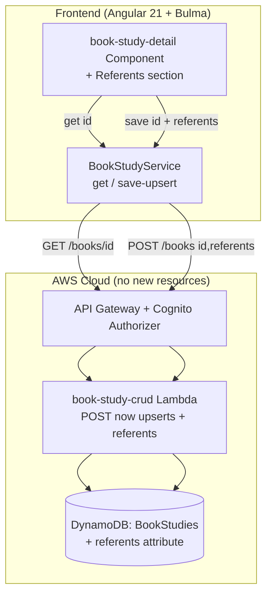
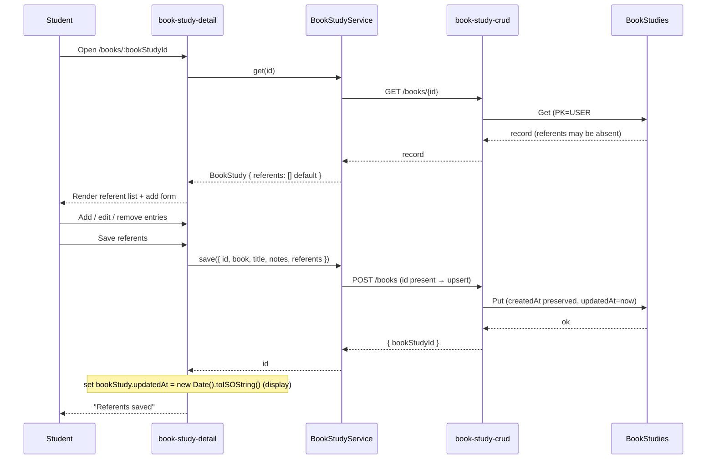

# Design Document: Referent Analysis (Step 6 — Identify Antecedents, Referents, Audience, and Speaker)

## Overview

This feature lets a student **document the referents they find in a study**: a list of referent
entries, each with the descriptive phrase, what it refers to, free-text notes, and an optional
free-text scroll-text reference (where in the book the phrase occurs). It is the first persisted
slice of inductive-study **Step 6** and the referent counterpart to the pronoun worklist (#20,
`.kiro/specs/parse-scroll-for-pronouns/`). Unlike the pronoun worklist, which is derived on demand
and stored nothing, this feature persists the student's **own interpretive work**.

The design is **additive and reuses the existing Book Study plumbing end to end**. A referent list
is stored as a new `referents` attribute on the existing `BookStudies` DynamoDB record, edited from
the existing `book-study-detail` component, read through the existing `BookStudyService.get`, and
persisted through the existing `POST /books` route handled by the `book-study-crud` Lambda — which
is extended to behave as an **upsert** exactly like the shipped `study-crud` POST already does
(`id ?? randomUUID()`, `createdAt ?? now`). No new DynamoDB table, Lambda, API route, or CORS method
is introduced; `infra/lib/stage-config.ts` is unchanged. It keeps the project's established Angular
21 standalone + signals + Bulma frontend and serverless-first backend patterns.

Consistent with the product's copyright stance, every referent field is the student's own words or
a free-text location; the app serves no Bible text and this feature puts nothing in an AI prompt.

## Architecture

The feature adds a Referents section to the Book Study detail page and extends the Book Study CRUD
Lambda to upsert the record (carrying the referent list). Everything else is already in place.





## Components and Interfaces

### Frontend (Angular 21 standalone, signals, Bulma)

**`book-study-detail` component** (`src/app/book-study-detail/book-study-detail.component.ts`) gains
a **Referents** section below the existing book/title/notes/timestamps block. It keeps its existing
`state` machine (`loading`/`loaded`/`notfound`/`error`), its `bookStudy` signal, and its 404-vs-5xx
`load()` branch (`err?.status === 404 ? 'notfound' : 'error'`) unchanged. Added signals:

- `referents = signal<Referent[]>([])` — the working list, initialised from the loaded record's
  `referents` (defaulting to `[]`), using Angular's immutable signal updates (`update`/`set` with a
  new array) so `OnPush` change detection fires.
- `draft = signal<{ phrase: string; refersTo: string; notes: string; scrollRef: string }>(...)` —
  the add-entry form model.
- `saveState = signal<'idle' | 'saving' | 'saved' | 'error'>('idle')` and a `saveError` signal.

Behaviour:
- **Add**: `addReferent()` trims `phrase`/`refersTo`; if either is empty it sets an inline
  validation flag and returns without mutating the list (Requirement 1 criteria 3–4); otherwise it
  appends `{ phrase, refersTo, notes, scrollRef }` (notes/scrollRef default `''`) to a new array and
  clears the draft.
- **Edit per-entry — all four fields are editable in place.** Each row binds `phrase`, `refersTo`,
  `notes`, and `scrollRef` to the entry via `update()` producing a new array (immutability for
  `OnPush`). The `Referent` shape already supports this, so correcting a typo in a phrase edits that
  row **in place** — it does not remove and re-append, so the entry keeps its position and the list
  is never silently reordered (resolving the MEDIUM review finding; see Requirement 1 criterion 7).
  In-place `phrase`/`refersTo` edits must stay non-empty after trim: a per-row edit that would blank
  a required field is rejected with the same inline message as the add form (the row keeps its last
  valid value), so the "phrase and refers-to are non-empty" invariant holds for existing rows as
  well as new ones. (Alternative considered: keep phrase/refers-to read-only after add and correct
  by remove-and-re-add. Rejected because a re-added entry appends to the end, silently reordering the
  student's list on a typo fix — a usability trap the shape does not force on us.)
- **Remove**: `removeReferent(index)` filters the entry out into a new array.
- **Save**: `saveReferents()` sets `saveState='saving'` and calls `BookStudyService.save(...)` with
  the current `bookStudy()` fields plus `referents()`. The `POST /books` response is the existing
  `{ bookStudyId }` only — it carries **no** `createdAt`/`updatedAt` — so on success the component
  does **not** try to read a timestamp off the response. Instead it sets `saveState='saved'` and
  updates the `bookStudy` signal's `updatedAt` to a client-generated `new Date().toISOString()`
  (via an immutable `update()` producing a new `BookStudy`), so the detail timestamps block
  (`data-testid="detail-timestamps"`, which renders `bs.updatedAt | date`) reflects the save
  without a reload. This is a display convenience; the **authoritative** `updatedAt` is the one the
  Lambda writes (`updatedAt: now`), and it will match on the next real `get(id)` (e.g. a page
  reload). The client value may differ from the server's by milliseconds, which is acceptable for a
  "medium"-granularity display. On error it sets `saveState='error'` and keeps the working list
  intact so the student can retry (Requirement 3 criterion 6).

  (Alternative considered: re-issue `get(id)` after a successful POST and set `bookStudy` from the
  returned authoritative record — one extra GET per save. Rejected for this increment: it adds a
  round-trip and a second failure mode on the save path purely to refresh a display timestamp that
  a reload already reconciles. The client-set `updatedAt` keeps the save path a single request while
  still keeping the displayed timestamp honest to the second.)

`data-testid`s are namespaced to this section: `referents-section`, `referent-row`,
`referent-phrase`, `referent-refersto`, `referent-notes`, `referent-scrollref`,
`add-referent-form`, `add-referent-phrase`, `add-referent-refersto`, `add-referent-notes`,
`add-referent-scrollref`, `add-referent-button`, `add-referent-error` (the add-form inline
"phrase/refers-to required" message), `remove-referent-button`, `save-referents-button`,
`referents-empty`, `referents-save-error`. The in-place per-row edit reuses `referent-phrase` /
`referent-refersto` / `referent-notes` / `referent-scrollref` as editable controls, and a blanked
required field surfaces the same `add-referent-error` message pattern on the row. The section uses
Bulma `field`/`control`/`input`/
`textarea`/`table` and labeled controls, matching the existing form and detail markup.

**Decision — edit on the detail page, not a new route.** The Referents section lives on the
existing `/books/:bookStudyId` detail page rather than a new `/books/:id/referents` route. Step 6
work belongs to the book, the detail page is already the book's workspace, and keeping it there
avoids a new route, a new component, and extra navigation for what is one more section of the same
study. (A separate route was considered and rejected as premature; it can be split out later if the
detail page grows unwieldy.)

### `BookStudyService` (`src/app/book-study.service.ts`)

The service gains a `referents` field on its `BookStudy` mapping (tolerant default `[]`) and a
**`save`** method that POSTs an upsert. The existing `create`/`get`/`list`/`delete` are unchanged;
`save` is the create path generalised to carry an optional `id` and the referent list:

```typescript
export interface Referent {
  phrase: string;     // descriptive phrase found (required, <=200)
  refersTo: string;   // what it stands for (required, <=200)
  notes: string;      // free-text, '' when unset (<=1000)
  scrollRef: string;  // optional free-text location, '' when unset (<=1000)
}

// BookStudy (in models.ts) gains:  referents: Referent[];

class BookStudyService {
  // unchanged: list(), get(), create(input), delete(id)

  /** Create or update a book study (upsert). Returns the bookStudyId. */
  save(study: {
    id?: string; book: string; title: string; notes: string; referents: Referent[];
  }): Observable<string>;
}
```

`toBookStudy` is extended to read `record.referents` with a tolerant default
(`Array.isArray(record.referents) ? record.referents.map(normalizeReferent) : []`), so a legacy
record with no `referents` attribute loads as `[]` (Requirement 3 criterion 4). `normalizeReferent`
coerces each entry's four fields to strings defaulting to `''` (mirroring how `toBookStudy` already
defaults `title`/`notes` to `''`), so the in-app shape is uniform regardless of what the record
holds. `save` POSTs `{ id, book, title, notes, referents }` to `/books`; omitting `id` creates,
including it updates. It returns `Observable<string>` (the `bookStudyId`), consistent with
`create`; the response body is the existing `{ bookStudyId }` and carries **no**
`createdAt`/`updatedAt`. The component therefore does not read a timestamp off the save response —
it sets `updatedAt` client-side on success (see the detail component's **Save** behaviour) and the
server-written `updatedAt` reconciles on the next `get(id)`.

**Why reuse `POST /books` rather than add `PATCH`/`PUT`.** The shared CORS helper
(`infra/lambda/shared/cors.ts`) advertises `Access-Control-Allow-Methods: GET,POST,DELETE,OPTIONS`.
Adding a `PATCH`/`PUT` would require widening that string **and** adding a new API Gateway method —
the scroll-text feature deliberately avoided exactly this. The shipped `study-crud` POST is already
an idempotent upsert keyed by an optional `id`, so generalising `book-study-crud` POST the same way
is the established, lower-risk pattern: no new route, no CORS change, no new method. (Alternative:
add `PUT /books/{bookStudyId}`. Rejected — it needs a CORS-methods widening and a new route for no
behaviour the upsert POST does not already give.)

### Backend — `book-study-crud` Lambda (`infra/lambda/book-study-crud/index.ts`)

The `POST /books` handler is extended to upsert and to accept a `referents` array. The change mirrors
`study-crud`'s `saveWordStudy`:

- `parseCreateBody` becomes `parseSaveBody`: it additionally reads an optional `id`
  (`typeof === 'string' && length > 0 ? id : undefined`), an optional `createdAt`
  (same tolerant read as `study-crud`), and a `referents` array. It still validates `book`
  (`isValidBook`), `title` (`title.length > TITLE_MAX_LENGTH`), and `notes`
  (`notes.length > NOTES_MAX_LENGTH`) exactly as today — i.e. on the **raw** string, with the limit
  value itself allowed. `referents` is validated per entry to match that existing pattern: `phrase`
  and `refersTo` must be strings, must be **non-empty after `.trim()`**, and must satisfy
  `str.length > 200` → reject (so a raw length of exactly 200 is allowed, matching the title check);
  `notes` and `scrollRef` must be strings (defaulting to `''` when absent) and satisfy
  `str.length > 1000` → reject. All length checks are on the raw string; only the non-empty check is
  on the trimmed string. An invalid entry (missing required field, wrong type, blank-after-trim, or
  over-limit) → `400` with a message naming `referents`; a missing `referents` key defaults to `[]`
  (so an old client that omits it still works). The frontend `maxlength` attributes are set to the
  same 200/1000 so the client and server agree on the boundary.
- `createBookStudy` becomes `saveBookStudy`: `const bookStudyId = input.id ?? randomUUID();` and
  `updatedAt: now`. The server still **ignores any body `userId`** and uses `claims.sub` for the PK
  (the existing security property, kept). **`createdAt` preservation is server-owned and
  mandatory**, not left to the client: when `input.id` is present (update path), the handler issues
  a `GetCommand` for the existing item (`PK=USER#${sub}`, `SK=BOOKSTUDY#${id}`) and sets
  `createdAt` to the stored item's `createdAt` when the item exists, else `now`; when `input.id` is
  absent (create path) `createdAt` is `now`. The frontend's `save` signature does **not** send
  `createdAt`, so this server read-before-write is the single source of truth for the field (see
  the HIGH finding resolution in "Review responses" and "Invariant ownership"). Concretely:

  ```typescript
  async function saveBookStudy(userId: string, input: SaveBookStudyInput) {
    const now = new Date().toISOString();
    const bookStudyId = input.id ?? randomUUID();
    let createdAt = now;
    if (input.id) {
      const existing = await getBookStudy(userId, bookStudyId); // Get under caller's own PK
      if (existing) createdAt = existing.createdAt; // preserve; advance only updatedAt
    }
    // ...Put with createdAt, updatedAt: now, referents, GSI1SK = `UPDATED#${now}`...
    return { bookStudyId };
  }
  ```

  Because the Get is keyed on `PK=USER#${sub}`, an update can only ever read the caller's own
  record; it cannot leak or adopt another user's `createdAt`. If the id does not exist under the
  caller's PK, the save still succeeds as a create with `createdAt = now` (an upsert, matching
  `study-crud`).
- `GET`/`DELETE` are unchanged. The record returned by `GET` now includes `referents` (absent on
  legacy records; the frontend defaults it).

The `BookStudyRecord` interface in `infra/lambda/shared/models.ts` gains `referents: Referent[]`,
and a new exported `Referent` interface is added there (single source of truth shared by the Lambda;
the frontend `models.ts` has its own matching `Referent`, as the two packages already keep parallel
model files). The `BookStudy` app interface in `src/app/models.ts` gains `referents: Referent[]`.

### Routing and navigation

**None.** The feature is edited on the existing `/books/:bookStudyId` route; `app.routes.ts` and the
navbar are untouched.

## Data model / API changes

### DynamoDB — `BookStudies` (existing table, new attribute)

No key, GSI, billing, or table-name change. A new optional attribute is written on the item:

```typescript
interface Referent {
  phrase: string;     // <=200
  refersTo: string;   // <=200
  notes: string;      // '' when unset, <=1000
  scrollRef: string;  // '' when unset, <=1000 (free-text location, NOT a Scroll Study FK)
}

interface BookStudyRecord {
  // ...existing fields unchanged...
  referents: Referent[]; // NEW; absent on records written before this feature
}
```

Because the attribute is additive and optional, there is **no migration**: existing records simply
lack it and read back as `[]` (Requirement 3 criterion 4). The referent list is small free text, so
item-size limits are not a concern (unlike the scroll-text feature's 350 KB inline cap); a soft cap
is unnecessary for this increment but the per-field limits bound growth.

### API — `POST /books` (existing route, upsert semantics)

The route and its Cognito authorizer are unchanged. The request body gains an optional `id` (present
→ update, absent → create) and a `referents` array; the response is the existing `{ bookStudyId }`.
No new route, no CORS method change (POST already allowed). `GET /books/{bookStudyId}` and
`GET /books` responses now include `referents` on records that have it.

### Infra / CDK

No construct is added or renamed. No new un-hashed `public/` asset, so the `DeployShell`/
`DeployAssets` include/exclude lists are untouched. No new `fromLookup`, so `cdk.context.json` is
unchanged. No log group or Lambda count changes, so the count-based CDK assertion tests
(`toHaveLength`, `PROD_LOGICAL_IDS`) keep passing without edits.

## Error handling

| Operation | Failure condition | How detected | Recoverable? | Caller receives | Logged |
|---|---|---|---|---|---|
| `GET /books/{id}` | study not found / not owned | existing 404 | n/a | detail page `notfound` state (existing) | no |
| `GET /books/{id}` | network / 5xx | `err.status !== 404` | yes | `error` state with existing Retry | browser console |
| load → map referents | record has no `referents` | `Array.isArray` false | n/a | `referents = []` (no error) | no |
| add referent | phrase/refers-to empty after trim | client validation | yes | inline message; no entry added | no |
| add/edit referent | field over length limit | client `maxlength` + server check | yes | input blocked client-side; server → 400 if bypassed | 400 (client error), no server log |
| `POST /books` (save) | invalid body (bad book, over-long title/notes, bad referent) | server validation | yes | `400` + message; nothing written | no (client error) |
| `POST /books` (save) | DynamoDB throttle/capacity / network | SDK error | yes | `500`; detail page `error` save state, working list retained for retry (Req 3 criterion 6) | error, Lambda log |
| save | wrong owner (study belongs to another user) | PK from `claims.sub` | n/a | upsert writes under the caller's own PK, so it can never touch another user's record (create under self, not update of theirs) | no |

**Validation rules (external inputs).**
- `id` (body, optional): string; empty/absent → create (new UUID); present → update that id **under
  the caller's own PK** only.
- `book` (body): required; must pass `isValidBook` (existing). Failure → 400.
- `title` (body): optional string ≤200 (existing). `notes` (body): optional string ≤2000 (existing).
- `referents` (body): optional array (default `[]`); each entry's `phrase` and `refersTo` must be
  strings, **non-empty after `.trim()`**, and fail `str.length > 200` (raw length; exactly 200
  allowed, matching the existing `title.length > TITLE_MAX_LENGTH` check); `notes`/`scrollRef` must
  be strings (default `''`) failing `str.length > 1000` (raw length). Any violation → 400 naming
  `referents`. The scroll-text reference is **not** validated as a real location — it is free text
  (assumption A3).
- `scrollStudyId`/scroll linkage: none — the scroll-text reference is a plain string, so there is no
  cross-entity lookup to fail.

**Invariant ownership.** User-scoping stays in the Lambda exactly as today: the PK is built from
`claims.sub`, body `userId` is ignored, and a get/delete of another user's study returns 404. The
"referent entry is well-formed" invariant is owned by the Lambda's `parseSaveBody` (authoritative,
never trusts the client) with a mirroring client-side check for UX. The `createdAt`-preservation
invariant is owned **entirely** by the Lambda and does not depend on the client: on the update path
(`input.id` present) the save handler **always** reads the existing record under the caller's own PK
and uses its stored `createdAt`, falling back to `now` only when no such record exists (create).
The frontend's `save` signature deliberately omits `createdAt`, so the server read-before-write —
not a client echo — is the single mechanism that keeps "createdAt is preserved across updates while
`updatedAt` advances" true (Requirement 3 criterion 1). This differs from `study-crud`, where the
word-study client echoes `createdAt`; here the server owns it unconditionally. The **authoritative**
`updatedAt` is likewise owned by the Lambda (`updatedAt: now` on every write); the client's
post-save `new Date().toISOString()` is a **display-only** optimistic update that keeps the detail
timestamp current without an extra round-trip and is reconciled to the server value on the next
`get(id)` (e.g. a reload). The persisted record never takes `updatedAt` from the client.

## Testing strategy

All tests run under the existing harnesses (frontend: Angular + vitest; infra: vitest with mocked
SDK — never hitting AWS; `infra/test/setup-no-aws.ts` points unmocked calls at a dead endpoint).

**Lambda — `book-study-crud` (`infra/lambda/book-study-crud/index.test.ts`, extend existing):**
- POST with an `id` present updates in place (same `bookStudyId` returned). A dedicated test seeds an
  existing item with a known `createdAt`, mocks the save path's `GetCommand` to return it, posts an
  update that **omits** `createdAt`, and asserts the written record keeps the stored `createdAt` and
  advances `updatedAt` to a newer value (closing the HIGH finding). POST without `id` still creates
  (existing tests keep passing), and a POST with an `id` that has no existing item writes a create
  with `createdAt = now`.
- POST stores a `referents` array verbatim (phrase/refersTo/notes/scrollRef) and defaults a missing
  `referents` to `[]`.
- Validation (mirroring the existing title/notes raw-length checks): a referent entry with a
  blank-after-trim `phrase` or `refersTo` → 400 naming `referents`; a `phrase`/`refersTo` of raw
  length 201 → 400 while raw length exactly 200 is accepted; a `notes`/`scrollRef` of raw length 1001
  → 400 while exactly 1000 is accepted; body `userId` still ignored (PK from `sub`) with a referent
  list present.
- Property test (fast-check, matching the file's existing `fc` usage): for any array of valid
  referent entries, POST returns 200 and a round-trip GET returns the same `referents` in order; the
  existing round-trip property is extended to assert `referents` equality.

**Frontend — `BookStudyService` (`book-study.service.spec.ts`, extend):**
- `get` maps a record **with** `referents` (preserved, normalised) and **without** `referents`
  (→ `[]`); `normalizeReferent` coerces missing fields to `''`.
- `save` POSTs `{ id, book, title, notes, referents }` to `/books` and returns the id; omitting `id`
  creates.

**Frontend — `book-study-detail` component (`book-study-detail.component.spec.ts`, extend):**
- Renders the Referents section with existing entries and the empty state when none; the add form
  appends on valid submit and clears; empty phrase or refers-to blocks the add and shows the inline
  `add-referent-error` message with no entry added (ties Requirement 1 criteria 3–4).
- Per-entry notes/scroll-ref edits update the working list; remove drops the entry.
- **In-place phrase/refers-to edit** (Requirement 1 criterion 7): editing an existing row's phrase to
  a new non-empty value updates that row and leaves its index unchanged (no reorder); an edit that
  blanks a required field is rejected with the inline message and the row keeps its prior value.
- Save calls `BookStudyService.save` with the current fields plus `referents()`; the `saving`→`saved`
  path renders a confirmation; a save error keeps the working list and shows the error (Req 3
  criterion 6). On a successful save the component advances the displayed `updatedAt`: a test records
  the `bookStudy().updatedAt` shown before save, stubs `save` to return an id, and asserts the
  rendered `detail-timestamps` "Updated" value moves to a newer timestamp than the pre-save value
  (ties Requirement 3 criterion 1 to an observable UI change without a reload). A regression
  assertion confirms the detail page issues exactly the `get` on load and the `save` on save (no
  new/unexpected service dependency, and in particular **no** extra `get` after save), and that the
  existing load states (`loading`/`notfound`/`error`) are unchanged.

**CDK / infra:** no change and nothing new to assert — no construct, route, table, or Lambda is
added, so the existing `infra/test/` suite (including the log-group count and `PROD_LOGICAL_IDS`
freeze) is untouched and keeps passing. The `BookStudies` table's existing on-demand-billing and
per-stage retention assertions already cover it; no new count moves.

## Risks

- **Upsert via POST vs. a REST `PUT`.** Reusing POST as an upsert is slightly less REST-idiomatic
  than a `PUT`, but it matches the shipped `study-crud` pattern and avoids a CORS-methods widening
  and a new route. The trade-off is accepted and documented; a `PUT` can be introduced later if a
  broader REST cleanup is undertaken.
- **Concurrent edits / last-write-wins.** Two tabs saving the same study will last-write-win on the
  whole `referents` array (the record is written as a unit, as the word-study tool already does).
  This matches existing behaviour and is acceptable for a single-user tool; no optimistic-locking is
  added.
- **`createdAt` on update costs one extra `GetCommand`.** Because the frontend `save` omits
  `createdAt` and the server owns preservation, every **update** (id present) is a `GetCommand`
  followed by a `PutCommand` rather than a bare `Put`; a **create** (no id) remains a single `Put`.
  The extra on-demand read is negligible (a single-item `GetCommand` on `BookStudies`, well under a
  cent at the dev/prod volumes in `delivery.md`), and it is the price of making `createdAt`
  preservation server-authoritative instead of trusting the client to round-trip the field. The
  Non-Functional cost note is updated accordingly.
- **Free-text scroll reference drift.** Because the scroll-text reference is free text (A3), it can
  become stale or not match any Scroll Study. Accepted for this increment; linking to a real Scroll
  Study record is Out of Scope and can be layered on later without changing the stored shape (the
  field would gain structure, not move).
- **Phrase/refers-to editability.** All four fields (including `phrase`/`refersTo`) are editable in
  place per row, so a typo fix keeps the entry's position and never reorders the list. The cost is a
  slightly larger component surface and a per-row required-field re-check; accepted because it avoids
  the silent-reorder trap of a read-only-then-remove-and-re-add model.
- **Displayed `updatedAt` is a client estimate until the next load.** Because the save path sets the
  shown `updatedAt` to a client `new Date().toISOString()` rather than re-reading the server record,
  the displayed value can differ from the stored one by a few milliseconds (clock skew / round-trip
  latency). Accepted: the detail page renders at `medium` granularity, so the skew is invisible, and
  the authoritative server value reconciles on the next `get(id)`. The alternative (a post-save
  re-GET) was rejected to keep the save path a single request (see the **Save** behaviour).

## Out of scope

- Antecedents, audience, speaker, and point of view (the rest of Step 6).
- Linking a referent to a specific Scroll Study record or validating the scroll-text reference
  against stored scroll text (the reference is free text).
- Auto-detecting/suggesting referent phrases from text (no parsing/NLP).
- Any AI summary or synthesis of referents (no Bedrock).
- A top-level "Referents" navbar surface or a cross-study referent view.
- A dedicated `PUT`/`PATCH` route or any new table/Lambda/API resource.
- Changes to the Word Study tool, the Scroll Study tool, or the pronoun worklist (#20).

## Review responses

### Round 2 (current)

Responses to the latest design review (`design-review.json`, verdict CHANGES_REQUESTED — one MEDIUM
plus a related NIT). Both are addressed; neither is backlogged or ignored.

1. **MEDIUM — save success cannot read `updatedAt` from the `{ bookStudyId }` POST response; the
   displayed timestamp goes stale (addressed, option b).** The design no longer claims the component
   reads `updatedAt` from a "reloaded/returned value". The detail component's **Save** behaviour now
   states that on success it sets the `bookStudy` signal's `updatedAt` to a client
   `new Date().toISOString()` (a display-only optimistic update, reconciled to the server value on
   the next `get(id)`), so `data-testid="detail-timestamps"` advances without a reload and
   Requirement 3 criterion 1 is verifiable from the UI. The sequence diagram, the "Invariant
   ownership" paragraph, a new Risks bullet ("Displayed `updatedAt` is a client estimate…"), and a
   new component test (the shown "Updated" value moves to a newer timestamp on save, with **no**
   extra `get` after save) all reflect this. The re-GET alternative is stated and explicitly
   rejected to keep the save path a single request.

2. **NIT — `save()` return type exposes only the id (addressed).** The `BookStudyService` section
   now states `save` returns `Observable<string>` (the `bookStudyId`) consistent with `create`, that
   the response body is `{ bookStudyId }` with no `createdAt`/`updatedAt`, and that the component
   therefore does not read a timestamp off it — keeping it consistent with finding 1's option (b).
   No signature change is needed.

### Round 1

1. **HIGH — `createdAt` preservation not guaranteed (addressed).** The upsert no longer takes
   `createdAt` from the body. On the update path (`input.id` present) `saveBookStudy` now
   **mandatorily** `GetCommand`s the existing item under the caller's own PK and uses its stored
   `createdAt` (falling back to `now` only when no item exists). The "Backend — book-study-crud
   Lambda" section states this as the authoritative rule with sample code, "Invariant ownership"
   drops the "MAY"/client-echo language, and the testing strategy adds a Lambda test that posts an
   update **omitting** `createdAt` and asserts the stored `createdAt` is preserved while `updatedAt`
   advances. This keeps the frontend `save({ id?, book, title, notes, referents })` signature
   (no `createdAt`) and satisfies Requirement 3 criterion 1.

2. **MEDIUM — remove-and-re-add silently reorders (addressed, option b).** Phrase and refers-to are
   now **editable in place** per row rather than read-only. The frontend "Edit per-entry" decision,
   the Risks "Phrase/refers-to editability" bullet, and new Requirement 1 criterion 7 (plus its
   correctness property) specify that an in-place phrase/refers-to edit preserves the entry's
   position and never moves it to the end, with a non-empty-after-trim re-check on the row. The old
   Out-of-Scope "edit model is a design detail" note is replaced; bulk operations remain out of
   scope.

3. **MEDIUM — ambiguous character-limit rule (addressed).** The validation rules now state the limit
   is applied to the **raw** string with `str.length > 200` / `> 1000` (so exactly 200/1000 is
   allowed, matching the existing `title.length > TITLE_MAX_LENGTH` check) and the non-empty check is
   on `str.trim()`. This is stated in the backend `parseSaveBody` description, the "Validation rules"
   list, and Requirement 1 criterion 5 / Requirement 2 criterion 4, so the frontend `maxlength` and
   the server agree. The Lambda tests assert raw-length 200/1000 accepted and 201/1001 rejected.

4. **NIT — missing testid for the add-form inline validation message (addressed).**
   `add-referent-error` is added to the namespaced `data-testid` list and referenced by the frontend
   add-validation test; it is also reused for a blanked in-place required-field edit.

5. **NIT — extra `GetCommand` per update not reflected in cost text (addressed).** The Risks section
   (renamed bullet "`createdAt` on update costs one extra `GetCommand`") and Non-Functional
   Requirement 5 now state that an update is a `Get` + `Put` (a create stays a single `Put`), noting
   the extra single-item read is negligible on-demand.
