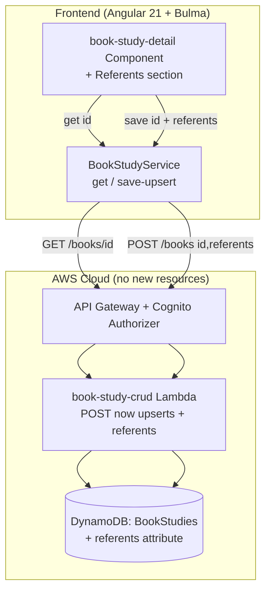
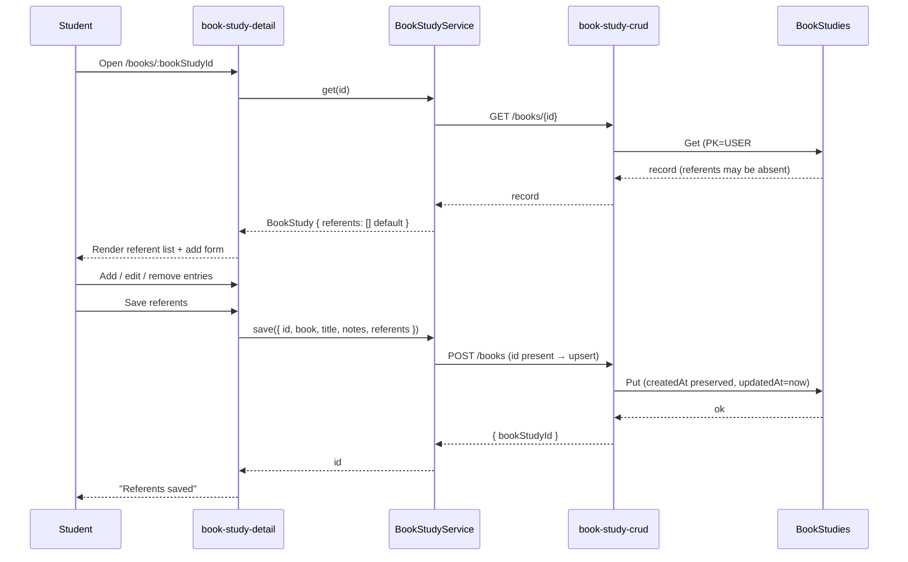

# Design Document: Referent Analysis (Step 6 — Identify Antecedents, Referents, Audience, and Speaker)

## Overview

This feature lets a student **document the referents they find in a study**: a list of referent
entries, each with the descriptive phrase, what it refers to, free-text notes, and an optional
free-text scroll-text reference (where in the book the phrase occurs). It is the first persisted
slice of inductive-study **Step 6** and the referent counterpart to the pronoun worklist (#20,
`.kiro/specs/parse-scroll-for-pronouns/`). Unlike the pronoun worklist, which is derived on demand
and stored nothing, this feature persists the student's **own interpretive work**.

The design is **additive and reuses the existing Book Study plumbing end to end**. A referent list
is stored as a new `referents` attribute on the existing `BookStudies` DynamoDB record, edited from
the existing `book-study-detail` component, read through the existing `BookStudyService.get`, and
persisted through the existing `POST /books` route handled by the `book-study-crud` Lambda — which
is extended to behave as an **upsert** exactly like the shipped `study-crud` POST already does
(`id ?? randomUUID()`, `createdAt ?? now`). No new DynamoDB table, Lambda, API route, or CORS method
is introduced; `infra/lib/stage-config.ts` is unchanged. It keeps the project's established Angular
21 standalone + signals + Bulma frontend and serverless-first backend patterns.

Consistent with the product's copyright stance, every referent field is the student's own words or
a free-text location; the app serves no Bible text and this feature puts nothing in an AI prompt.

## Architecture

The feature adds a Referents section to the Book Study detail page and extends the Book Study CRUD
Lambda to upsert the record (carrying the referent list). Everything else is already in place.





## Components and Interfaces

### Frontend (Angular 21 standalone, signals, Bulma)

**`book-study-detail` component** (`src/app/book-study-detail/book-study-detail.component.ts`) gains
a **Referents** section below the existing book/title/notes/timestamps block. It keeps its existing
`state` machine (`loading`/`loaded`/`notfound`/`error`), its `bookStudy` signal, and its 404-vs-5xx
`load()` branch (`err?.status === 404 ? 'notfound' : 'error'`) unchanged. Added signals:

- `referents = signal<Referent[]>([])` — the working list, initialised from the loaded record's
  `referents` (defaulting to `[]`), using Angular's immutable signal updates (`update`/`set` with a
  new array) so `OnPush` change detection fires.
- `draft = signal<{ phrase: string; refersTo: string; notes: string; scrollRef: string }>(...)` —
  the add-entry form model.
- `saveState = signal<'idle' | 'saving' | 'saved' | 'error'>('idle')` and a `saveError` signal.

Behaviour:
- **Add**: `addReferent()` trims `phrase`/`refersTo`; if either is empty it sets an inline
  validation flag and returns without mutating the list (Requirement 1 criteria 3–4); otherwise it
  appends `{ phrase, refersTo, notes, scrollRef }` (notes/scrollRef default `''`) to a new array and
  clears the draft.
- **Edit per-entry notes / scroll-ref**: bound to the entry via `update()` producing a new array
  (immutability for `OnPush`); phrase/refers-to are shown read-only on an added entry — editing them
  is done by removing and re-adding, which keeps the add/edit model simple and is called out in the
  requirements' Out of Scope note. (Alternative considered: fully inline-editable phrase/refers-to
  per row. Rejected for this increment to keep the component and its specs small; the entry shape
  already supports it, so an inline edit can be added later without a data change.)
- **Remove**: `removeReferent(index)` filters the entry out into a new array.
- **Save**: `saveReferents()` sets `saveState='saving'` and calls `BookStudyService.save(...)` with
  the current `bookStudy()` fields plus `referents()`; on success sets `saved` and updates the
  `bookStudy` signal's `updatedAt` from the reloaded/returned value; on error sets `error` and keeps
  the working list intact so the student can retry (Requirement 3 criterion 6).

`data-testid`s are namespaced to this section: `referents-section`, `referent-row`,
`referent-phrase`, `referent-refersto`, `referent-notes`, `referent-scrollref`,
`add-referent-form`, `add-referent-phrase`, `add-referent-refersto`, `add-referent-notes`,
`add-referent-scrollref`, `add-referent-button`, `remove-referent-button`, `save-referents-button`,
`referents-empty`, `referents-save-error`. The section uses Bulma `field`/`control`/`input`/
`textarea`/`table` and labeled controls, matching the existing form and detail markup.

**Decision — edit on the detail page, not a new route.** The Referents section lives on the
existing `/books/:bookStudyId` detail page rather than a new `/books/:id/referents` route. Step 6
work belongs to the book, the detail page is already the book's workspace, and keeping it there
avoids a new route, a new component, and extra navigation for what is one more section of the same
study. (A separate route was considered and rejected as premature; it can be split out later if the
detail page grows unwieldy.)

### `BookStudyService` (`src/app/book-study.service.ts`)

The service gains a `referents` field on its `BookStudy` mapping (tolerant default `[]`) and a
**`save`** method that POSTs an upsert. The existing `create`/`get`/`list`/`delete` are unchanged;
`save` is the create path generalised to carry an optional `id` and the referent list:

```typescript
export interface Referent {
  phrase: string;     // descriptive phrase found (required, <=200)
  refersTo: string;   // what it stands for (required, <=200)
  notes: string;      // free-text, '' when unset (<=1000)
  scrollRef: string;  // optional free-text location, '' when unset (<=1000)
}

// BookStudy (in models.ts) gains:  referents: Referent[];

class BookStudyService {
  // unchanged: list(), get(), create(input), delete(id)

  /** Create or update a book study (upsert). Returns the bookStudyId. */
  save(study: {
    id?: string; book: string; title: string; notes: string; referents: Referent[];
  }): Observable<string>;
}
```

`toBookStudy` is extended to read `record.referents` with a tolerant default
(`Array.isArray(record.referents) ? record.referents.map(normalizeReferent) : []`), so a legacy
record with no `referents` attribute loads as `[]` (Requirement 3 criterion 4). `normalizeReferent`
coerces each entry's four fields to strings defaulting to `''` (mirroring how `toBookStudy` already
defaults `title`/`notes` to `''`), so the in-app shape is uniform regardless of what the record
holds. `save` POSTs `{ id, book, title, notes, referents }` to `/books`; omitting `id` creates,
including it updates.

**Why reuse `POST /books` rather than add `PATCH`/`PUT`.** The shared CORS helper
(`infra/lambda/shared/cors.ts`) advertises `Access-Control-Allow-Methods: GET,POST,DELETE,OPTIONS`.
Adding a `PATCH`/`PUT` would require widening that string **and** adding a new API Gateway method —
the scroll-text feature deliberately avoided exactly this. The shipped `study-crud` POST is already
an idempotent upsert keyed by an optional `id`, so generalising `book-study-crud` POST the same way
is the established, lower-risk pattern: no new route, no CORS change, no new method. (Alternative:
add `PUT /books/{bookStudyId}`. Rejected — it needs a CORS-methods widening and a new route for no
behaviour the upsert POST does not already give.)

### Backend — `book-study-crud` Lambda (`infra/lambda/book-study-crud/index.ts`)

The `POST /books` handler is extended to upsert and to accept a `referents` array. The change mirrors
`study-crud`'s `saveWordStudy`:

- `parseCreateBody` becomes `parseSaveBody`: it additionally reads an optional `id`
  (`typeof === 'string' && length > 0 ? id : undefined`), an optional `createdAt`
  (same tolerant read as `study-crud`), and a `referents` array. It still validates `book`
  (`isValidBook`), `title` (≤200), and `notes` (≤2000) exactly as today. `referents` is validated
  per entry: `phrase` and `refersTo` are required non-empty strings ≤200 chars after trim; `notes`
  and `scrollRef` are optional strings defaulting to `''`, each ≤1000 chars. An invalid entry (missing
  required field, wrong type, or over-limit) → `400` with a message naming `referents`; a missing
  `referents` key defaults to `[]` (so an old client that omits it still works).
- `createBookStudy` becomes `saveBookStudy`: `const bookStudyId = input.id ?? randomUUID();` and
  `createdAt: input.createdAt ?? now`, `updatedAt: now`. The server still **ignores any body
  `userId`** and uses `claims.sub` for the PK (the existing security property, kept). On an update,
  `createdAt` is taken from the body when the client passes it back; to be robust the handler MAY
  read the existing record and prefer its stored `createdAt` — see "Invariant ownership".
- `GET`/`DELETE` are unchanged. The record returned by `GET` now includes `referents` (absent on
  legacy records; the frontend defaults it).

The `BookStudyRecord` interface in `infra/lambda/shared/models.ts` gains `referents: Referent[]`,
and a new exported `Referent` interface is added there (single source of truth shared by the Lambda;
the frontend `models.ts` has its own matching `Referent`, as the two packages already keep parallel
model files). The `BookStudy` app interface in `src/app/models.ts` gains `referents: Referent[]`.

### Routing and navigation

**None.** The feature is edited on the existing `/books/:bookStudyId` route; `app.routes.ts` and the
navbar are untouched.

## Data model / API changes

### DynamoDB — `BookStudies` (existing table, new attribute)

No key, GSI, billing, or table-name change. A new optional attribute is written on the item:

```typescript
interface Referent {
  phrase: string;     // <=200
  refersTo: string;   // <=200
  notes: string;      // '' when unset, <=1000
  scrollRef: string;  // '' when unset, <=1000 (free-text location, NOT a Scroll Study FK)
}

interface BookStudyRecord {
  // ...existing fields unchanged...
  referents: Referent[]; // NEW; absent on records written before this feature
}
```

Because the attribute is additive and optional, there is **no migration**: existing records simply
lack it and read back as `[]` (Requirement 3 criterion 4). The referent list is small free text, so
item-size limits are not a concern (unlike the scroll-text feature's 350 KB inline cap); a soft cap
is unnecessary for this increment but the per-field limits bound growth.

### API — `POST /books` (existing route, upsert semantics)

The route and its Cognito authorizer are unchanged. The request body gains an optional `id` (present
→ update, absent → create) and a `referents` array; the response is the existing `{ bookStudyId }`.
No new route, no CORS method change (POST already allowed). `GET /books/{bookStudyId}` and
`GET /books` responses now include `referents` on records that have it.

### Infra / CDK

No construct is added or renamed. No new un-hashed `public/` asset, so the `DeployShell`/
`DeployAssets` include/exclude lists are untouched. No new `fromLookup`, so `cdk.context.json` is
unchanged. No log group or Lambda count changes, so the count-based CDK assertion tests
(`toHaveLength`, `PROD_LOGICAL_IDS`) keep passing without edits.

## Error handling

| Operation | Failure condition | How detected | Recoverable? | Caller receives | Logged |
|---|---|---|---|---|---|
| `GET /books/{id}` | study not found / not owned | existing 404 | n/a | detail page `notfound` state (existing) | no |
| `GET /books/{id}` | network / 5xx | `err.status !== 404` | yes | `error` state with existing Retry | browser console |
| load → map referents | record has no `referents` | `Array.isArray` false | n/a | `referents = []` (no error) | no |
| add referent | phrase/refers-to empty after trim | client validation | yes | inline message; no entry added | no |
| add/edit referent | field over length limit | client `maxlength` + server check | yes | input blocked client-side; server → 400 if bypassed | 400 (client error), no server log |
| `POST /books` (save) | invalid body (bad book, over-long title/notes, bad referent) | server validation | yes | `400` + message; nothing written | no (client error) |
| `POST /books` (save) | DynamoDB throttle/capacity / network | SDK error | yes | `500`; detail page `error` save state, working list retained for retry (Req 3 criterion 6) | error, Lambda log |
| save | wrong owner (study belongs to another user) | PK from `claims.sub` | n/a | upsert writes under the caller's own PK, so it can never touch another user's record (create under self, not update of theirs) | no |

**Validation rules (external inputs).**
- `id` (body, optional): string; empty/absent → create (new UUID); present → update that id **under
  the caller's own PK** only.
- `book` (body): required; must pass `isValidBook` (existing). Failure → 400.
- `title` (body): optional string ≤200 (existing). `notes` (body): optional string ≤2000 (existing).
- `referents` (body): optional array (default `[]`); each entry must have `phrase` and `refersTo` as
  non-empty strings ≤200 after trim, and `notes`/`scrollRef` as strings ≤1000 (defaulting to `''`).
  Any violation → 400 naming `referents`. The scroll-text reference is **not** validated as a real
  location — it is free text (assumption A3).
- `scrollStudyId`/scroll linkage: none — the scroll-text reference is a plain string, so there is no
  cross-entity lookup to fail.

**Invariant ownership.** User-scoping stays in the Lambda exactly as today: the PK is built from
`claims.sub`, body `userId` is ignored, and a get/delete of another user's study returns 404. The
"referent entry is well-formed" invariant is owned by the Lambda's `parseSaveBody` (authoritative,
never trusts the client) with a mirroring client-side check for UX. The `createdAt`-preservation
invariant is owned by the Lambda: like `study-crud` it accepts the client's echoed `createdAt`, and
to be robust against a client that drops it on update, the save path reads the existing record and
prefers its stored `createdAt` when present, falling back to the body value, then to `now`. This
keeps "createdAt is preserved across updates" true even if the client omits it.

## Testing strategy

All tests run under the existing harnesses (frontend: Angular + vitest; infra: vitest with mocked
SDK — never hitting AWS; `infra/test/setup-no-aws.ts` points unmocked calls at a dead endpoint).

**Lambda — `book-study-crud` (`infra/lambda/book-study-crud/index.test.ts`, extend existing):**
- POST with an `id` present updates in place (same `bookStudyId` returned) and preserves `createdAt`
  while advancing `updatedAt`; POST without `id` still creates (existing tests keep passing).
- POST stores a `referents` array verbatim (phrase/refersTo/notes/scrollRef) and defaults a missing
  `referents` to `[]`.
- Validation: a referent entry with empty `phrase` or empty `refersTo` → 400 naming `referents`; an
  over-200 phrase/refers-to or over-1000 notes/scrollRef → 400; body `userId` still ignored (PK from
  `sub`) with a referent list present.
- Property test (fast-check, matching the file's existing `fc` usage): for any array of valid
  referent entries, POST returns 200 and a round-trip GET returns the same `referents` in order; the
  existing round-trip property is extended to assert `referents` equality.

**Frontend — `BookStudyService` (`book-study.service.spec.ts`, extend):**
- `get` maps a record **with** `referents` (preserved, normalised) and **without** `referents`
  (→ `[]`); `normalizeReferent` coerces missing fields to `''`.
- `save` POSTs `{ id, book, title, notes, referents }` to `/books` and returns the id; omitting `id`
  creates.

**Frontend — `book-study-detail` component (`book-study-detail.component.spec.ts`, extend):**
- Renders the Referents section with existing entries and the empty state when none; the add form
  appends on valid submit and clears; empty phrase or refers-to blocks the add with an inline
  message (ties Requirement 1 criteria 3–4).
- Per-entry notes/scroll-ref edits update the working list; remove drops the entry.
- Save calls `BookStudyService.save` with the current fields plus `referents()`; the `saving`→`saved`
  path renders a confirmation; a save error keeps the working list and shows the error (Req 3
  criterion 6). A regression assertion confirms the detail page issues exactly the `get` on load and
  the `save` on save (no new/unexpected service dependency), and that the existing load states
  (`loading`/`notfound`/`error`) are unchanged.

**CDK / infra:** no change and nothing new to assert — no construct, route, table, or Lambda is
added, so the existing `infra/test/` suite (including the log-group count and `PROD_LOGICAL_IDS`
freeze) is untouched and keeps passing. The `BookStudies` table's existing on-demand-billing and
per-stage retention assertions already cover it; no new count moves.

## Risks

- **Upsert via POST vs. a REST `PUT`.** Reusing POST as an upsert is slightly less REST-idiomatic
  than a `PUT`, but it matches the shipped `study-crud` pattern and avoids a CORS-methods widening
  and a new route. The trade-off is accepted and documented; a `PUT` can be introduced later if a
  broader REST cleanup is undertaken.
- **Concurrent edits / last-write-wins.** Two tabs saving the same study will last-write-win on the
  whole `referents` array (the record is written as a unit, as the word-study tool already does).
  This matches existing behaviour and is acceptable for a single-user tool; no optimistic-locking is
  added.
- **`createdAt` on update.** If a future client posts an update without echoing `createdAt`, the
  Lambda's read-existing-then-prefer-stored fallback keeps `createdAt` stable; this is the one place
  the save path reads before writing (a small extra `GetCommand`), chosen over trusting the client to
  always round-trip the field.
- **Free-text scroll reference drift.** Because the scroll-text reference is free text (A3), it can
  become stale or not match any Scroll Study. Accepted for this increment; linking to a real Scroll
  Study record is Out of Scope and can be layered on later without changing the stored shape (the
  field would gain structure, not move).
- **Phrase/refers-to editability.** Added entries expose only notes/scroll-ref for inline edit;
  correcting a phrase means remove-and-re-add. Called out in requirements' Out of Scope; the entry
  shape already supports inline phrase editing if that is wanted later.

## Out of scope

- Antecedents, audience, speaker, and point of view (the rest of Step 6).
- Linking a referent to a specific Scroll Study record or validating the scroll-text reference
  against stored scroll text (the reference is free text).
- Auto-detecting/suggesting referent phrases from text (no parsing/NLP).
- Any AI summary or synthesis of referents (no Bedrock).
- A top-level "Referents" navbar surface or a cross-study referent view.
- A dedicated `PUT`/`PATCH` route or any new table/Lambda/API resource.
- Changes to the Word Study tool, the Scroll Study tool, or the pronoun worklist (#20).
