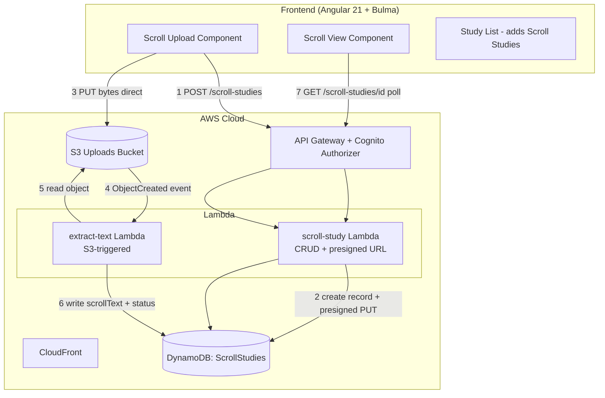
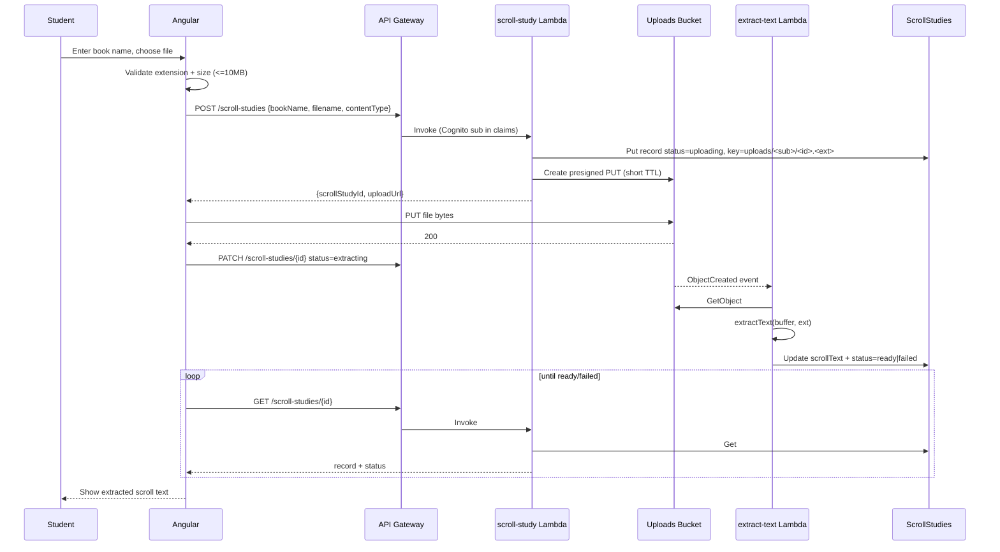

# Design Document: Scroll Text Upload (Step 4 — Observe the Text as a Scroll)

## Overview

This feature adds a second study tool to the suite — a **Scroll Study** for inductive-study
**Step 4 (Observe the Text as a Scroll)**. A student uploads a document (PDF, Word `.docx`,
or plain `.txt`) containing a book of the Bible in "scroll" form, the system extracts the
running text, and stores it as a Scroll Study record owned by the student. The student can
re-open the study later and read the extracted text while working subsequent steps.

The design reuses the project's established serverless-first pattern: an Angular 21 standalone
frontend (signals + Bulma) served from S3/CloudFront, API Gateway with the existing Cognito
authorizer, Lambda handlers, and DynamoDB for per-user records. It adds two new backend
resources — an **uploads S3 bucket** and a **`ScrollStudies` DynamoDB table** — plus a new
`scroll-study` Lambda and an `extract-text` Lambda. All new constructs are additive; no
existing construct ID or stateful physical name is renamed, and no prod value in
`stage-config.ts` is edited (new values follow the existing per-stage shape).

The upload itself never passes through the API: the browser requests a short-lived presigned
S3 `PUT` URL and uploads bytes directly to S3. An S3 `ObjectCreated` event triggers the
extraction Lambda asynchronously, which writes the extracted text back onto the Scroll Study
record and flips its status. The frontend polls the study record for status.

Consistent with the product's copyright stance, the uploaded file is the **student's own
document**, stored privately under their user prefix and scoped to them; it is never served to
other users and is not placed into any AI prompt by this feature.

## Architecture



### Upload / extraction sequence



## Components and Interfaces

### Frontend (Angular 21 standalone, signals, Bulma)

New components under `src/app/`, lazily routed like the existing `study-page`:

- **`scroll-upload` component** (`src/app/scroll-upload/`): Bulma form with a book-name
  `input`, a `file` input, inline validation messages, and an upload progress/notification
  area. Holds state in signals (`bookName`, `selectedFile`, `uploadState`). Emits nothing
  up; it drives the flow via a new `ScrollStudyService` and navigates to the view on success.
- **`scroll-view` component** (`src/app/scroll-view/`): read-only display. Shows status
  (`uploading`/`extracting` → Bulma "processing" notification with `aria-live="polite"`;
  `ready` → scrollable `<pre>`/`box` with the text and an optional truncation notice;
  `failed` → `is-danger` notification with the reason and a re-upload button). Uses signals
  and polls via the service while status is non-terminal.
- **`study-list` (existing)**: extended to also list Scroll Studies alongside word studies,
  each row tagged with its type (Bulma `tag`), book name/word, date, and status. The list
  calls both `StudyCrudService.listStudies()` and `ScrollStudyService.listScrollStudies()`
  and merges by `updatedAt` descending.

New routes in `app.routes.ts` (additive): `scroll/new` → `scroll-upload`,
`scroll/:scrollStudyId` → `scroll-view`.

**`ScrollStudyService`** (`src/app/scroll-study.service.ts`), mirroring `StudyCrudService`:

```typescript
interface CreateScrollStudyResponse {
  scrollStudyId: string;
  uploadUrl: string;        // presigned S3 PUT
  objectKey: string;
}
interface ScrollStudy {
  id: string;
  userId: string;
  bookName: string;
  status: 'uploading' | 'extracting' | 'ready' | 'failed';
  scrollText: string;       // populated when ready
  truncated: boolean;
  failureReason: string;    // populated when failed
  createdAt: string;
  updatedAt: string;
}
class ScrollStudyService {
  createScrollStudy(input: { bookName: string; filename: string; contentType: string }): Observable<CreateScrollStudyResponse>;
  uploadBytes(uploadUrl: string, file: File): Observable<void>;        // direct S3 PUT, no auth header
  markExtracting(id: string): Observable<void>;                        // PATCH after upload
  getScrollStudy(id: string): Observable<ScrollStudy>;
  listScrollStudies(): Observable<ScrollStudy[]>;
  deleteScrollStudy(id: string): Observable<void>;
}
```

The existing `userIdInterceptor` attaches the Cognito bearer token to `/studies` and `/ai/`
URLs. It must be extended to also match `/scroll-studies`. The **presigned S3 `PUT`** goes to
an S3 URL (not the API host) and must NOT carry the `Authorization` header — the interceptor's
URL check already excludes non-API hosts, so `uploadBytes` is safe as long as it does not match
the interceptor's substrings; the S3 URL does not contain `/scroll-studies` so no change is
needed there, but the interceptor's allow-list is updated to include `/scroll-studies` for the
API calls.

### Backend Lambdas

- **`scroll-study` Lambda** (`infra/lambda/scroll-study/index.ts`): handles the CRUD + presign
  routes, following the `study-crud` handler shape (reads `sub` from
  `requestContext.authorizer.claims`, uses `corsResponse`/`getRequestOrigin` from
  `shared/cors.ts`). Routes:
  - `POST /scroll-studies` → validate `bookName` (required, ≤100 chars) and `filename`
    extension; create the DynamoDB record with status `uploading` and a user-scoped object key
    `uploads/<sub>/<scrollStudyId>.<ext>`; return a presigned `PUT` URL
    (`@aws-sdk/s3-request-presigner`, TTL 300s) constrained to that key and content type.
  - `PATCH /scroll-studies/{scrollStudyId}` (body `{status:'extracting'}`) → set status
    `extracting` only; any other transition is ignored.
  - `GET /scroll-studies` → list current user's records (GSI, newest first).
  - `GET /scroll-studies/{scrollStudyId}` → get, 404 if not owned.
  - `DELETE /scroll-studies/{scrollStudyId}` → delete record and best-effort delete the S3
    object.
- **`extract-text` Lambda** (`infra/lambda/extract-text/index.ts`): S3 `ObjectCreated`
  trigger. Parses the key to recover `userId` + `scrollStudyId`, reads the object, runs
  `extractText`, writes `scrollText` (truncated to limit), `truncated`, and status
  `ready`/`failed` back to the record. Memory 512 MB, timeout 60s (PDF/Word parsing is heavier
  than the existing 256MB/15s functions).

Shared validation lives in `infra/lambda/shared/validation.ts` (new `isAllowedUpload`,
`uploadExtension` helpers) and new models in `infra/lambda/shared/models.ts`.

### Text extraction

```typescript
type ExtractResult =
  | { ok: true; text: string }
  | { ok: false; reason: string };

async function extractText(buf: Buffer, ext: 'pdf' | 'docx' | 'txt'): Promise<ExtractResult>;
```

- `.txt` → `buf.toString('utf8')`; empty/whitespace-only → failure.
- `.pdf` → `pdf-parse` (pure JS, no native deps; bundles cleanly with esbuild). Image-only PDFs
  yield empty text → failure "No extractable text (the PDF may be scanned images).".
- `.docx` → `mammoth` `extractRawText` (pure JS). Returns plain text.

Both libraries are pure-JS and bundle under the existing `nodejs.NodejsFunction` esbuild
setup; no Lambda layer or container image is needed. **Decision:** use `pdf-parse` + `mammoth`
rather than Textract — Textract is an extra always-considered AWS service, costs per page, and
is overkill for text-layer documents, which conflicts with the "keep the number of distinct
AWS services small" and cost-efficiency steering. If a future need for scanned-image OCR
arises it can be added behind the same `failed` path.

`extractText` never throws: library errors are caught and mapped to `{ ok: false, reason }`.

## Data model / API changes

### DynamoDB table: `ScrollStudies` (new, additive)

A new table rather than overloading `WordStudies`, keeping the two tools' records cleanly
separated and the word-study schema frozen. Same single-table key shape and GSI as
`WordStudies` so the CRUD code and tests mirror the existing ones.

```typescript
interface ScrollStudyRecord {
  PK: string;            // "USER#<sub>"
  SK: string;            // "SCROLL#<scrollStudyId>"
  scrollStudyId: string;
  userId: string;        // Cognito sub
  bookName: string;      // <=100 chars
  objectKey: string;     // "uploads/<sub>/<scrollStudyId>.<ext>"
  status: 'uploading' | 'extracting' | 'ready' | 'failed';
  scrollText: string;    // '' until ready
  truncated: boolean;
  failureReason: string; // '' unless failed
  createdAt: string;     // ISO 8601
  updatedAt: string;     // ISO 8601
  GSI1PK: string;        // "USER#<sub>"
  GSI1SK: string;        // "UPDATED#<updatedAt>"
}
```

**Storage limit.** DynamoDB caps an item at 400 KB. The record holds the extracted text
inline, so `scrollText` is capped to **350,000 bytes** (leaving headroom for the other
attributes); longer text is stored truncated with `truncated = true`. A typical Bible book in
plain text is well under this (e.g. Psalms, the longest, is ≈ 100 KB), so truncation is an edge
case, not the norm. **Decision:** inline in DynamoDB rather than storing the extracted text as
a second S3 object — it keeps reads single-call and the CRUD code identical to the word-study
tool, and the 350 KB cap comfortably covers single books. If multi-book or whole-Bible scrolls
become a requirement, the extracted text would move to S3 and the record would hold a pointer;
that is out of scope here.

### S3 uploads bucket (new, additive)

- `blockPublicAccess: BLOCK_ALL`, `enforceSSL`, S3-managed encryption (matches `SiteBucket`).
- CORS rule allowing `PUT` from the stage's allowed origins (same list as the API) so the
  browser can upload directly.
- Lifecycle rule expiring objects after **7 days** — the source file is only needed until
  extraction completes; the extracted text lives in DynamoDB.
- `removalPolicy`/`autoDeleteObjects`: uploads are transient and rebuildable, so **DESTROY in
  every stage** (like `SiteBucket`), independent of `statefulRemovalPolicy`. The bucket holds
  no durable user data (that is the DynamoDB record), so it is not a frozen stateful resource.
- Triggers `extract-text` on `ObjectCreated` (S3 event notification / `addEventSource`).

### API Gateway routes (new, additive, Cognito-authorized)

Added to `WordStudyToolStack` exactly like the `/studies` routes, each with
`authMethodOptions`:

```
POST   /scroll-studies
GET    /scroll-studies
GET    /scroll-studies/{scrollStudyId}
PATCH  /scroll-studies/{scrollStudyId}
DELETE /scroll-studies/{scrollStudyId}
```

`defaultCorsPreflightOptions` already allows all methods and the needed headers; `PATCH` is
within `Cors.ALL_METHODS`. The shared `corsResponse` `Allow-Methods` string is widened to
include `PATCH`.

### IAM (least privilege)

- `scroll-study` Lambda: `ScrollStudies` read/write; `s3:PutObject` + `s3:DeleteObject` on
  `uploads/*` of the uploads bucket (presign needs the grant on the signer's role).
- `extract-text` Lambda: `ScrollStudies` read/write (update by key); `s3:GetObject` on the
  uploads bucket.

### Stage config

No prod values change. The new bucket/table honour the existing `config.nameSuffix`
(`ScrollStudies` → `ScrollStudies-dev`) and dev's `DESTROY` policy. The uploads bucket uses
`DESTROY` + `autoDeleteObjects` in both stages (transient data). CORS origins for the uploads
bucket reuse the already-computed `allowedOrigins` array. No new `fromLookup` is introduced, so
no `cdk.context.json` change is required.

### Deploy / caching note

No new un-hashed files are added to `public/`, so the `DeployShell`/`DeployAssets`
include/exclude lists are unaffected.

## Error handling

| Operation | Failure condition | Recoverable? | Caller receives | Logged |
|---|---|---|---|---|
| `POST /scroll-studies` | missing/oversized book name, bad extension | yes | 400 + message; no record created | no (client error) |
| presign | S3/SDK error | yes | 500; frontend shows retry | error, Lambda log |
| direct S3 `PUT` | network / expired URL | yes | frontend catches, offers retry (book name retained) | n/a (browser) |
| `extract-text` read | object missing | no (for that upload) | record → `failed`, reason set | warn |
| `extract-text` parse | unreadable/encrypted/image-only/empty | no (for that file) | record → `failed`, reason set | warn |
| `extract-text` DDB update | throttle/capacity | retried by Lambda async retry; terminal failure leaves `extracting` | polling continues; see stuck-state note | error |
| `GET`/`DELETE` wrong owner | `scrollStudyId` not under user PK | n/a | 404 | no |

**Stuck `extracting` guard.** Because extraction is async and a hard Lambda failure could
leave a record in `extracting`, the frontend poller stops after a bounded number of attempts
(e.g. 20 polls at 3s ≈ 60s, matching the extractor timeout) and then shows a timeout message
with a re-upload option, so the UI never hangs indefinitely. The record is not auto-deleted;
the student can delete or re-upload.

**Validation rules (external inputs).**
- `bookName`: required, string, 1–100 chars after trim; failure → 400.
- `filename`/extension: required; must map to `pdf|docx|txt`; failure → 400 (server) and
  blocked client-side.
- file size: client-side ≤10 MB; the presigned URL also constrains content length, and the S3
  lifecycle + bucket policy bound server-side exposure.
- `status` on `PATCH`: only `extracting` accepted; other values ignored (no error, no change)
  to keep the transition one-way.

**Invariant ownership.** User-scoping is enforced in the Lambda (every key is built from the
Cognito `sub`; cross-user access returns 404) — the same layer and reasoning as `study-crud`.
The one-way status progression (`uploading → extracting → ready|failed`) is owned by the two
Lambdas: `scroll-study` only ever sets `uploading`/`extracting`; `extract-text` only ever sets
`ready`/`failed`. This keeps a single writer for the terminal states.

## Testing strategy

Unit (vitest, mocked SDK — never hit AWS; `infra/test/setup-no-aws.ts` points unmocked calls
at a dead endpoint):
- `isAllowedUpload` / `uploadExtension`: property test over filenames (allowed iff extension in
  the set), mirroring the existing `validateStrongsNumber` property tests.
- `extractText`: txt happy path, empty-txt failure, docx via a tiny fixture buffer (mammoth),
  pdf via a tiny text-layer fixture and an image-only fixture → failure; assert it never
  throws and truncation sets `truncated` exactly at the limit boundary.
- `scroll-study` handler: create returns id + presigned url (S3 presigner mocked); get/list/
  delete scope by `sub`; wrong-owner get → 404; `PATCH` only accepts `extracting`.
- `extract-text` handler: given an S3 event, reads (mocked) object and writes correct status.

Frontend (Angular + vitest):
- `ScrollStudyService`: builds correct requests; `uploadBytes` PUTs to the presigned URL
  without an auth header.
- `scroll-upload`: extension and size validation gate the create call; error path retains book
  name.
- `scroll-view`: renders processing/ready/failed states; polling stops on terminal status and
  after the bounded timeout.
- `study-list`: merges and sorts both study types by `updatedAt`.

CDK assertion tests (`infra/test/`): the `ScrollStudies` table (keys + GSI), the uploads bucket
(block-public-access, lifecycle expiry, CORS), the five authorized routes, the S3→Lambda event
wiring, and the two Lambdas' IAM grants. A guard assertion confirms the uploads bucket is
`DESTROY`/auto-delete and the `ScrollStudies` table honours `statefulRemovalPolicy` per stage.

Integration: upload → event → extract → ready reload is exercised with mocked S3/DDB; no step
calls AWS or Bedrock.

## Risks

- **Bundle size / cold start.** `pdf-parse` and `mammoth` enlarge the `extract-text` bundle and
  cold-start time. Mitigated by isolating them in the extraction Lambda only (the CRUD Lambda
  stays lean) and 512 MB memory. If bundling proves problematic under esbuild/minify, pin exact
  versions (steering requires exact pins) and, if needed, disable minify for that function.
- **Dependency trust.** `pdf-parse` and `mammoth` are widely used but add third-party code that
  parses untrusted files. Pin exact versions; the extractor runs with least-privilege IAM and
  no network egress needs.
- **DynamoDB 400 KB item cap.** Addressed by the 350 KB truncation; multi-book scrolls would
  need the S3-pointer variant (out of scope).
- **Async extraction UX.** Polling + bounded timeout avoids an indefinitely stuck UI; there is
  no WebSocket/push (deliberately, to keep the service list small).
- **"Book Study" naming.** This spec ships a Scroll Study, not a cross-tool Book Study
  aggregate; if the maintainer intends the latter as a first-class entity, that is a follow-up
  product decision (flagged in requirements).

## Out of scope

- Cross-tool "Book Study" aggregate linking scroll studies to word studies.
- In-app editing/re-formatting of extracted text (read-only).
- OCR of scanned/image-only PDFs; `.doc`, RTF, ePub; direct Google Drive integration.
- Chapter/verse structural parsing (Step 7) and use of scroll text in the AI summary.
- Real-time push for extraction status (polling only).
