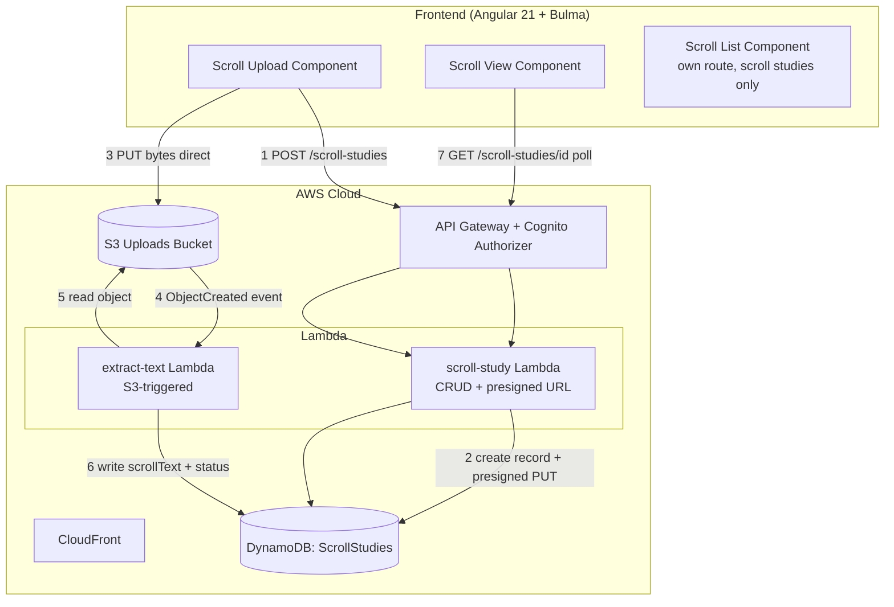
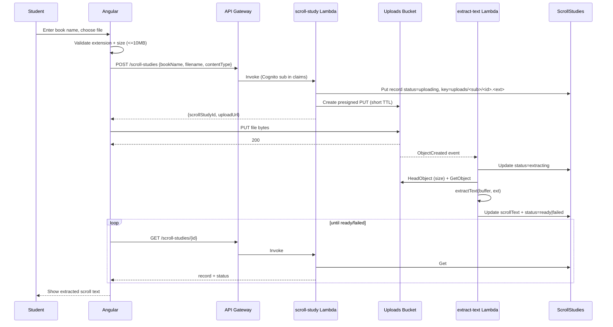

# Design Document: Scroll Text Upload (Step 4 — Observe the Text as a Scroll)

## Overview

This feature adds a second study tool to the suite — a **Scroll Study** for inductive-study
**Step 4 (Observe the Text as a Scroll)**. A student uploads a document (PDF, Word `.docx`,
or plain `.txt`) containing a book of the Bible in "scroll" form, the system extracts the
running text, and stores it as a Scroll Study record owned by the student. The student can
re-open the study later and read the extracted text while working subsequent steps.

The design reuses the project's established serverless-first pattern: an Angular 21 standalone
frontend (signals + Bulma) served from S3/CloudFront, API Gateway with the existing Cognito
authorizer, Lambda handlers, and DynamoDB for per-user records. It adds two new backend
resources — an **uploads S3 bucket** and a **`ScrollStudies` DynamoDB table** — plus a new
`scroll-study` Lambda and an `extract-text` Lambda. All new constructs are additive; no
existing construct ID or stateful physical name is renamed, and no prod value in
`stage-config.ts` is edited (new values follow the existing per-stage shape).

The upload itself never passes through the API: the browser requests a short-lived presigned
S3 `PUT` URL and uploads bytes directly to S3. An S3 `ObjectCreated` event triggers the
extraction Lambda asynchronously, which owns the full status progression after upload
(`uploading → extracting → ready|failed`), writing the extracted text back onto the Scroll
Study record. The browser only creates and polls — it never writes status — so there is no
client/worker status race. The frontend polls the study record for status.

Consistent with the product's copyright stance, the uploaded file is the **student's own
document**, stored privately under their user prefix and scoped to them; it is never served to
other users and is not placed into any AI prompt by this feature.

## Architecture



### Upload / extraction sequence



## Components and Interfaces

### Frontend (Angular 21 standalone, signals, Bulma)

New components under `src/app/`, lazily routed like the existing `study-page`:

- **`scroll-upload` component** (`src/app/scroll-upload/`): Bulma form with a book-name
  `input`, a `file` input, inline validation messages, and an upload progress/notification
  area. Holds state in signals (`bookName`, `selectedFile`, `uploadState`). Emits nothing
  up; it drives the flow via a new `ScrollStudyService` and navigates to the view on success.
- **`scroll-view` component** (`src/app/scroll-view/`): read-only display. Shows status
  (`uploading`/`extracting` → Bulma "processing" notification with `aria-live="polite"`;
  `ready` → a scrollable, read-only `box` holding the text in a `<pre>` styled
  `white-space: pre-wrap` (so the running text wraps on long lines instead of overflowing
  horizontally, while preserving the extractor's newlines) with a bounded `max-height` and
  `overflow-y: auto`, plus an optional truncation notice;
  `failed` → `is-danger` notification with the reason and a re-upload button). Uses signals
  and polls via the service while status is non-terminal.
- **`scroll-list` component** (`src/app/scroll-list/scroll-list.component.ts`): a **new,
  separate** list surface for Scroll Studies, distinct from the existing `study-list` word
  surface. Per the PR #17 owner decision, the two kinds are **not** merged into one table — the
  scroll list loads and renders only Scroll Studies from `ScrollStudyService`, and the existing
  `study-list` is left **unchanged** (it keeps its `My Word Studies` heading, its
  `Word`/`Strong's #`/`Last Updated` columns, its `firstWord()`/`firstStrongsNumber()` helpers,
  its `/study/:id` routing, its word-interpolating delete modal, and all its existing
  `data-testid`s). No `ListRow` union, no `forkJoin`, and no combined "My Studies" heading are
  introduced.

  `scroll-list` mirrors `study-list`'s structure and accessibility (the same signal-based
  `state` machine — `idle`/`loading`/`loaded`/`error` — the same empty-state box, the same
  retry button, and the same delete-confirmation modal pattern) so the two lists stay visually
  and behaviourally consistent while remaining separate components. `loadScrollStudies()` calls
  **only** `ScrollStudyService.listScrollStudies()` and sorts the result by `updatedAt`
  descending; on error it shows the error state with a retry button.

  Table columns: **Book** (the book name, primary column), **Status** (a Bulma `tag`:
  `uploading`/`extracting` → `is-warning`, `ready` → `is-success`, `failed` → `is-danger`),
  **Last Updated**, and an actions column. `openScrollStudy(study)` routes to `/scroll/:id`.
  The delete modal references the book name and calls `ScrollStudyService.deleteScrollStudy`.
  Its own `data-testid`s are namespaced to avoid colliding with the word list's specs:
  `scroll-row`, `scroll-book`, `scroll-status`, `open-scroll-button`, `delete-scroll-button`,
  `scroll-delete-modal`, etc. The empty state reads "No scroll studies yet. Upload a document
  to start one."

New routes in `app.routes.ts` (additive): `scrolls` → `scroll-list` (the Scroll Studies list),
`scroll/new` → `scroll-upload`, `scroll/:scrollStudyId` → `scroll-view`. The existing `''` →
`study-list` and `study/new`/`study/:studyId` routes are untouched.

### Navigation (how the student reaches the separate scroll list)

Because the combined "My Studies" table is gone, the Scroll Studies list needs its own way in.
The root `App` component (`src/app/app.ts`) already renders a Bulma `navbar` whose `navbar-start`
holds the word-study entries. **Decision (reasonable and reversible):** add two sibling
`navbar-item` links in that same `navbar-start`, alongside the existing ones, rather than
introduce a dropdown or a tool-switcher landing page — the suite has exactly two list surfaces
today, so two flat links are the simplest fit for the existing pattern and trivially revisited
if more tools are added later:

- **"Scroll Studies"** → `routerLink="/scrolls"` with `routerLinkActive="is-active"` (the new
  `scroll-list`).
- **"New Scroll Study"** → `routerLink="/scroll/new"` with `routerLinkActive="is-active"` (the
  existing `scroll-upload`).

The existing word-study links are kept and only their **label** is clarified so the two tools
read as peers: the current `My Studies` link (route `/`, which renders the word list whose own
heading is already `My Word Studies`) is relabeled **"Word Studies"**, and `New Study` becomes
**"New Word Study"**. These are text/`routerLink` changes to the existing navbar markup — no new
component, no routing-guard, no change to the word-study list component itself — so the change is
easily reversed. (A nested `navbar-dropdown` grouping each tool's list/new links was considered
but rejected as premature for two tools; it can be adopted later without reworking the routes.)

**`ScrollStudyService`** (`src/app/scroll-study.service.ts`), mirroring `StudyCrudService`:

```typescript
interface CreateScrollStudyResponse {
  scrollStudyId: string;
  uploadUrl: string;        // presigned S3 PUT
  objectKey: string;
}
interface ScrollStudy {
  id: string;
  userId: string;
  bookName: string;
  status: 'uploading' | 'extracting' | 'ready' | 'failed';
  scrollText: string;       // populated when ready
  truncated: boolean;
  failureReason: string;    // populated when failed
  createdAt: string;
  updatedAt: string;
}
class ScrollStudyService {
  createScrollStudy(input: { bookName: string; filename: string; contentType: string }): Observable<CreateScrollStudyResponse>;
  uploadBytes(uploadUrl: string, file: File): Observable<void>;        // direct S3 PUT, no auth header
  getScrollStudy(id: string): Observable<ScrollStudy>;
  listScrollStudies(): Observable<ScrollStudy[]>;
  deleteScrollStudy(id: string): Observable<void>;
}
```

The existing `userIdInterceptor` (`src/app/user-id.interceptor.ts`) attaches the Cognito bearer
token only when `req.url.includes('/studies') || req.url.includes('/ai/')`. A `/scroll-studies`
URL does **not** contain the substring `/studies` (the slash precedes "scroll"), so the
allow-list must be extended to also match `/scroll-studies` for the API calls. The **presigned
S3 `PUT`** goes to an S3 URL whose key prefix is `uploads/...`, which matches neither `/studies`
nor `/ai/` nor `/scroll-studies`; `uploadBytes` therefore correctly carries **no**
`Authorization` header (a presigned URL is self-authenticating and S3 would reject an extra
bearer token). This safety depends on the key prefix staying `uploads/` — the prefix is fixed
by this design precisely so a future rename to something containing "studies" cannot silently
attach a bearer token to the S3 request.

### Backend Lambdas

- **`scroll-study` Lambda** (`infra/lambda/scroll-study/index.ts`): handles the CRUD + presign
  routes, following the `study-crud` handler shape (reads `sub` from
  `requestContext.authorizer.claims`, uses `corsResponse`/`getRequestOrigin` from
  `shared/cors.ts`). Routes:
  - `POST /scroll-studies` → validate `bookName` (required, ≤100 chars) and `filename`
    extension; create the DynamoDB record with status `uploading` and a user-scoped object key
    `uploads/<sub>/<scrollStudyId>.<ext>`; return a presigned `PUT` URL
    (`@aws-sdk/s3-request-presigner`, TTL 300s) constrained to that key and content type.
  - `GET /scroll-studies` → list current user's records (GSI, newest first).
  - `GET /scroll-studies/{scrollStudyId}` → get, 404 if not owned.
  - `DELETE /scroll-studies/{scrollStudyId}` → delete record and best-effort delete the S3
    object.
- **`extract-text` Lambda** (`infra/lambda/extract-text/index.ts`): S3 `ObjectCreated`
  trigger and the **sole writer of the post-upload status progression**. For each event
  record it parses the key `uploads/<sub>/<scrollStudyId>.<ext>` to recover `userId` +
  `scrollStudyId`. If the key does not match that exact shape it logs a warning and skips the
  record (no DynamoDB write), so the handler is a total function over events (Requirement 2
  AC 7). On a matching key it: (1) writes `status = extracting` (so the UI reflects progress
  even though no client PATCH exists); (2) checks the object size via `HeadObject` (or the
  event's `object.size`) and, if it exceeds 10 MB, sets `status = failed`, reason
  "file too large", and stops without downloading — this is the authoritative server-side size
  gate (Requirement 2 AC 6); (3) otherwise reads the object, runs `extractText`, and writes
  `scrollText` (truncated to limit), `truncated`, and `status = ready|failed`. Because this
  Lambda is the only writer of `extracting`/`ready`/`failed`, there is no race with the client.
  Memory 512 MB, timeout 60s (PDF/Word parsing is heavier than the existing 256MB/15s
  functions).

Shared validation lives in `infra/lambda/shared/validation.ts` (new `isAllowedUpload`,
`uploadExtension` helpers) and new models in `infra/lambda/shared/models.ts`.

### Text extraction

```typescript
type ExtractResult =
  | { ok: true; text: string }
  | { ok: false; reason: string };

async function extractText(buf: Buffer, ext: 'pdf' | 'docx' | 'txt'): Promise<ExtractResult>;
```

- `.txt` → `buf.toString('utf8')`; empty/whitespace-only → failure.
- `.pdf` → `pdf-parse` (pure JS, no native deps; bundles cleanly with esbuild). Image-only PDFs
  yield empty text → failure "No extractable text (the PDF may be scanned images).".
- `.docx` → `mammoth` `extractRawText` (pure JS). Returns plain text.

Both libraries are pure-JS and bundle under the existing `nodejs.NodejsFunction` esbuild
setup; no Lambda layer or container image is needed.

**New `infra` runtime dependencies (exact pins, per steering).** Four packages are added to
`infra/package.json` `dependencies`:
- `@aws-sdk/client-s3` and `@aws-sdk/s3-request-presigner` — pinned to **`3.1037.0`**, matching
  the existing `@aws-sdk/*` line already in the file (`client-bedrock-runtime`,
  `client-dynamodb`, `lib-dynamodb` are all `3.1037.0`). `scroll-study` uses the presigner for
  the `PUT` URL; `extract-text` uses `client-s3` for `HeadObject`/`GetObject`.
- `pdf-parse` and `mammoth` — pinned to a single exact version each (chosen and verified to
  bundle cleanly at implementation time; see the bundle-size risk). No `fast-check` change is
  needed — it is already a devDependency (`4.7.0`) for the proposed property tests.

**Decision:** use `pdf-parse` + `mammoth`
rather than Textract — Textract is an extra always-considered AWS service, costs per page, and
is overkill for text-layer documents, which conflicts with the "keep the number of distinct
AWS services small" and cost-efficiency steering. If a future need for scanned-image OCR
arises it can be added behind the same `failed` path.

`extractText` never throws: library errors are caught and mapped to `{ ok: false, reason }`.

## Data model / API changes

### DynamoDB table: `ScrollStudies` (new, additive)

A new table rather than overloading `WordStudies`, keeping the two tools' records cleanly
separated and the word-study schema frozen. Same single-table key shape and GSI as
`WordStudies` so the CRUD code and tests mirror the existing ones.

```typescript
interface ScrollStudyRecord {
  PK: string;            // "USER#<sub>"
  SK: string;            // "SCROLL#<scrollStudyId>"
  scrollStudyId: string;
  userId: string;        // Cognito sub
  bookName: string;      // <=100 chars
  objectKey: string;     // "uploads/<sub>/<scrollStudyId>.<ext>"
  status: 'uploading' | 'extracting' | 'ready' | 'failed';
  scrollText: string;    // '' until ready
  truncated: boolean;
  failureReason: string; // '' unless failed
  createdAt: string;     // ISO 8601
  updatedAt: string;     // ISO 8601
  GSI1PK: string;        // "USER#<sub>"
  GSI1SK: string;        // "UPDATED#<updatedAt>"
}
```

**Storage limit.** DynamoDB caps an item at 400 KB. The record holds the extracted text
inline, so `scrollText` is capped to **350,000 bytes** (leaving headroom for the other
attributes); longer text is stored truncated with `truncated = true`. A typical Bible book in
plain text is well under this (e.g. Psalms, the longest, is ≈ 100 KB), so truncation is an edge
case, not the norm. **Decision:** inline in DynamoDB rather than storing the extracted text as
a second S3 object — it keeps reads single-call and the CRUD code identical to the word-study
tool, and the 350 KB cap comfortably covers single books. If multi-book or whole-Bible scrolls
become a requirement, the extracted text would move to S3 and the record would hold a pointer;
that is out of scope here.

### S3 uploads bucket (new, additive)

- `blockPublicAccess: BLOCK_ALL`, `enforceSSL`, S3-managed encryption (matches `SiteBucket`).
- CORS rule allowing `PUT` from the stage's allowed origins (same list as the API) so the
  browser can upload directly.
- Lifecycle rule expiring objects after **7 days** — the source file is only needed until
  extraction completes; the extracted text lives in DynamoDB.
- `removalPolicy`/`autoDeleteObjects`: uploads are transient and rebuildable, so **DESTROY in
  every stage** (like `SiteBucket`), independent of `statefulRemovalPolicy`. The bucket holds
  no durable user data (that is the DynamoDB record), so it is not a frozen stateful resource.
- Triggers `extract-text` on `ObjectCreated` (S3 event notification / `addEventSource`).

### API Gateway routes (new, additive, Cognito-authorized)

Added to `WordStudyToolStack` exactly like the `/studies` routes, each with
`authMethodOptions`:

```
POST   /scroll-studies
GET    /scroll-studies
GET    /scroll-studies/{scrollStudyId}
DELETE /scroll-studies/{scrollStudyId}
```

These are the same four verbs (`POST`/`GET`/`DELETE`) the `/studies` routes already use, so
the shared `corsResponse` `Allow-Methods` string (`GET,POST,DELETE,OPTIONS` in
`shared/cors.ts`) needs **no change** — dropping the client PATCH (Finding 1) also removes the
need to widen CORS. `defaultCorsPreflightOptions` already allows the needed headers and
methods.

### IAM (least privilege)

- `scroll-study` Lambda: `ScrollStudies` read/write; `s3:PutObject` + `s3:DeleteObject` on
  `uploads/*` of the uploads bucket (presign needs the grant on the signer's role).
- `extract-text` Lambda: `ScrollStudies` read/write (update by key); `s3:GetObject` on the
  uploads bucket.

### Stage config

No prod values change. The new bucket/table honour the existing `config.nameSuffix`
(`ScrollStudies` → `ScrollStudies-dev`) and dev's `DESTROY` policy. The uploads bucket uses
`DESTROY` + `autoDeleteObjects` in both stages (transient data). CORS origins for the uploads
bucket reuse the already-computed `allowedOrigins` array. No new `fromLookup` is introduced, so
no `cdk.context.json` change is required.

### Deploy / caching note

No new un-hashed files are added to `public/`, so the `DeployShell`/`DeployAssets`
include/exclude lists are unaffected.

## Error handling

| Operation | Failure condition | Recoverable? | Caller receives | Logged |
|---|---|---|---|---|
| `POST /scroll-studies` | missing/oversized book name, bad extension | yes | 400 + message; no record created | no (client error) |
| presign | S3/SDK error | yes | 500; frontend shows retry | error, Lambda log |
| direct S3 `PUT` | network / expired URL | yes | frontend catches, offers retry (book name retained) | n/a (browser) |
| `extract-text` key parse | key not `uploads/<sub>/<id>.<ext>` | n/a (no record) | nothing updated | warn (then skip) |
| `extract-text` size check | object > 10 MB | no (for that file) | record → `failed`, reason "file too large" | warn |
| `extract-text` read | object missing | no (for that upload) | record → `failed`, reason set | warn |
| `extract-text` parse | unreadable/encrypted/image-only/empty | no (for that file) | record → `failed`, reason set | warn |
| `extract-text` DDB update | throttle/capacity | retried by Lambda async retry; terminal failure leaves `extracting` | polling continues; see stuck-state note | error |
| `GET`/`DELETE` wrong owner | `scrollStudyId` not under user PK | n/a | 404 | no |

**Stuck `extracting`/`uploading` guard.** Extraction is async and the `extract-text` worker
owns the `extracting → ready|failed` transition. A hard Lambda failure (OOM, timeout, or a
crash before it can write `failed`) could leave a record in `extracting`; likewise a record can
sit in `uploading` if the browser never completes the `PUT`. In both cases the frontend poller
stops after a bounded number of attempts (e.g. 20 polls at 3s ≈ 60s, matching the extractor
timeout) and then shows a timeout message with a re-upload option, so the UI never hangs
indefinitely. The record is not auto-deleted; the student can delete or re-upload.

**Validation rules (external inputs).**
- `bookName`: required, string, 1–100 chars after trim; failure → 400.
- `filename`/extension: required; must map to `pdf|docx|txt`; failure → 400 (server) and
  blocked client-side.
- file size: the client-side ≤10 MB check is the primary gate and prevents a wasted upload.
  A plain presigned `PutObject` URL does **not** bind content length (`getSignedUrl(s3, new
  PutObjectCommand(...))` signs the key and content type, not the size), so it is NOT a
  server-side size guarantee and the design does not claim one. The authoritative server-side
  bound is in `extract-text`: it reads the uploaded object's size (`HeadObject`, or the S3
  event's `object.size`) and, if it exceeds 10 MB, sets `status = failed` with reason
  "file too large" and never downloads/parses the body (Requirement 2 AC 6). The 7-day S3
  lifecycle still bounds how long an oversized object lingers. (A presigned POST with a
  `content-length-range` policy was considered but rejected: it complicates the browser upload
  for no real gain, since `extract-text` must size-check anyway to stay within the DynamoDB
  item cap.)
- key shape: `extract-text` only acts on keys matching `uploads/<sub>/<scrollStudyId>.<ext>`;
  a non-matching key is logged and ignored (Requirement 2 AC 7).

**Invariant ownership.** User-scoping is enforced in the Lambda (every key is built from the
Cognito `sub`; cross-user access returns 404) — the same layer and reasoning as `study-crud`.
The one-way status progression (`uploading → extracting → ready|failed`) has a **single
writer**: `scroll-study` writes `uploading` once at create, and `extract-text` owns every
transition after that (`extracting`, then `ready`/`failed`). The client never writes status,
so no concurrent PATCH can revert a terminal state (Finding 1). This is cleaner than a
client-issued `PATCH extracting` guarded by a conditional write, because it removes a route and
a whole class of race entirely rather than defending against it.

## Testing strategy

Unit (vitest, mocked SDK — never hit AWS; `infra/test/setup-no-aws.ts` points unmocked calls
at a dead endpoint):
- `isAllowedUpload` / `uploadExtension`: property test over filenames (allowed iff extension in
  the set), mirroring the existing `validateStrongsNumber` property tests.
- `extractText`: txt happy path, empty-txt failure, docx via a tiny fixture buffer (mammoth),
  pdf via a tiny text-layer fixture and an image-only fixture → failure; assert it never
  throws and truncation sets `truncated` exactly at the limit boundary.
- `scroll-study` handler: create returns id + presigned url (S3 presigner mocked) and writes a
  record with status `uploading`; get/list/delete scope by `sub`; wrong-owner get → 404. (No
  `PATCH` route exists — the client never writes status.)
- `extract-text` handler: given an S3 event with a matching key, writes `extracting` then
  `ready`/`failed`; an oversized object (>10 MB) → `failed` "file too large" without reading
  the body; a non-matching key is logged and ignored (no DynamoDB write).

Frontend (Angular + vitest):
- `ScrollStudyService`: builds correct requests; `uploadBytes` PUTs to the presigned URL
  without an auth header.
- `scroll-upload`: extension and size validation gate the create call; error path retains book
  name.
- `scroll-view`: renders processing/ready/failed states; the `ready` text region wraps
  (`pre-wrap`) and scrolls; polling stops on terminal status and after the bounded timeout.
- `scroll-list`: lists **only** Scroll Studies from `ScrollStudyService.listScrollStudies()`,
  sorted by `updatedAt` descending; renders the status tag per status; `open` routes to
  `/scroll/:id` and `delete` calls `deleteScrollStudy`; the empty state and the list-load error
  state (with retry) render. A regression assertion confirms the scroll list issues **no** call
  to `StudyCrudService` (the two lists stay separate). The existing `study-list` specs are
  **unchanged** — the word list is not modified, so its tests keep passing as-is.

CDK assertion tests (`infra/test/`): the `ScrollStudies` table (keys + GSI), the uploads bucket
(block-public-access, lifecycle expiry, CORS), the four authorized routes
(`POST`/`GET`/`GET`/`DELETE`), the S3→Lambda event wiring, and the two Lambdas' IAM grants. A
guard assertion confirms the uploads bucket is `DESTROY`/auto-delete and the `ScrollStudies`
table honours `statefulRemovalPolicy` per stage.

**Existing count-based assertions that MUST be updated (Finding 2).** Adding two Lambdas, each
with its own explicit `fnLogs(...)` log group (the established pattern), changes exact counts
the current suite asserts in `infra/test/word-study-tool-stack.test.ts`:
- `it('keeps 90-day log retention')` (prod) and `it('keeps 7-day log retention')` (dev) both do
  `expect(groups).toHaveLength(4)` over `AWS::Logs::LogGroup`. With `scroll-study` +
  `extract-text` log groups this becomes **6**; both assertions are updated to `toHaveLength(6)`
  (retention/`DeletionPolicy` expectations unchanged). Any other exact `resourceCountIs` /
  `toHaveLength` touching Lambdas or log groups is re-counted at implementation time.
- The `has 2 BucketDeployments and 2 AwsCliLayers` assertion is **unaffected**: the uploads
  bucket is a plain `s3.Bucket`, not a `BucketDeployment`, and adds no `AwsCliLayer`.
- The existing `uses on-demand billing for every table` and `retains both tables` loops iterate
  all tables, so `ScrollStudies` is covered automatically; the new table must assert
  `PAY_PER_REQUEST` and per-stage retention (prod `Retain`, dev `Delete`) alongside
  `WordStudies`. The prod logical-ID freeze test (`PROD_LOGICAL_IDS`) still passes because no
  existing construct is renamed — only additive constructs are introduced.

Integration: upload → event → extract → ready reload is exercised with mocked S3/DDB; no step
calls AWS or Bedrock.

## Risks

- **Bundle size / cold start.** `pdf-parse` and `mammoth` enlarge the `extract-text` bundle and
  cold-start time. Mitigated by isolating them in the extraction Lambda only (the CRUD Lambda
  stays lean) and 512 MB memory. If bundling proves problematic under esbuild/minify, pin exact
  versions (steering requires exact pins) and, if needed, disable minify for that function.
- **Dependency trust.** `pdf-parse` and `mammoth` are widely used but add third-party code that
  parses untrusted files. Pin exact versions; the extractor runs with least-privilege IAM and
  no network egress needs.
- **DynamoDB 400 KB item cap.** Addressed by the 350 KB truncation; multi-book scrolls would
  need the S3-pointer variant (out of scope).
- **Async extraction UX.** Polling + bounded timeout avoids an indefinitely stuck UI; there is
  no WebSocket/push (deliberately, to keep the service list small).
- **"Book Study" naming.** This spec ships a Scroll Study, not a cross-tool Book Study
  aggregate; if the maintainer intends the latter as a first-class entity, that is a follow-up
  product decision (flagged in requirements).

## Out of scope

- Cross-tool "Book Study" aggregate linking scroll studies to word studies.
- In-app editing/re-formatting of extracted text (read-only).
- OCR of scanned/image-only PDFs; `.doc`, RTF, ePub; direct Google Drive integration.
- Chapter/verse structural parsing (Step 7) and use of scroll text in the AI summary.
- Real-time push for extraction status (polling only).

## Responses to design review findings

Review verdict: CHANGES_REQUESTED — 4 MEDIUM + 3 NIT. All seven findings were verified against
the real codebase and addressed.

1. **MEDIUM — Status race (client PATCH can revert a terminal state).** Addressed, option (b).
   The client `PATCH /scroll-studies/{id}` is removed entirely; `extract-text` is now the sole
   writer of `extracting`/`ready`/`failed`. The sequence diagram, the `ScrollStudyService`
   interface (`markExtracting` dropped), the Lambda route list (PATCH removed → four routes),
   the CORS note (no `Allow-Methods` widening needed), the error-handling table, and the
   "Invariant ownership" paragraph were all updated. Requirements 1 AC 4 and 2 AC 1 now state
   the worker owns the progression. This removes a route and a whole race class rather than
   guarding against it with a conditional write.

2. **MEDIUM — Breaking count assertions.** Addressed. The Testing-strategy section now calls
   out that the prod `keeps 90-day log retention` and dev `keeps 7-day log retention`
   assertions move from `toHaveLength(4)` to `toHaveLength(6)` for the two new log groups, that
   the `BucketDeployment`/`AwsCliLayer` counts are unaffected, and that `ScrollStudies` must be
   asserted `PAY_PER_REQUEST` with per-stage retention alongside `WordStudies`; the
   `PROD_LOGICAL_IDS` freeze still passes (additive only).

3. **MEDIUM — False content-length guarantee.** Addressed. The design no longer claims the
   presigned `PUT` URL constrains size. The client-side ≤10 MB check is the primary gate; the
   authoritative server-side bound is `extract-text`, which size-checks the object
   (`HeadObject`/event `object.size`) and fails oversized uploads with reason "file too large"
   before downloading. Added Requirement 2 AC 6 and updated the Validation-rules bullet and the
   error-handling table. The presigned-POST alternative is noted and rejected with reasoning.

4. **MEDIUM — Underspecified `study-list` merge.** Originally addressed by merging both kinds
   into one `study-list` table via a `ListRow` union + `forkJoin`. **This was subsequently
   reversed — see the PR #17 reversal below.** The two kinds are now presented as separate
   lists, which also removes the merge-underspecification entirely (there is no shared table to
   underspecify).

5. **NIT — Unenumerated runtime deps.** Addressed. The Text-extraction section now lists all
   four new `infra` dependencies — `@aws-sdk/client-s3` and `@aws-sdk/s3-request-presigner`
   pinned to `3.1037.0` (matching the existing `@aws-sdk/*` line), plus exact-pinned
   `pdf-parse` and `mammoth` — and notes `fast-check` already exists for the property tests.

6. **NIT — `<pre>` wrapping.** Addressed. The `scroll-view` `ready` region is specified as a
   scrollable `box` with a `<pre>` styled `white-space: pre-wrap`, bounded `max-height`, and
   `overflow-y: auto`, with a matching frontend test bullet.

7. **NIT — Unmatched S3 key handling.** Addressed. `extract-text` logs and ignores any object
   key not matching `uploads/<sub>/<scrollStudyId>.<ext>` (no record to update), making it a
   total function over events. Added Requirement 2 AC 7, the `extract-text` component
   description, the error-handling table, and the Validation-rules bullet.

### PR #17 owner decision — keep the two lists separate (list-presentation reversal)

On the spec PR (#17), the repo owner (`trsam1`) commented: *"Design decision, do not conflate
the word study and scroll lists in the same table. Keep them separate."* This overrides the
earlier Finding-4 resolution, which had merged word studies and Scroll Studies into one
`study-list` table. The spec is revised so the two kinds are **separate list surfaces**:

- The existing `study-list` word-study list is left **unchanged** (its own route `/`, its own
  heading, columns, routing, delete modal, and `data-testid`s).
- A **new `scroll-list` component** (own route `/scrolls`) lists **only** Scroll Studies from
  `ScrollStudyService`. No `ListRow` union, no `forkJoin`, and no combined "My Studies" heading
  are introduced; each list loads only its own kind from its own service.
- Navigation: two new navbar links ("Scroll Studies" → `/scrolls`, "New Scroll Study" →
  `/scroll/new`) are added alongside the existing word-study links, whose labels are clarified
  to "Word Studies" / "New Word Study". This is a reversible navbar-markup change (flat links
  rather than a dropdown, appropriate for two tools).

Updated to match: Requirement 4 AC 2–3; the architecture diagram's frontend subgraph; the
Components section (new "Navigation" subsection + the `scroll-list` description replacing the
merged `study-list` refactor); the `app.routes.ts` additions (`scrolls` route added); and the
Testing-strategy `scroll-list` bullet (plus a regression assertion that the scroll list never
calls `StudyCrudService`). Everything else already approved — the create+upload flow, presigned
`PUT` with the client ≤10 MB gate + `extract-text` `HeadObject` size check, `extract-text` as
sole status writer, the `ScrollStudies` table, the transient uploads bucket (7-day lifecycle +
DESTROY), the two Lambdas, `pdf-parse`/`mammoth`, the 4→6 log-group test-count note, and the
infra dep pins — is unchanged.
