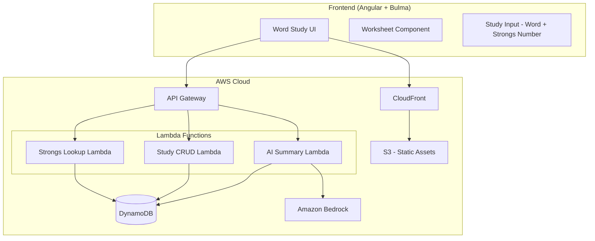
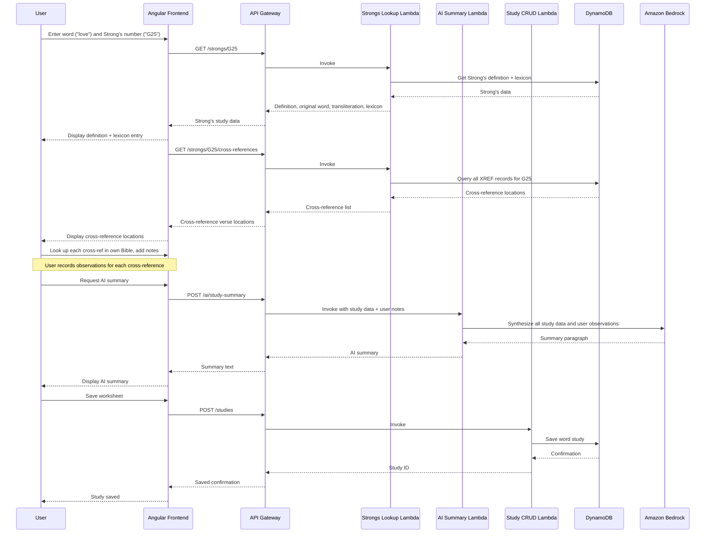
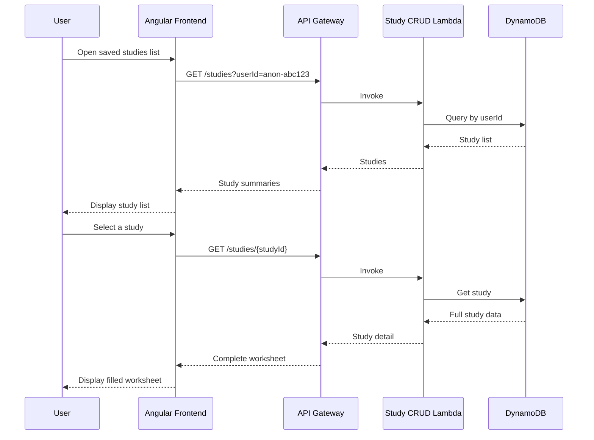

# Design Document: Bible Word Study Tool

## Overview

The Bible Word Study Tool is a guided, step-by-step assistant that walks users through the "Steps to Bible Knowledge" word study method (Step 5). Users enter an English word and its Strong's concordance number. The tool retrieves the Strong's definition, Hebrew/Greek original word, lexicon entry, and a list of cross-reference verse locations where the same Strong's number is used. The user looks up each cross-reference in their own Bible and records their observations. An AI-generated study summary synthesizes all the data — including the user's notes — into a concise insight paragraph. Everything is captured in a saveable worksheet.

The tool works exclusively with public domain Strong's concordance data (published 1890) and does not serve any copyrighted Bible translation text. Cross-references provide verse locations (e.g., "Romans 5:8") that users look up in their own Bible or app.

The application follows a serverless-first architecture with an Angular frontend served via CloudFront/S3 and a Lambda-backed API Gateway for data operations. DynamoDB stores user word studies and Strong's concordance data. Amazon Bedrock (Claude 3 Haiku) generates study summaries. No external Bible APIs are needed at runtime.

The MVP workflow: enter word + Strong's number → view definition and lexicon → see cross-reference locations → add notes for each cross-reference → optionally generate AI summary → save the worksheet. No user authentication in MVP; studies are tied to a browser-generated anonymous ID stored in localStorage.

## Architecture



## Sequence Diagrams

### Main Flow: Creating a Word Study



### Retrieving a Saved Study



## Components and Interfaces

### Component 1: Study Input

**Purpose**: Simple form where the user enters the English word and Strong's concordance number to study.

**Interface**:
```typescript
interface StudyInput {
  word: string;          // e.g. "love"
  strongsNumber: string; // e.g. "G25"
}
```

**Responsibilities**:
- Display a text input for the word and a text input for the Strong's number
- Validate that both fields are filled and Strong's number matches `/^[GH]\d+$/`
- Emit the study input to trigger the Strong's lookup

### Component 2: Study Worksheet

**Purpose**: The main workspace that guides the user through each word study step and captures all data and notes.

**Interface**:
```typescript
interface StudyWorksheet {
  id: string;
  userId: string;
  createdAt: string;
  updatedAt: string;
  wordStudies: WordStudyEntry[];
  status: 'in_progress' | 'completed';
}
```

**Responsibilities**:
- Display the step-by-step word study workflow
- Show Strong's definition, original word, transliteration, and lexicon entry
- List cross-reference verse locations with a notes field for each
- Provide a general notes text area for overall observations
- Offer an "AI Summary" button to generate a synthesis of all study data including user notes
- Allow saving and resuming the worksheet

### Component 3: Study List

**Purpose**: Shows all saved word studies for the current user, allowing them to resume or review.

**Responsibilities**:
- List saved studies with word, Strong's number, date, and status
- Allow opening a study to view or continue editing
- Allow deleting a study

## Data Models

### WordStudyEntry

```typescript
interface WordStudyEntry {
  word: string;                       // English word studied
  strongsNumber: string;              // e.g. "G25" or "H157"
  englishDefinition: string;          // Dictionary definition
  strongsDefinition: string;          // Strong's concordance definition
  originalWord: string;               // Greek or Hebrew word
  transliteration: string;            // Romanized form
  lexiconEntry: string;               // Extended lexicon definition
  crossReferences: CrossReference[];  // Verse locations using same Strong's number
  aiSummary: string;                  // AI-generated study synthesis
  notes: string;                      // User's general personal notes
}
```

### CrossReference

```typescript
interface CrossReference {
  reference: string;  // e.g. "Romans 5:8" — location only, no copyrighted text
  notes: string;      // User's observations after looking up this verse
}
```

### DynamoDB Table: WordStudies

```typescript
interface WordStudyRecord {
  PK: string;           // "USER#<userId>"
  SK: string;           // "STUDY#<studyId>"
  studyId: string;
  userId: string;
  createdAt: string;    // ISO 8601
  updatedAt: string;    // ISO 8601
  wordStudies: WordStudyEntry[];
  status: 'in_progress' | 'completed';
  GSI1PK: string;       // "USER#<userId>"
  GSI1SK: string;       // "UPDATED#<updatedAt>" — for sorting by recent
}
```

**Validation Rules**:
- `userId` must be a non-empty string
- `wordStudies` array can be empty (study just started) but each entry must have at least `word` and `strongsNumber`
- `status` must be one of the two allowed values

### DynamoDB Table: StrongsData

Pre-loaded with public domain Strong's concordance data (~8,700 Hebrew + ~5,600 Greek entries).

```typescript
interface StrongsRecord {
  PK: string;    // "STRONGS#<strongsNumber>" e.g. "STRONGS#G25"
  SK: string;    // "DEF" | "LEXICON" | "XREF#<book>#<chapter>:<verse>"
  definition?: string;
  originalWord?: string;
  transliteration?: string;
  lexiconEntry?: string;
  reference?: string;     // For XREF records: "Romans 5:8"
}
```

**Access Patterns**:
- Get definition: PK = `STRONGS#G25`, SK = `DEF`
- Get lexicon entry: PK = `STRONGS#G25`, SK = `LEXICON`
- Get all cross-references: PK = `STRONGS#G25`, SK begins_with `XREF#`

## Algorithmic Pseudocode

### Strong's Study Data Algorithm

```typescript
/**
 * ALGORITHM: getStrongsStudyData
 * 
 * Retrieves the complete Strong's concordance data for a given
 * Strong's number: definition, original word, and lexicon entry.
 * All data comes from the pre-loaded StrongsData DynamoDB table.
 */
async function getStrongsStudyData(
  strongsNumber: string
): Promise<StrongsStudyResult> {
  // Fetch definition and lexicon in parallel
  const [defResult, lexResult] = await Promise.all([
    dynamodb.get({
      TableName: 'StrongsData',
      Key: { PK: `STRONGS#${strongsNumber}`, SK: 'DEF' }
    }),
    dynamodb.get({
      TableName: 'StrongsData',
      Key: { PK: `STRONGS#${strongsNumber}`, SK: 'LEXICON' }
    })
  ]);

  return {
    strongsNumber,
    definition: defResult.Item?.definition ?? 'Definition not available',
    originalWord: defResult.Item?.originalWord ?? '',
    transliteration: defResult.Item?.transliteration ?? '',
    lexiconEntry: lexResult.Item?.lexiconEntry ?? 'Lexicon entry not available'
  };
}
```

**Preconditions:**
- `strongsNumber` matches pattern `/^[GH]\d+$/`
- StrongsData table is pre-loaded with concordance data

**Postconditions:**
- Returns a `StrongsStudyResult` with all fields populated (may contain fallback values)
- Never throws — returns graceful fallback strings on missing data
- Both definition and lexicon are fetched in parallel for performance

### Cross-Reference Lookup Algorithm

```typescript
/**
 * ALGORITHM: getCrossReferences
 * 
 * Fetches all verse locations that use the same Strong's number.
 * Returns reference strings only (no copyrighted verse text).
 * Each reference includes an empty notes field for user observations.
 */
async function getCrossReferences(
  strongsNumber: string
): Promise<CrossReference[]> {
  const results = await dynamodb.query({
    TableName: 'StrongsData',
    KeyConditionExpression: 'PK = :pk AND begins_with(SK, :prefix)',
    ExpressionAttributeValues: {
      ':pk': `STRONGS#${strongsNumber}`,
      ':prefix': 'XREF#'
    }
  });

  if (!results.Items || results.Items.length === 0) {
    return [];
  }

  return results.Items.map(item => ({
    reference: item.reference,
    notes: ''
  }));
}
```

**Preconditions:**
- `strongsNumber` matches pattern `/^[GH]\d+$/`

**Postconditions:**
- Returns an array of `CrossReference` objects (may be empty)
- Each cross-reference has a valid `reference` string and empty `notes`
- References are verse locations only — no copyrighted text
- Results are in canonical Bible order (determined by SK sort)

### AI Study Summary Algorithm

```typescript
/**
 * ALGORITHM: generateStudySummary
 * 
 * Uses Amazon Bedrock to synthesize all word study data — including
 * the user's cross-reference observations — into a concise summary.
 */
async function generateStudySummary(
  entry: WordStudyEntry
): Promise<string> {
  // Collect user's cross-reference observations
  const userObservations = entry.crossReferences
    .filter(ref => ref.notes.trim().length > 0)
    .map(ref => `${ref.reference}: ${ref.notes}`)
    .join('\n');

  const prompt = `You are a Bible study assistant. Synthesize the following word study data into a concise, insightful summary paragraph (3-5 sentences). Focus on what this word means in its original language and how the user's cross-reference observations illuminate its usage across Scripture.

Word: "${entry.word}"
Strong's Number: ${entry.strongsNumber}
Strong's Definition: ${entry.strongsDefinition}
Original Word: ${entry.originalWord} (${entry.transliteration})
Lexicon Entry: ${entry.lexiconEntry}
English Definition: ${entry.englishDefinition}
User's Cross-Reference Observations:
${userObservations || 'None provided'}
User's General Notes: ${entry.notes || 'None'}

Provide a summary that helps the student understand the depth and nuance of this word in its biblical context.`;

  try {
    const response = await bedrock.invokeModel({
      modelId: 'anthropic.claude-3-haiku-20240307-v1:0',
      body: JSON.stringify({
        anthropic_version: 'bedrock-2023-05-31',
        max_tokens: 512,
        messages: [{ role: 'user', content: prompt }]
      })
    });

    return parseTextResponse(response);
  } catch {
    return 'AI summary unavailable. Please try again later.';
  }
}
```

**Preconditions:**
- `entry` has at minimum `word`, `strongsNumber`, and `strongsDefinition` populated

**Postconditions:**
- Returns a non-empty string containing the AI-generated summary
- Summary incorporates the user's cross-reference observations when available
- On Bedrock failure, returns fallback: "AI summary unavailable. Please try again later."
- Does not throw exceptions

### Save Word Study Algorithm

```typescript
/**
 * ALGORITHM: saveWordStudy
 * 
 * Persists a word study worksheet to DynamoDB.
 * Creates a new record or updates an existing one.
 */
async function saveWordStudy(study: StudyWorksheet): Promise<string> {
  const now = new Date().toISOString();
  const studyId = study.id || generateId();

  const record: WordStudyRecord = {
    PK: `USER#${study.userId}`,
    SK: `STUDY#${studyId}`,
    studyId: studyId,
    userId: study.userId,
    createdAt: study.createdAt || now,
    updatedAt: now,
    wordStudies: study.wordStudies,
    status: study.status,
    GSI1PK: `USER#${study.userId}`,
    GSI1SK: `UPDATED#${now}`
  };

  await dynamodb.put({
    TableName: 'WordStudies',
    Item: record
  });

  return studyId;
}
```

**Preconditions:**
- `study.userId` is a non-empty string
- `study.wordStudies` is a valid array (may be empty)
- `study.status` is either `'in_progress'` or `'completed'`

**Postconditions:**
- Returns the `studyId` (newly generated or existing)
- `updatedAt` is always set to current timestamp
- `createdAt` is preserved on updates, set to now on creates
- Record is queryable by `PK` (userId) and sortable by `GSI1SK` (updatedAt)

## Key Functions with Formal Specifications

### fetchEnglishDefinition()

```typescript
async function fetchEnglishDefinition(word: string): Promise<string>
```

**Preconditions:**
- `word` is a non-empty string containing a single English word

**Postconditions:**
- Returns a non-empty string containing the dictionary definition
- On failure, returns a fallback message: "Definition not available"
- Does not throw exceptions

### getTestament()

```typescript
function getTestament(strongsNumber: string): 'OT' | 'NT'
```

**Preconditions:**
- `strongsNumber` matches pattern `/^[GH]\d+$/`

**Postconditions:**
- Returns `'OT'` if the number starts with 'H' (Hebrew)
- Returns `'NT'` if the number starts with 'G' (Greek)
- Pure function with no side effects

### validateStrongsNumber()

```typescript
function validateStrongsNumber(input: string): boolean
```

**Preconditions:**
- `input` is a string (may be empty or malformed)

**Postconditions:**
- Returns `true` if and only if `input` matches `/^[GH]\d+$/`
- Pure function with no side effects

## Example Usage

```typescript
// Example 1: Look up Strong's data for "love" (G25)
const strongsData = await getStrongsStudyData('G25');
// strongsData = {
//   strongsNumber: "G25",
//   definition: "to love (in a social or moral sense)",
//   originalWord: "ἀγαπάω",
//   transliteration: "agapaō",
//   lexiconEntry: "From ἀγάπη; to love..."
// }

// Example 2: Get cross-reference locations
const crossRefs = await getCrossReferences('G25');
// crossRefs = [
//   { reference: "Matthew 5:44", notes: "" },
//   { reference: "John 3:16", notes: "" },
//   { reference: "Romans 5:8", notes: "" },
//   { reference: "1 John 4:8", notes: "" },
//   ...
// ]

// Example 3: User adds notes after looking up cross-references
crossRefs[0].notes = "Here agapaō is used for loving enemies — radical self-sacrifice";
crossRefs[1].notes = "God's love for the world — the ultimate expression of agapaō";

// Example 4: Generate AI summary with user observations
const entry: WordStudyEntry = {
  word: 'love',
  strongsNumber: 'G25',
  englishDefinition: 'an intense feeling of deep affection',
  strongsDefinition: 'to love (in a social or moral sense)',
  originalWord: 'ἀγαπάω',
  transliteration: 'agapaō',
  lexiconEntry: 'From ἀγάπη; to love...',
  crossReferences: crossRefs,
  aiSummary: '',
  notes: 'This is the self-sacrificial love of God'
};
const summary = await generateStudySummary(entry);
// summary = "The Greek word ἀγαπάω (agapaō) represents a deliberate, self-sacrificial love..."

// Example 5: Save the worksheet
const worksheet: StudyWorksheet = {
  id: '',
  userId: 'anon-abc123',
  createdAt: '',
  updatedAt: '',
  wordStudies: [{ ...entry, aiSummary: summary }],
  status: 'in_progress'
};
const studyId = await saveWordStudy(worksheet);
```

## Error Handling

### Error Scenario 1: Strong's Number Not Found

**Condition**: The entered Strong's number does not exist in the StrongsData table
**Response**: Return fallback strings for definition and lexicon ("Definition not available", "Lexicon entry not available")
**Recovery**: User can verify the Strong's number and try again

### Error Scenario 2: No Cross-References Found

**Condition**: The Strong's number has no XREF records in the StrongsData table
**Response**: Return empty array; frontend displays "No cross-references found for this Strong's number"
**Recovery**: User can still complete the study with definition, lexicon, and notes

### Error Scenario 3: Bedrock AI Call Fails

**Condition**: Bedrock returns an error or times out
**Response**: Return "AI summary unavailable. Please try again later."
**Recovery**: Core word study functionality works without AI; user can retry the summary later

### Error Scenario 4: DynamoDB Write Failure

**Condition**: DynamoDB put/update fails (throttling, capacity)
**Response**: Lambda returns 500; frontend shows "Save failed, please try again"
**Recovery**: Frontend retries with exponential backoff (max 3 attempts)

### Error Scenario 5: Invalid Strong's Number Format

**Condition**: User enters a Strong's number that doesn't match `/^[GH]\d+$/`
**Response**: Frontend validation prevents submission; displays inline error message
**Recovery**: User corrects the input

## Testing Strategy

### Unit Testing Approach

- Test each Lambda handler in isolation with mocked DynamoDB and Bedrock clients
- Test `getTestament()` with H and G prefixes
- Test `validateStrongsNumber()` with valid and invalid inputs
- Test graceful fallback behavior when Strong's data or Bedrock is unavailable
- Test that cross-reference notes are preserved through save/load cycle
- Coverage goal: 80%+ for Lambda handlers

### Property-Based Testing Approach

**Property Test Library**: fast-check

- For any string matching `/^[GH]\d+$/`, `validateStrongsNumber` returns `true`; for any string not matching, it returns `false`
- For any valid Strong's number, `getStrongsStudyData` returns an object where all string fields are non-empty (either real data or fallback strings)
- For any valid `StudyWorksheet`, `saveWordStudy` followed by a get with the returned `studyId` returns a record matching the saved input
- `generateStudySummary` never throws — for any `WordStudyEntry` with `word` and `strongsNumber` populated, it returns a non-empty string

### Integration Testing Approach

- End-to-end test: enter word + Strong's number → view definition → view cross-refs → add notes → generate AI summary → save → reload
- Test API Gateway → Lambda → DynamoDB flow with local DynamoDB (dynamodb-local)
- Test Bedrock integration with mocked responses for deterministic testing

## Performance Considerations

- DynamoDB on-demand capacity to avoid provisioning costs and handle variable load
- Strong's concordance and lexicon data pre-loaded into DynamoDB (public domain, ~14,300 entries total) — no runtime external calls needed
- Cross-reference queries use DynamoDB `begins_with` on SK for efficient range queries
- Bedrock calls use Claude 3 Haiku for fast, cost-effective AI responses (~0.3s latency)
- Lambda functions sized at 256MB / 15s timeout (extra time for Bedrock calls)
- CloudFront caching for static Angular assets with long cache headers

## Security Considerations

- No user authentication in MVP — anonymous user ID generated client-side and stored in localStorage
- API Gateway with usage plan and throttling to prevent abuse (100 req/s burst, 50 req/s sustained)
- Lambda functions use least-privilege IAM roles (DynamoDB access to specific tables, Bedrock invoke for specific model)
- No PII stored — anonymous IDs only
- CORS configured to allow only the CloudFront domain
- DynamoDB encryption at rest enabled (AWS-managed keys)
- All traffic over HTTPS (CloudFront → API Gateway)
- Bedrock prompts contain only Strong's concordance data and user study notes — no copyrighted text

## Dependencies

- **Angular v25+**: Frontend framework with standalone components and signals
- **Bulma CSS**: Styling framework (CSS only, no JS)
- **AWS CDK (TypeScript)**: Infrastructure as code
- **AWS Lambda (Node.js 20.x)**: Backend compute
- **API Gateway (REST)**: HTTP API layer
- **Amazon Bedrock (Claude 3 Haiku)**: AI for study summary generation
- **DynamoDB**: Data storage (2 tables: WordStudies, StrongsData)
- **S3 + CloudFront**: Static asset hosting and CDN
- **Open Scriptures Strong's Dataset**: Public domain Strong's Hebrew/Greek dictionaries for pre-loading
